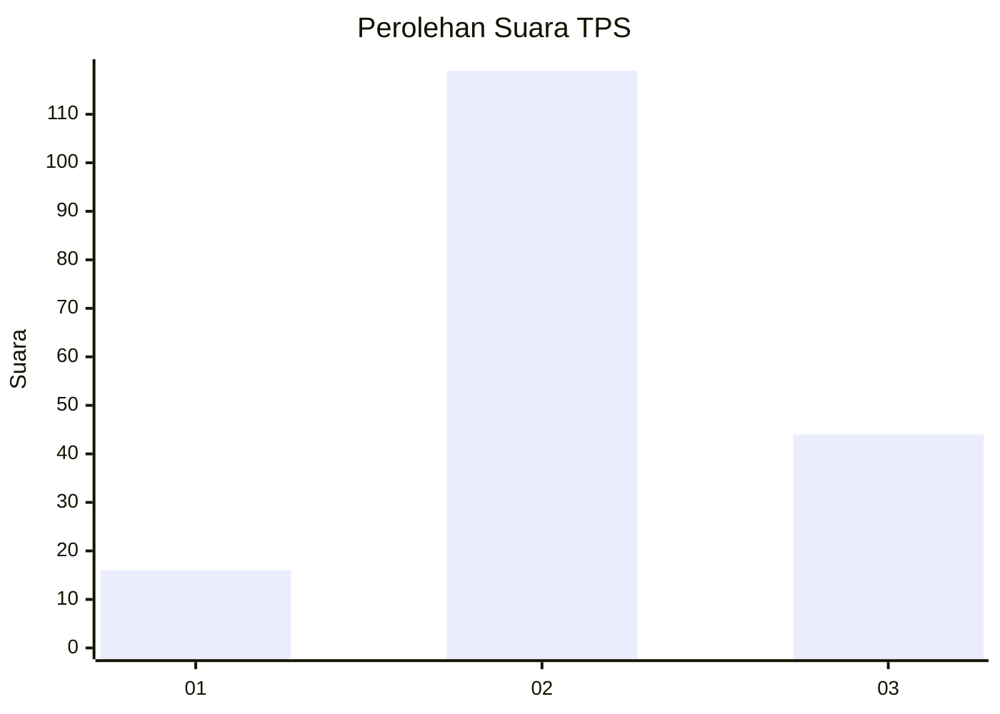
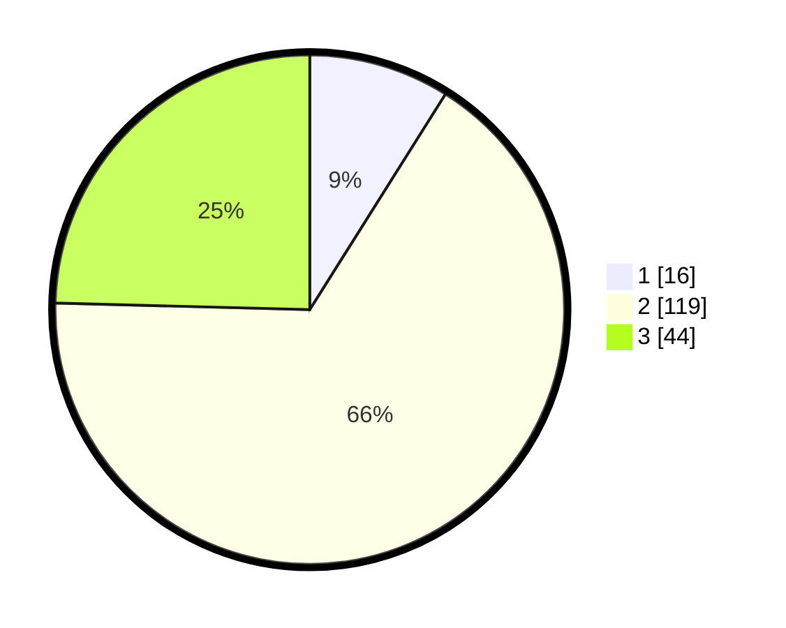

# Hasil

## Grafik

## Tabel

| No. | Nama Paslon    | Suara | Suara (raw) | Persentase |
|:--- |:-------------- | -----:| -----------:| ----------:|
| 1   | ANIES MUHAIMIN | 16    | [16][p-1]   | 8,94       |
| 2   | PRABOWO GIBRAN | 119   | [119][p-2]  | 66,48      |
| 3   | GANJAR MAHFUD  | 44    | [44][p-3]   | 24,58      |

[p-1]: https://github.com/gigit-pemilu/pemilu-2024-35-jawa-timur/blob/main/pilpres/hitung-suara/sub/35-jawa-timur/sub/10-banyuwangi/sub/07-gambiran/sub/2001-purwodadi/sub/001-tps/sub/paslon-1.txt
[p-2]: https://github.com/gigit-pemilu/pemilu-2024-35-jawa-timur/blob/main/pilpres/hitung-suara/sub/35-jawa-timur/sub/10-banyuwangi/sub/07-gambiran/sub/2001-purwodadi/sub/001-tps/sub/paslon-2.txt
[p-3]: https://github.com/gigit-pemilu/pemilu-2024-35-jawa-timur/blob/main/pilpres/hitung-suara/sub/35-jawa-timur/sub/10-banyuwangi/sub/07-gambiran/sub/2001-purwodadi/sub/001-tps/sub/paslon-3.txt

## Foto C Plano

https://sirekap-obj-formc.kpu.go.id/7cb9/pemilu/ppwp/35/10/07/20/01/3510072001001-20240218-105937--1e3007fd-ac13-47ca-8494-696959e95ec3.jpg

https://sirekap-obj-formc.kpu.go.id/7cb9/pemilu/ppwp/35/10/07/20/01/3510072001001-20240214-232247--8b69327f-fc3d-4f30-b564-842266a88016.jpg

https://sirekap-obj-formc.kpu.go.id/7cb9/pemilu/ppwp/35/10/07/20/01/3510072001001-20240219-112203--ac2db243-7c66-4a31-b6d4-24c615016dde.jpg

## Metadata

| Key        | Value               |
| ---------- | ------------------- |
| Time Stamp | 2024-02-24 22:31:28 |

