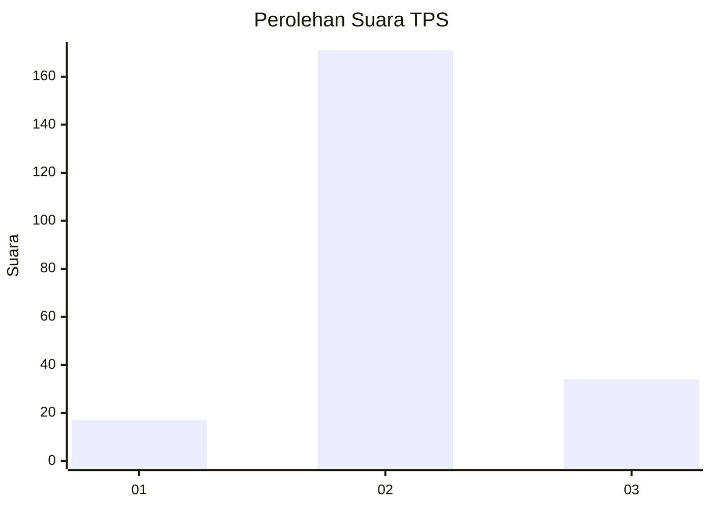

# Hasil

## Grafik

## Tabel

| No. | Nama Paslon    | Suara | Suara (raw) | Persentase |
|:--- |:-------------- | -----:| -----------:| ----------:|
| 1   | ANIES MUHAIMIN | 17    | [17][p-1]   | 7,66       |
| 2   | PRABOWO GIBRAN | 171   | [171][p-2]  | 77,03      |
| 3   | GANJAR MAHFUD  | 34    | [34][p-3]   | 15,32      |

[p-1]: https://github.com/gigit-pemilu/pemilu-2024-35-jawa-timur/blob/main/pilpres/hitung-suara/sub/35-jawa-timur/sub/10-banyuwangi/sub/07-gambiran/sub/2001-purwodadi/sub/003-tps/sub/paslon-1.txt
[p-2]: https://github.com/gigit-pemilu/pemilu-2024-35-jawa-timur/blob/main/pilpres/hitung-suara/sub/35-jawa-timur/sub/10-banyuwangi/sub/07-gambiran/sub/2001-purwodadi/sub/003-tps/sub/paslon-2.txt
[p-3]: https://github.com/gigit-pemilu/pemilu-2024-35-jawa-timur/blob/main/pilpres/hitung-suara/sub/35-jawa-timur/sub/10-banyuwangi/sub/07-gambiran/sub/2001-purwodadi/sub/003-tps/sub/paslon-3.txt

## Foto C Plano

https://sirekap-obj-formc.kpu.go.id/ccb6/pemilu/ppwp/35/10/07/20/01/3510072001003-20240214-211844--3e714d91-5415-4e7b-9a79-ee31a615b2cd.jpg

https://sirekap-obj-formc.kpu.go.id/ccb6/pemilu/ppwp/35/10/07/20/01/3510072001003-20240214-230742--2bf65eaa-e610-4b9a-bf83-54c97b8f29a4.jpg

https://sirekap-obj-formc.kpu.go.id/ccb6/pemilu/ppwp/35/10/07/20/01/3510072001003-20240214-220554--be7d9857-d824-4ea2-903a-740ca044ba3d.jpg

## Metadata

| Key        | Value               |
| ---------- | ------------------- |
| Time Stamp | 2024-02-24 22:31:28 |

