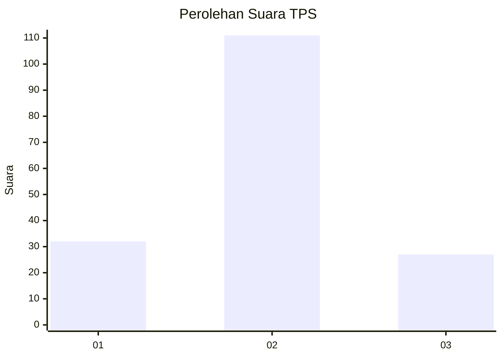
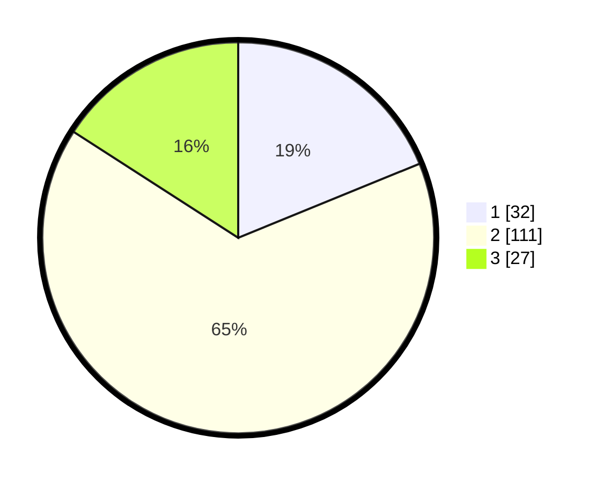

# Hasil

## Grafik

## Tabel

| No. | Nama Paslon    | Suara | Suara (raw) | Persentase |
|:--- |:-------------- | -----:| -----------:| ----------:|
| 1   | ANIES MUHAIMIN | 32    | [32][p-1]   | 18,82      |
| 2   | PRABOWO GIBRAN | 111   | [111][p-2]  | 65,29      |
| 3   | GANJAR MAHFUD  | 27    | [27][p-3]   | 15,88      |

[p-1]: https://github.com/gigit-pemilu/pemilu-2024/blob/main/pilpres/hitung-suara/sub/35-jawa-timur/sub/10-banyuwangi/sub/07-gambiran/sub/2001-purwodadi/sub/008-tps/sub/paslon-1.txt
[p-2]: https://github.com/gigit-pemilu/pemilu-2024/blob/main/pilpres/hitung-suara/sub/35-jawa-timur/sub/10-banyuwangi/sub/07-gambiran/sub/2001-purwodadi/sub/008-tps/sub/paslon-2.txt
[p-3]: https://github.com/gigit-pemilu/pemilu-2024/blob/main/pilpres/hitung-suara/sub/35-jawa-timur/sub/10-banyuwangi/sub/07-gambiran/sub/2001-purwodadi/sub/008-tps/sub/paslon-3.txt

## Foto C Plano

https://sirekap-obj-formc.kpu.go.id/ad56/pemilu/ppwp/35/10/07/20/01/3510072001008-20240217-194336--69a64a7c-41fd-403b-af6d-a89ecc370137.jpg

https://sirekap-obj-formc.kpu.go.id/ad56/pemilu/ppwp/35/10/07/20/01/3510072001008-20240215-190832--54ec2fb2-d1ea-4653-96ce-11910bbd8906.jpg

https://sirekap-obj-formc.kpu.go.id/ad56/pemilu/ppwp/35/10/07/20/01/3510072001008-20240215-190901--e6e39fce-e818-48bb-b14a-e7993b0e8563.jpg

## Metadata

| Key        | Value               |
| ---------- | ------------------- |
| Time Stamp | 2024-02-24 22:31:28 |

