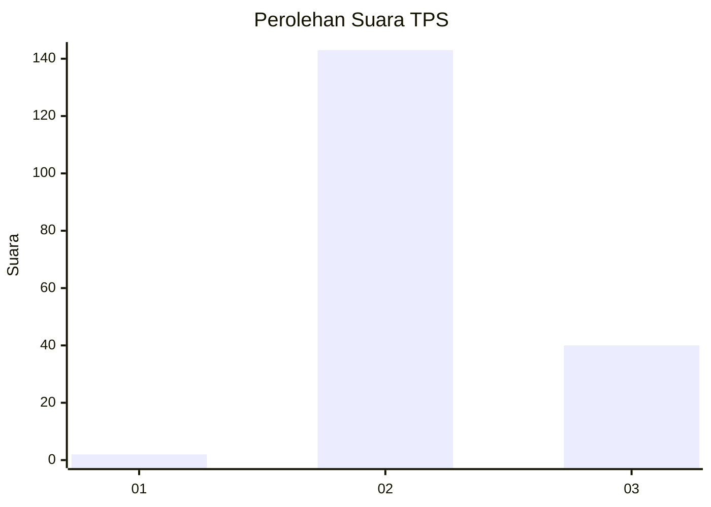

# Hasil

## Grafik

## Tabel

| No. | Nama Paslon    | Suara | Suara (raw) | Persentase |
|:--- |:-------------- | -----:| -----------:| ----------:|
| 1   | ANIES MUHAIMIN | 2     | [2][p-1]    | 1,08       |
| 2   | PRABOWO GIBRAN | 143   | [143][p-2]  | 77,30      |
| 3   | GANJAR MAHFUD  | 40    | [40][p-3]   | 21,62      |

[p-1]: https://github.com/gigit-pemilu/pemilu-2024/blob/main/pilpres/hitung-suara/sub/35-jawa-timur/sub/10-banyuwangi/sub/07-gambiran/sub/2001-purwodadi/sub/017-tps/sub/paslon-1.txt
[p-2]: https://github.com/gigit-pemilu/pemilu-2024/blob/main/pilpres/hitung-suara/sub/35-jawa-timur/sub/10-banyuwangi/sub/07-gambiran/sub/2001-purwodadi/sub/017-tps/sub/paslon-2.txt
[p-3]: https://github.com/gigit-pemilu/pemilu-2024/blob/main/pilpres/hitung-suara/sub/35-jawa-timur/sub/10-banyuwangi/sub/07-gambiran/sub/2001-purwodadi/sub/017-tps/sub/paslon-3.txt

## Foto C Plano

https://sirekap-obj-formc.kpu.go.id/b797/pemilu/ppwp/35/10/07/20/01/3510072001017-20240216-115219--b283b4cb-b8f0-4cfb-ba00-908ddedcf9cd.jpg

https://sirekap-obj-formc.kpu.go.id/b797/pemilu/ppwp/35/10/07/20/01/3510072001017-20240216-115406--a6b54011-2bfb-4afb-ae92-8b0eb4e22532.jpg

https://sirekap-obj-formc.kpu.go.id/b797/pemilu/ppwp/35/10/07/20/01/3510072001017-20240216-114952--fb8b07c3-a89a-4c57-9060-f9c591920009.jpg

## Metadata

| Key        | Value               |
| ---------- | ------------------- |
| Time Stamp | 2024-02-21 19:00:00 |

