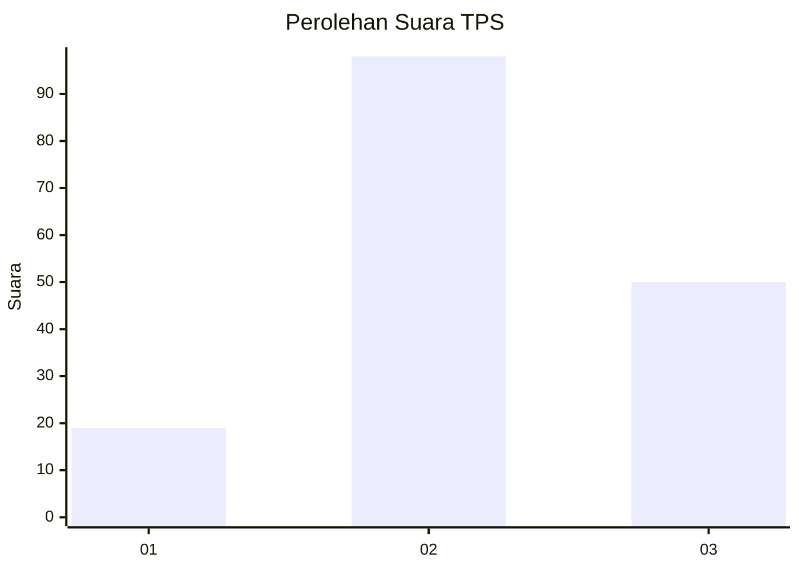
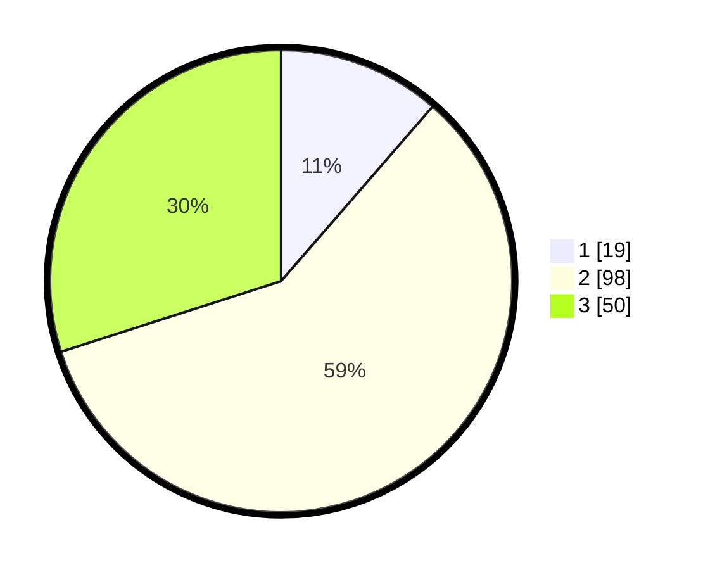

# Hasil

## Grafik

## Tabel

| No. | Nama Paslon    | Suara | Suara (raw) | Persentase |
|:--- |:-------------- | -----:| -----------:| ----------:|
| 1   | ANIES MUHAIMIN | 19    | [19][p-1]   | 11,38      |
| 2   | PRABOWO GIBRAN | 98    | [98][p-2]   | 58,68      |
| 3   | GANJAR MAHFUD  | 50    | [50][p-3]   | 29,94      |

[p-1]: https://github.com/gigit-pemilu/pemilu-2024/blob/main/pilpres/hitung-suara/sub/35-jawa-timur/sub/10-banyuwangi/sub/07-gambiran/sub/2002-jajag/sub/009-tps/sub/paslon-1.txt
[p-2]: https://github.com/gigit-pemilu/pemilu-2024/blob/main/pilpres/hitung-suara/sub/35-jawa-timur/sub/10-banyuwangi/sub/07-gambiran/sub/2002-jajag/sub/009-tps/sub/paslon-2.txt
[p-3]: https://github.com/gigit-pemilu/pemilu-2024/blob/main/pilpres/hitung-suara/sub/35-jawa-timur/sub/10-banyuwangi/sub/07-gambiran/sub/2002-jajag/sub/009-tps/sub/paslon-3.txt

## Foto C Plano

https://sirekap-obj-formc.kpu.go.id/2570/pemilu/ppwp/35/10/07/20/02/3510072002009-20240214-205558--8a2f2a45-fc69-4664-83d8-eb2aba2379c3.jpg

https://sirekap-obj-formc.kpu.go.id/2570/pemilu/ppwp/35/10/07/20/02/3510072002009-20240214-205825--51fa454b-87ba-4ede-86ee-413549a504f1.jpg

https://sirekap-obj-formc.kpu.go.id/2570/pemilu/ppwp/35/10/07/20/02/3510072002009-20240214-205858--22e1406c-4de6-4cb8-9c15-85d3b29d32eb.jpg

## Metadata

| Key        | Value               |
| ---------- | ------------------- |
| Time Stamp | 2024-02-21 19:00:00 |

