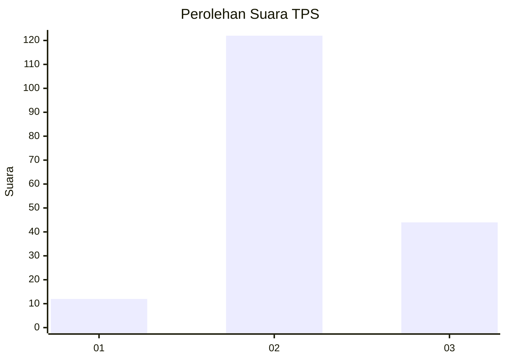
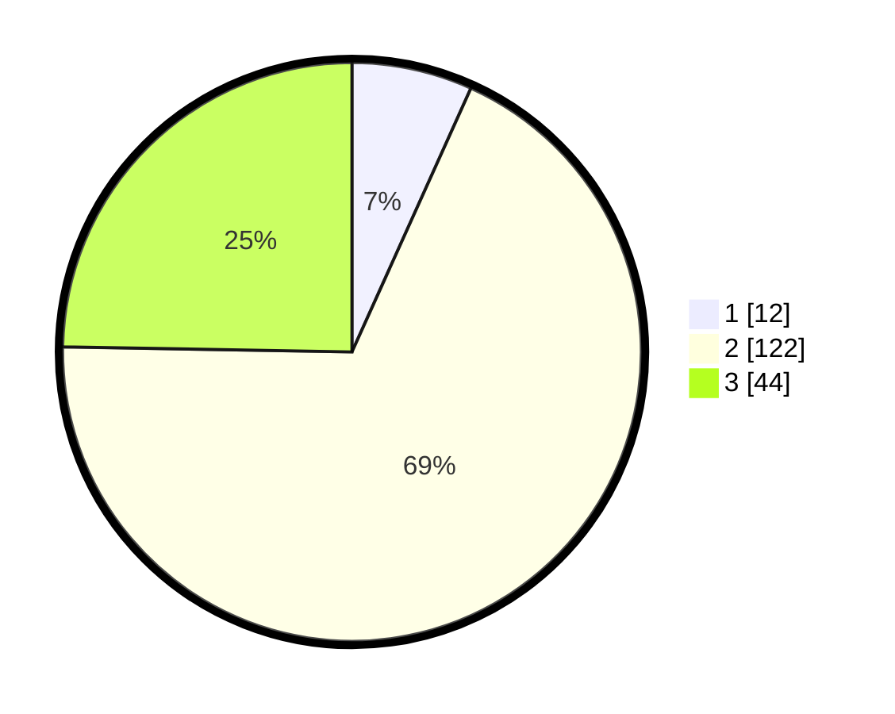

# Hasil

## Grafik

## Tabel

| No. | Nama Paslon    | Suara | Suara (raw) | Persentase |
|:--- |:-------------- | -----:| -----------:| ----------:|
| 1   | ANIES MUHAIMIN | 12    | [12][p-1]   | 6,74       |
| 2   | PRABOWO GIBRAN | 122   | [122][p-2]  | 68,54      |
| 3   | GANJAR MAHFUD  | 44    | [44][p-3]   | 24,72      |

[p-1]: https://github.com/gigit-pemilu/pemilu-2024-35-jawa-timur/blob/main/pilpres/hitung-suara/sub/35-jawa-timur/sub/10-banyuwangi/sub/07-gambiran/sub/2007-gambiran/sub/001-tps/sub/paslon-1.txt
[p-2]: https://github.com/gigit-pemilu/pemilu-2024-35-jawa-timur/blob/main/pilpres/hitung-suara/sub/35-jawa-timur/sub/10-banyuwangi/sub/07-gambiran/sub/2007-gambiran/sub/001-tps/sub/paslon-2.txt
[p-3]: https://github.com/gigit-pemilu/pemilu-2024-35-jawa-timur/blob/main/pilpres/hitung-suara/sub/35-jawa-timur/sub/10-banyuwangi/sub/07-gambiran/sub/2007-gambiran/sub/001-tps/sub/paslon-3.txt

## Foto C Plano

https://sirekap-obj-formc.kpu.go.id/e7c8/pemilu/ppwp/35/10/07/20/07/3510072007001-20240218-090810--dd76a607-6a63-44ce-b465-3c2c9bfb9043.jpg

https://sirekap-obj-formc.kpu.go.id/e7c8/pemilu/ppwp/35/10/07/20/07/3510072007001-20240218-090949--4eed7e97-6e5a-463f-9fae-5f237cf513a5.jpg

https://sirekap-obj-formc.kpu.go.id/e7c8/pemilu/ppwp/35/10/07/20/07/3510072007001-20240218-091058--eafd10d3-6f18-4f48-9656-f076977d7ad2.jpg

## Metadata

| Key        | Value               |
| ---------- | ------------------- |
| Time Stamp | 2024-02-22 11:00:00 |

