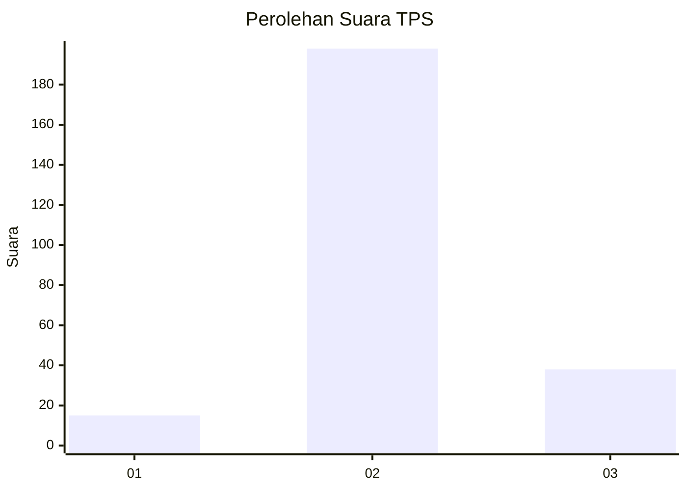

# Hasil

## Grafik

## Tabel

| No. | Nama Paslon    | Suara | Suara (raw) | Persentase |
|:--- |:-------------- | -----:| -----------:| ----------:|
| 1   | ANIES MUHAIMIN | 15    | [15][p-1]   | 5,98       |
| 2   | PRABOWO GIBRAN | 198   | [198][p-2]  | 78,88      |
| 3   | GANJAR MAHFUD  | 38    | [38][p-3]   | 15,14      |

[p-1]: https://github.com/gigit-pemilu/pemilu-2024/blob/main/pilpres/hitung-suara/sub/35-jawa-timur/sub/10-banyuwangi/sub/07-gambiran/sub/2007-gambiran/sub/035-tps/sub/paslon-1.txt
[p-2]: https://github.com/gigit-pemilu/pemilu-2024/blob/main/pilpres/hitung-suara/sub/35-jawa-timur/sub/10-banyuwangi/sub/07-gambiran/sub/2007-gambiran/sub/035-tps/sub/paslon-2.txt
[p-3]: https://github.com/gigit-pemilu/pemilu-2024/blob/main/pilpres/hitung-suara/sub/35-jawa-timur/sub/10-banyuwangi/sub/07-gambiran/sub/2007-gambiran/sub/035-tps/sub/paslon-3.txt

## Foto C Plano

https://sirekap-obj-formc.kpu.go.id/41cd/pemilu/ppwp/35/10/07/20/07/3510072007035-20240217-112830--c88754b7-66fb-46ca-9ca7-4e70f144991e.jpg

https://sirekap-obj-formc.kpu.go.id/41cd/pemilu/ppwp/35/10/07/20/07/3510072007035-20240217-113231--352a33e2-8110-4bb1-ac83-5e5040322d92.jpg

https://sirekap-obj-formc.kpu.go.id/41cd/pemilu/ppwp/35/10/07/20/07/3510072007035-20240217-113317--418ca8b0-f40a-4626-9de5-0d42f7dcc4b9.jpg

## Metadata

| Key        | Value               |
| ---------- | ------------------- |
| Time Stamp | 2024-02-24 22:31:28 |

