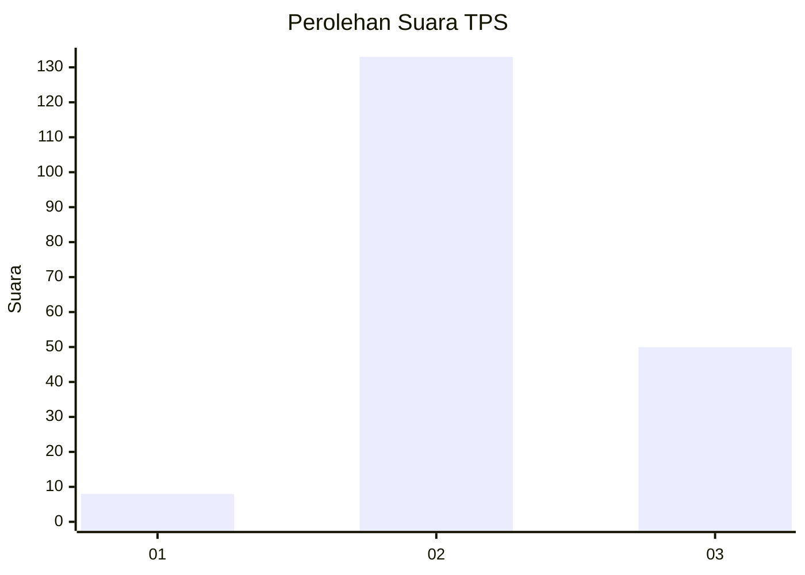

# Hasil

## Grafik

## Tabel

| No. | Nama Paslon    | Suara | Suara (raw) | Persentase |
|:--- |:-------------- | -----:| -----------:| ----------:|
| 1   | ANIES MUHAIMIN | 8     | [8][p-1]    | 4,19       |
| 2   | PRABOWO GIBRAN | 133   | [133][p-2]  | 69,63      |
| 3   | GANJAR MAHFUD  | 50    | [50][p-3]   | 26,18      |

[p-1]: https://github.com/gigit-pemilu/pemilu-2024/blob/main/pilpres/hitung-suara/sub/35-jawa-timur/sub/10-banyuwangi/sub/08-srono/sub/2002-wonosobo/sub/006-tps/sub/paslon-1.txt
[p-2]: https://github.com/gigit-pemilu/pemilu-2024/blob/main/pilpres/hitung-suara/sub/35-jawa-timur/sub/10-banyuwangi/sub/08-srono/sub/2002-wonosobo/sub/006-tps/sub/paslon-2.txt
[p-3]: https://github.com/gigit-pemilu/pemilu-2024/blob/main/pilpres/hitung-suara/sub/35-jawa-timur/sub/10-banyuwangi/sub/08-srono/sub/2002-wonosobo/sub/006-tps/sub/paslon-3.txt

## Foto C Plano

https://sirekap-obj-formc.kpu.go.id/4139/pemilu/ppwp/35/10/08/20/02/3510082002006-20240218-162923--b1b51f5b-a3c5-4760-ad48-faee8a35bab6.jpg

https://sirekap-obj-formc.kpu.go.id/4139/pemilu/ppwp/35/10/08/20/02/3510082002006-20240218-163151--c60d0925-98ff-47be-b0ee-c2a2a116d7b3.jpg

https://sirekap-obj-formc.kpu.go.id/4139/pemilu/ppwp/35/10/08/20/02/3510082002006-20240218-163903--26c5051d-7079-4c5a-b956-326b677fad14.jpg

## Metadata

| Key        | Value               |
| ---------- | ------------------- |
| Time Stamp | 2024-02-24 22:31:28 |

