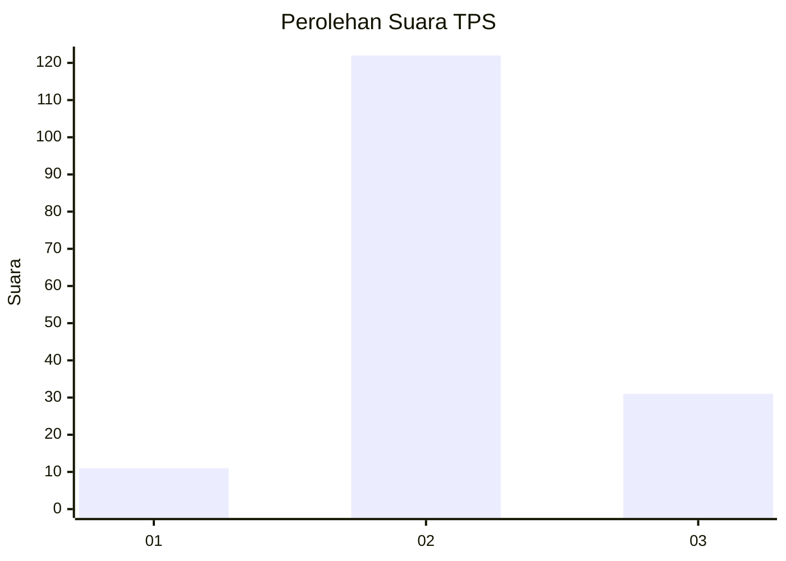
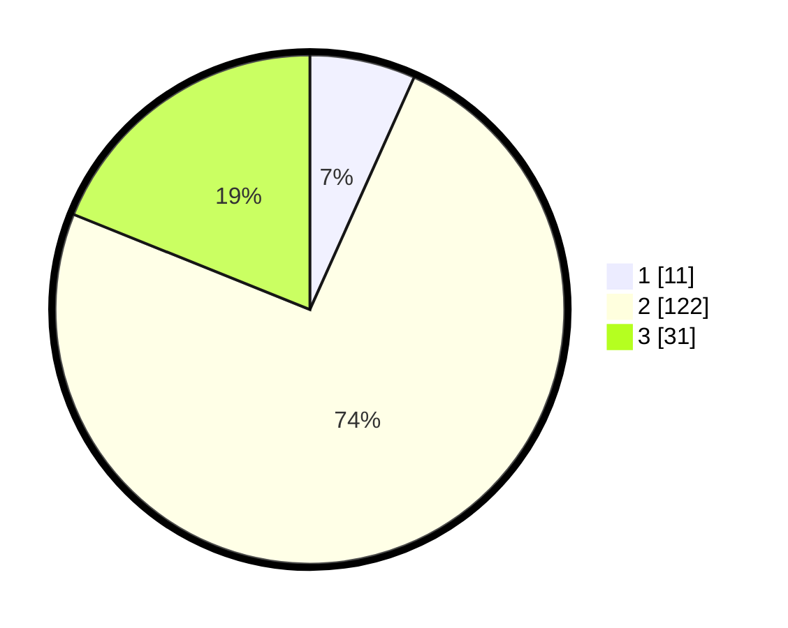

# Hasil

## Grafik

## Tabel

| No. | Nama Paslon    | Suara | Suara (raw) | Persentase |
|:--- |:-------------- | -----:| -----------:| ----------:|
| 1   | ANIES MUHAIMIN | 11    | [11][p-1]   | 6,71       |
| 2   | PRABOWO GIBRAN | 122   | [122][p-2]  | 74,39      |
| 3   | GANJAR MAHFUD  | 31    | [31][p-3]   | 18,90      |

[p-1]: https://github.com/gigit-pemilu/pemilu-2024-35-jawa-timur/blob/main/pilpres/hitung-suara/sub/35-jawa-timur/sub/10-banyuwangi/sub/08-srono/sub/2003-sukonatar/sub/004-tps/sub/paslon-1.txt
[p-2]: https://github.com/gigit-pemilu/pemilu-2024-35-jawa-timur/blob/main/pilpres/hitung-suara/sub/35-jawa-timur/sub/10-banyuwangi/sub/08-srono/sub/2003-sukonatar/sub/004-tps/sub/paslon-2.txt
[p-3]: https://github.com/gigit-pemilu/pemilu-2024-35-jawa-timur/blob/main/pilpres/hitung-suara/sub/35-jawa-timur/sub/10-banyuwangi/sub/08-srono/sub/2003-sukonatar/sub/004-tps/sub/paslon-3.txt

## Foto C Plano

https://sirekap-obj-formc.kpu.go.id/2b8e/pemilu/ppwp/35/10/08/20/03/3510082003004-20240216-205839--c1862cb2-0b68-485e-b101-751d4269694d.jpg

https://sirekap-obj-formc.kpu.go.id/2b8e/pemilu/ppwp/35/10/08/20/03/3510082003004-20240216-205348--6aaf2217-f0dc-4763-a7d1-852a464b49d3.jpg

https://sirekap-obj-formc.kpu.go.id/2b8e/pemilu/ppwp/35/10/08/20/03/3510082003004-20240216-205446--a9e7c4ba-98b8-4646-b51f-d7397fb1b660.jpg

## Metadata

| Key        | Value               |
| ---------- | ------------------- |
| Time Stamp | 2024-02-21 16:00:00 |

