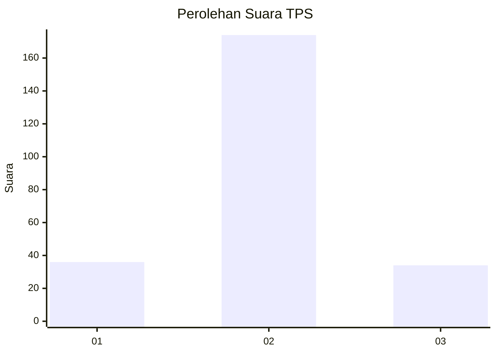

# Hasil

## Grafik

## Tabel

| No. | Nama Paslon    | Suara | Suara (raw) | Persentase |
|:--- |:-------------- | -----:| -----------:| ----------:|
| 1   | ANIES MUHAIMIN | 36    | [36][p-1]   | 14,75      |
| 2   | PRABOWO GIBRAN | 174   | [174][p-2]  | 71,31      |
| 3   | GANJAR MAHFUD  | 34    | [34][p-3]   | 13,93      |

[p-1]: https://github.com/gigit-pemilu/pemilu-2024-35-jawa-timur/blob/main/pilpres/hitung-suara/sub/35-jawa-timur/sub/10-banyuwangi/sub/08-srono/sub/2005-sumbersari/sub/003-tps/sub/paslon-1.txt
[p-2]: https://github.com/gigit-pemilu/pemilu-2024-35-jawa-timur/blob/main/pilpres/hitung-suara/sub/35-jawa-timur/sub/10-banyuwangi/sub/08-srono/sub/2005-sumbersari/sub/003-tps/sub/paslon-2.txt
[p-3]: https://github.com/gigit-pemilu/pemilu-2024-35-jawa-timur/blob/main/pilpres/hitung-suara/sub/35-jawa-timur/sub/10-banyuwangi/sub/08-srono/sub/2005-sumbersari/sub/003-tps/sub/paslon-3.txt

## Foto C Plano

https://sirekap-obj-formc.kpu.go.id/d77d/pemilu/ppwp/35/10/08/20/05/3510082005003-20240215-030822--895ab8c1-5b4b-4c04-8048-fa04db7bc242.jpg

https://sirekap-obj-formc.kpu.go.id/d77d/pemilu/ppwp/35/10/08/20/05/3510082005003-20240215-030903--7592c807-ab46-4032-9686-f79e7263f20b.jpg

https://sirekap-obj-formc.kpu.go.id/d77d/pemilu/ppwp/35/10/08/20/05/3510082005003-20240215-031017--0759aea1-46f8-4e61-9f43-c2aa0bcae68b.jpg

## Metadata

| Key        | Value               |
| ---------- | ------------------- |
| Time Stamp | 2024-02-24 22:31:28 |

