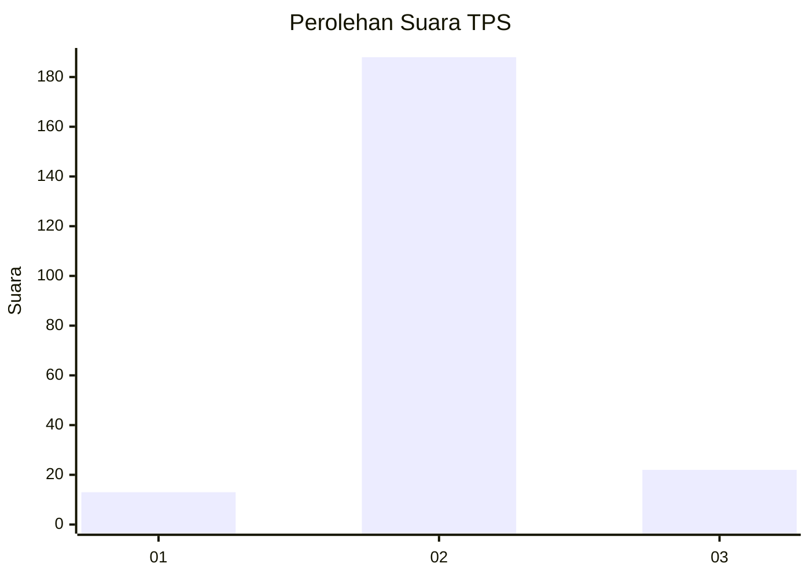
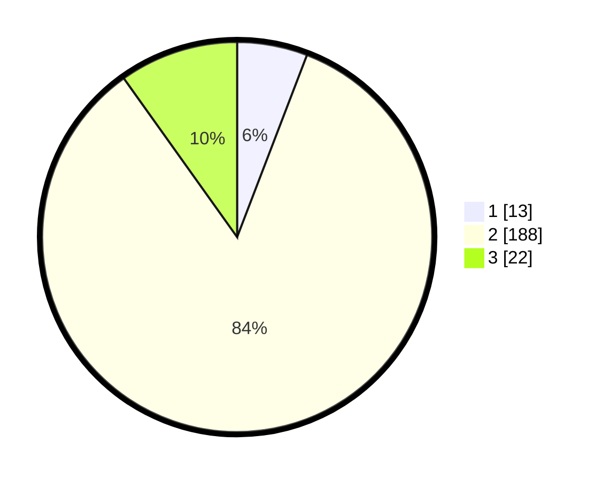

# Hasil

## Grafik

## Tabel

| No. | Nama Paslon    | Suara | Suara (raw) | Persentase |
|:--- |:-------------- | -----:| -----------:| ----------:|
| 1   | ANIES MUHAIMIN | 13    | [13][p-1]   | 5,83       |
| 2   | PRABOWO GIBRAN | 188   | [188][p-2]  | 84,30      |
| 3   | GANJAR MAHFUD  | 22    | [22][p-3]   | 9,87       |

[p-1]: https://github.com/gigit-pemilu/pemilu-2024/blob/main/pilpres/hitung-suara/sub/35-jawa-timur/sub/10-banyuwangi/sub/08-srono/sub/2005-sumbersari/sub/017-tps/sub/paslon-1.txt
[p-2]: https://github.com/gigit-pemilu/pemilu-2024/blob/main/pilpres/hitung-suara/sub/35-jawa-timur/sub/10-banyuwangi/sub/08-srono/sub/2005-sumbersari/sub/017-tps/sub/paslon-2.txt
[p-3]: https://github.com/gigit-pemilu/pemilu-2024/blob/main/pilpres/hitung-suara/sub/35-jawa-timur/sub/10-banyuwangi/sub/08-srono/sub/2005-sumbersari/sub/017-tps/sub/paslon-3.txt

## Foto C Plano

https://sirekap-obj-formc.kpu.go.id/057a/pemilu/ppwp/35/10/08/20/05/3510082005017-20240215-010727--c39b90b7-3178-48d2-9679-756e5a574268.jpg

https://sirekap-obj-formc.kpu.go.id/057a/pemilu/ppwp/35/10/08/20/05/3510082005017-20240215-010938--b8110218-aa84-4087-99a4-c1ea3cc4cb7b.jpg

https://sirekap-obj-formc.kpu.go.id/057a/pemilu/ppwp/35/10/08/20/05/3510082005017-20240215-051401--8b82a55f-28a2-40a1-9d2d-c505360bee4e.jpg

## Metadata

| Key        | Value               |
| ---------- | ------------------- |
| Time Stamp | 2024-02-24 22:31:28 |

