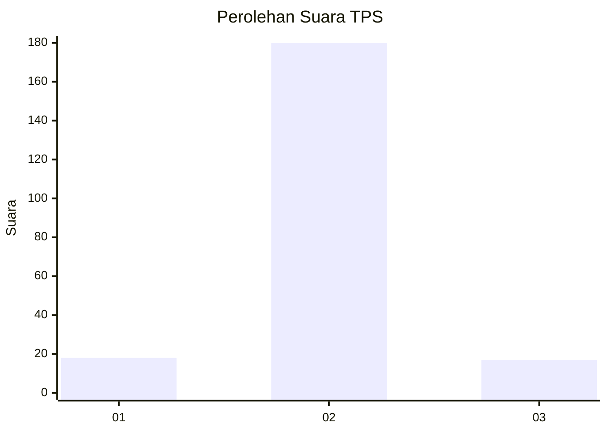
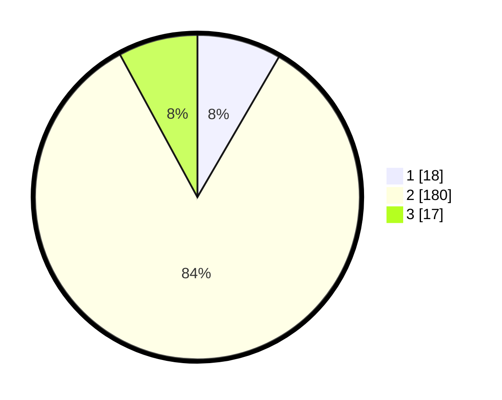

# Hasil

## Grafik

## Tabel

| No. | Nama Paslon    | Suara | Suara (raw) | Persentase |
|:--- |:-------------- | -----:| -----------:| ----------:|
| 1   | ANIES MUHAIMIN | 18    | [18][p-1]   | 8,37       |
| 2   | PRABOWO GIBRAN | 180   | [180][p-2]  | 83,72      |
| 3   | GANJAR MAHFUD  | 17    | [17][p-3]   | 7,91       |

[p-1]: https://github.com/gigit-pemilu/pemilu-2024-35-jawa-timur/blob/main/pilpres/hitung-suara/sub/35-jawa-timur/sub/10-banyuwangi/sub/08-srono/sub/2005-sumbersari/sub/020-tps/sub/paslon-1.txt
[p-2]: https://github.com/gigit-pemilu/pemilu-2024-35-jawa-timur/blob/main/pilpres/hitung-suara/sub/35-jawa-timur/sub/10-banyuwangi/sub/08-srono/sub/2005-sumbersari/sub/020-tps/sub/paslon-2.txt
[p-3]: https://github.com/gigit-pemilu/pemilu-2024-35-jawa-timur/blob/main/pilpres/hitung-suara/sub/35-jawa-timur/sub/10-banyuwangi/sub/08-srono/sub/2005-sumbersari/sub/020-tps/sub/paslon-3.txt

## Foto C Plano

https://sirekap-obj-formc.kpu.go.id/08eb/pemilu/ppwp/35/10/08/20/05/3510082005020-20240214-212301--698d744b-803a-479e-a8a3-5443ea70df19.jpg

https://sirekap-obj-formc.kpu.go.id/08eb/pemilu/ppwp/35/10/08/20/05/3510082005020-20240214-212314--bbf70aa8-9d22-4524-89fa-31b3d3aad818.jpg

https://sirekap-obj-formc.kpu.go.id/08eb/pemilu/ppwp/35/10/08/20/05/3510082005020-20240214-212320--8fe9b0c6-296b-4ab2-bb66-a16bbf1935a7.jpg

## Metadata

| Key        | Value               |
| ---------- | ------------------- |
| Time Stamp | 2024-02-24 22:31:28 |

