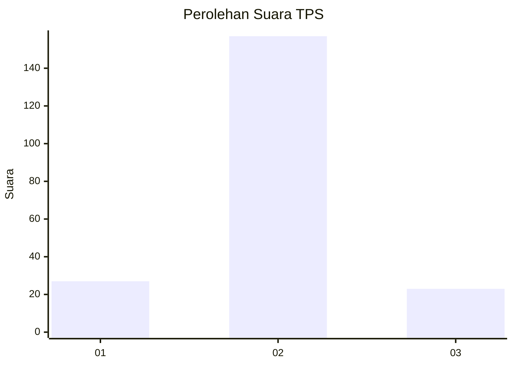
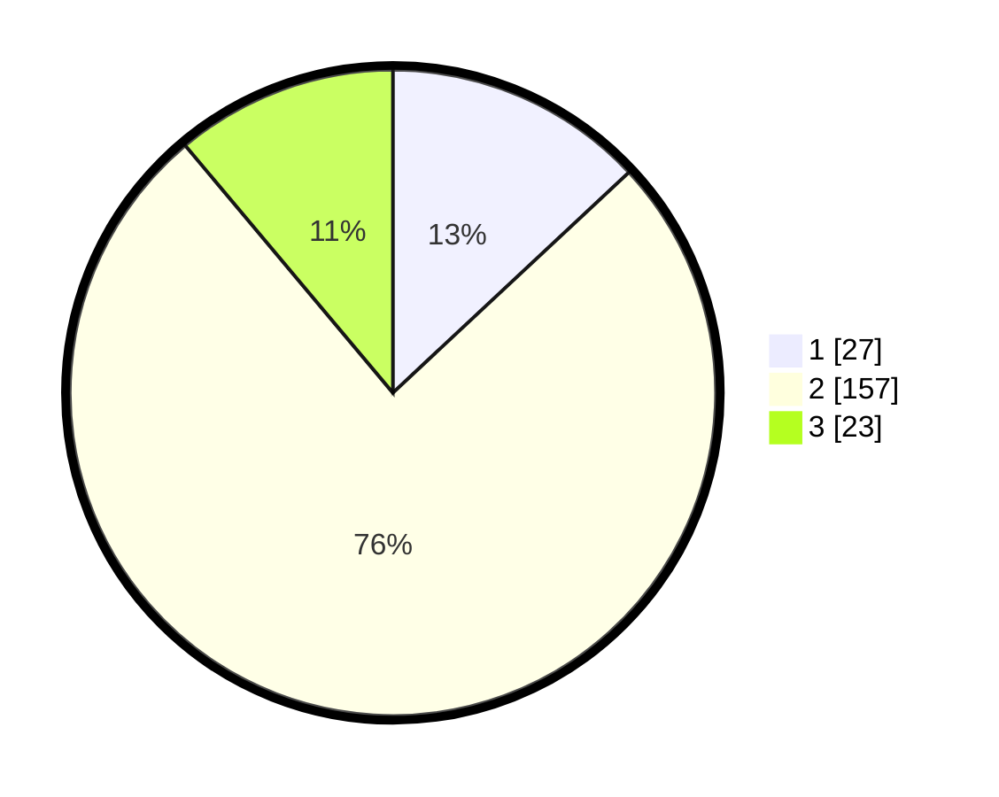

# Hasil

## Grafik

## Tabel

| No. | Nama Paslon    | Suara | Suara (raw) | Persentase |
|:--- |:-------------- | -----:| -----------:| ----------:|
| 1   | ANIES MUHAIMIN | 27    | [27][p-1]   | 13,04      |
| 2   | PRABOWO GIBRAN | 157   | [157][p-2]  | 75,85      |
| 3   | GANJAR MAHFUD  | 23    | [23][p-3]   | 11,11      |

[p-1]: https://github.com/gigit-pemilu/pemilu-2024/blob/main/pilpres/hitung-suara/sub/35-jawa-timur/sub/10-banyuwangi/sub/08-srono/sub/2007-parijatah-kulon/sub/007-tps/sub/paslon-1.txt
[p-2]: https://github.com/gigit-pemilu/pemilu-2024/blob/main/pilpres/hitung-suara/sub/35-jawa-timur/sub/10-banyuwangi/sub/08-srono/sub/2007-parijatah-kulon/sub/007-tps/sub/paslon-2.txt
[p-3]: https://github.com/gigit-pemilu/pemilu-2024/blob/main/pilpres/hitung-suara/sub/35-jawa-timur/sub/10-banyuwangi/sub/08-srono/sub/2007-parijatah-kulon/sub/007-tps/sub/paslon-3.txt

## Foto C Plano

https://sirekap-obj-formc.kpu.go.id/8bea/pemilu/ppwp/35/10/08/20/07/3510082007007-20240217-134348--11a1bf8d-b388-413f-8c48-a30691cb81a1.jpg

https://sirekap-obj-formc.kpu.go.id/8bea/pemilu/ppwp/35/10/08/20/07/3510082007007-20240217-134548--d816f91e-7e61-4ffd-bd70-c35b7769d1a0.jpg

https://sirekap-obj-formc.kpu.go.id/8bea/pemilu/ppwp/35/10/08/20/07/3510082007007-20240217-134745--e1c250f3-47fb-4c7a-88f7-a90749e1888f.jpg

## Metadata

| Key        | Value               |
| ---------- | ------------------- |
| Time Stamp | 2024-02-24 22:31:28 |

