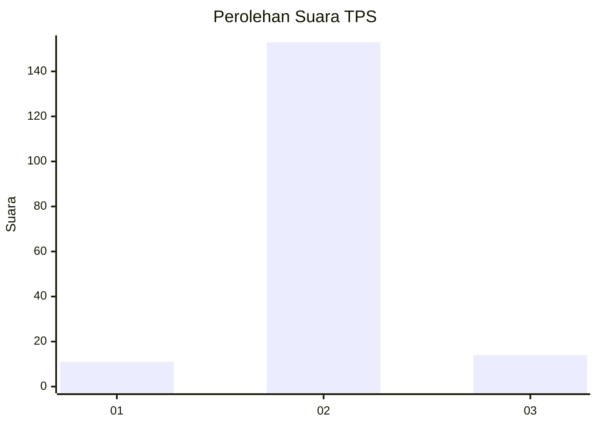
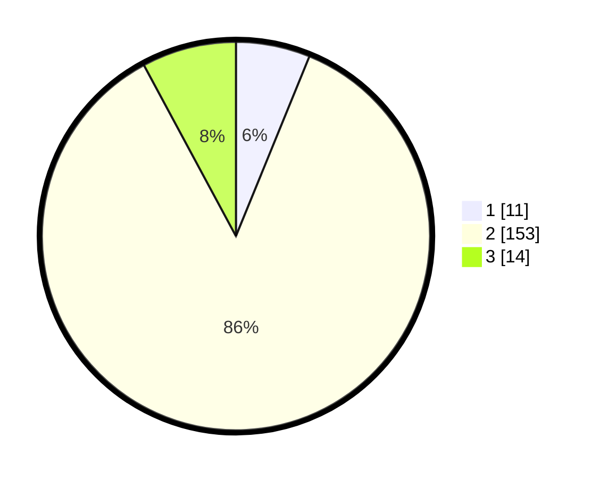

# Hasil

## Grafik

## Tabel

| No. | Nama Paslon    | Suara | Suara (raw) | Persentase |
|:--- |:-------------- | -----:| -----------:| ----------:|
| 1   | ANIES MUHAIMIN | 11    | [11][p-1]   | 6,18       |
| 2   | PRABOWO GIBRAN | 153   | [153][p-2]  | 85,96      |
| 3   | GANJAR MAHFUD  | 14    | [14][p-3]   | 7,87       |

[p-1]: https://github.com/gigit-pemilu/pemilu-2024/blob/main/pilpres/hitung-suara/sub/35-jawa-timur/sub/10-banyuwangi/sub/08-srono/sub/2007-parijatah-kulon/sub/018-tps/sub/paslon-1.txt
[p-2]: https://github.com/gigit-pemilu/pemilu-2024/blob/main/pilpres/hitung-suara/sub/35-jawa-timur/sub/10-banyuwangi/sub/08-srono/sub/2007-parijatah-kulon/sub/018-tps/sub/paslon-2.txt
[p-3]: https://github.com/gigit-pemilu/pemilu-2024/blob/main/pilpres/hitung-suara/sub/35-jawa-timur/sub/10-banyuwangi/sub/08-srono/sub/2007-parijatah-kulon/sub/018-tps/sub/paslon-3.txt

## Foto C Plano

https://sirekap-obj-formc.kpu.go.id/c247/pemilu/ppwp/35/10/08/20/07/3510082007018-20240217-194148--d49f3343-16d1-43c7-9165-d3aa165cc56e.jpg

https://sirekap-obj-formc.kpu.go.id/c247/pemilu/ppwp/35/10/08/20/07/3510082007018-20240217-193849--65ab6e22-ea72-46ec-9114-40176f977733.jpg

https://sirekap-obj-formc.kpu.go.id/c247/pemilu/ppwp/35/10/08/20/07/3510082007018-20240217-194335--059684dc-1fd2-4da8-afa9-aba40af028ae.jpg

## Metadata

| Key        | Value               |
| ---------- | ------------------- |
| Time Stamp | 2024-02-24 22:31:28 |

