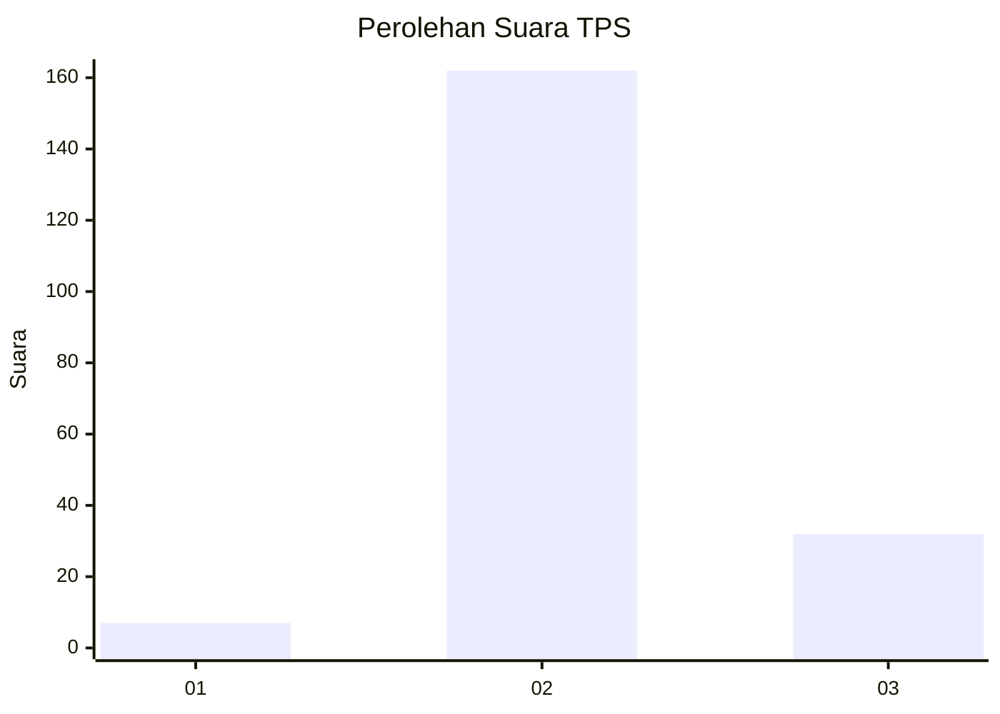
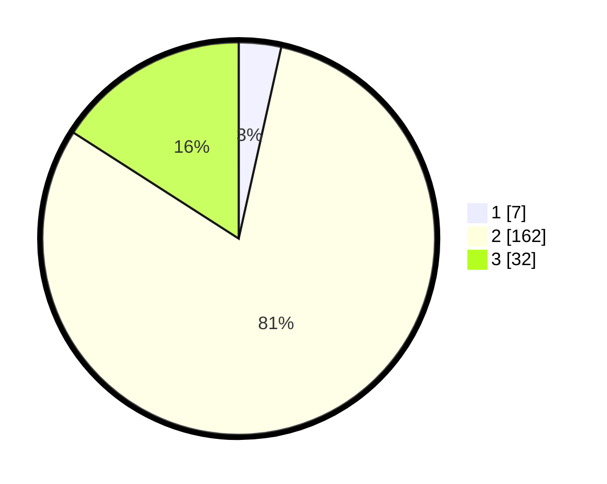

# Hasil

## Grafik

## Tabel

| No. | Nama Paslon    | Suara | Suara (raw) | Persentase |
|:--- |:-------------- | -----:| -----------:| ----------:|
| 1   | ANIES MUHAIMIN | 7     | [7][p-1]    | 3,48       |
| 2   | PRABOWO GIBRAN | 162   | [162][p-2]  | 80,60      |
| 3   | GANJAR MAHFUD  | 32    | [32][p-3]   | 15,92      |

[p-1]: https://github.com/gigit-pemilu/pemilu-2024/blob/main/pilpres/hitung-suara/sub/35-jawa-timur/sub/10-banyuwangi/sub/09-genteng/sub/2001-kembiritan/sub/003-tps/sub/paslon-1.txt
[p-2]: https://github.com/gigit-pemilu/pemilu-2024/blob/main/pilpres/hitung-suara/sub/35-jawa-timur/sub/10-banyuwangi/sub/09-genteng/sub/2001-kembiritan/sub/003-tps/sub/paslon-2.txt
[p-3]: https://github.com/gigit-pemilu/pemilu-2024/blob/main/pilpres/hitung-suara/sub/35-jawa-timur/sub/10-banyuwangi/sub/09-genteng/sub/2001-kembiritan/sub/003-tps/sub/paslon-3.txt

## Foto C Plano

https://sirekap-obj-formc.kpu.go.id/082b/pemilu/ppwp/35/10/09/20/01/3510092001003-20240218-101055--56c8b6e0-6256-46fe-bef9-fa72e8d46c80.jpg

https://sirekap-obj-formc.kpu.go.id/082b/pemilu/ppwp/35/10/09/20/01/3510092001003-20240214-193413--16bf2030-8a36-4686-954f-dcd7649aae1d.jpg

https://sirekap-obj-formc.kpu.go.id/082b/pemilu/ppwp/35/10/09/20/01/3510092001003-20240214-190331--da5e6b90-f1a3-4d06-8d80-4af942aa362f.jpg

## Metadata

| Key        | Value               |
| ---------- | ------------------- |
| Time Stamp | 2024-02-19 06:16:00 |

