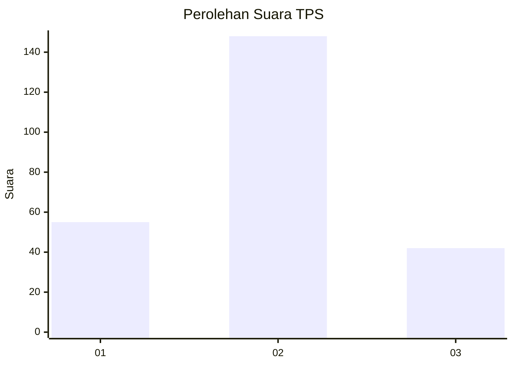

# Hasil

## Grafik

## Tabel

| No. | Nama Paslon    | Suara | Suara (raw) | Persentase |
|:--- |:-------------- | -----:| -----------:| ----------:|
| 1   | ANIES MUHAIMIN | 55    | [55][p-1]   | 22,45      |
| 2   | PRABOWO GIBRAN | 148   | [148][p-2]  | 60,41      |
| 3   | GANJAR MAHFUD  | 42    | [42][p-3]   | 17,14      |

[p-1]: https://github.com/gigit-pemilu/pemilu-2024-35-jawa-timur/blob/main/pilpres/hitung-suara/sub/35-jawa-timur/sub/10-banyuwangi/sub/09-genteng/sub/2003-genteng-kulon/sub/043-tps/sub/paslon-1.txt
[p-2]: https://github.com/gigit-pemilu/pemilu-2024-35-jawa-timur/blob/main/pilpres/hitung-suara/sub/35-jawa-timur/sub/10-banyuwangi/sub/09-genteng/sub/2003-genteng-kulon/sub/043-tps/sub/paslon-2.txt
[p-3]: https://github.com/gigit-pemilu/pemilu-2024-35-jawa-timur/blob/main/pilpres/hitung-suara/sub/35-jawa-timur/sub/10-banyuwangi/sub/09-genteng/sub/2003-genteng-kulon/sub/043-tps/sub/paslon-3.txt

## Foto C Plano

https://sirekap-obj-formc.kpu.go.id/ddb6/pemilu/ppwp/35/10/09/20/03/3510092003043-20240214-213808--7e67eefe-49be-4dac-8c70-db492f1cc24a.jpg

https://sirekap-obj-formc.kpu.go.id/ddb6/pemilu/ppwp/35/10/09/20/03/3510092003043-20240214-213925--273b5d44-f42a-443f-b087-cbed68e2607f.jpg

https://sirekap-obj-formc.kpu.go.id/ddb6/pemilu/ppwp/35/10/09/20/03/3510092003043-20240214-214101--72f15501-8d17-4c63-901f-8532f1e59475.jpg

## Metadata

| Key        | Value               |
| ---------- | ------------------- |
| Time Stamp | 2024-02-24 22:31:28 |

