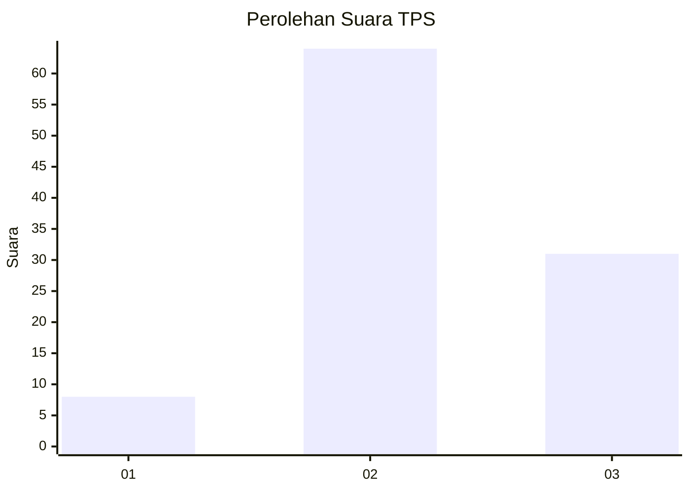
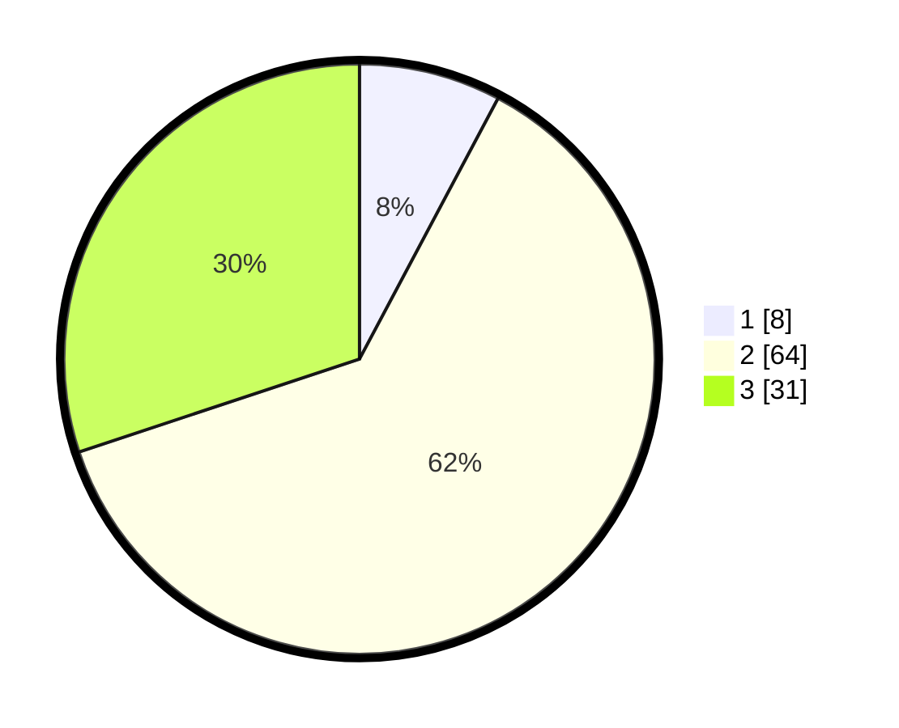

# Hasil

## Grafik

## Tabel

| No. | Nama Paslon    | Suara | Suara (raw) | Persentase |
|:--- |:-------------- | -----:| -----------:| ----------:|
| 1   | ANIES MUHAIMIN | 8     | [8][p-1]    | 7,77       |
| 2   | PRABOWO GIBRAN | 64    | [64][p-2]   | 62,14      |
| 3   | GANJAR MAHFUD  | 31    | [31][p-3]   | 30,10      |

[p-1]: https://github.com/gigit-pemilu/pemilu-2024/blob/main/pilpres/hitung-suara/sub/35-jawa-timur/sub/10-banyuwangi/sub/09-genteng/sub/2004-setail/sub/005-tps/sub/paslon-1.txt
[p-2]: https://github.com/gigit-pemilu/pemilu-2024/blob/main/pilpres/hitung-suara/sub/35-jawa-timur/sub/10-banyuwangi/sub/09-genteng/sub/2004-setail/sub/005-tps/sub/paslon-2.txt
[p-3]: https://github.com/gigit-pemilu/pemilu-2024/blob/main/pilpres/hitung-suara/sub/35-jawa-timur/sub/10-banyuwangi/sub/09-genteng/sub/2004-setail/sub/005-tps/sub/paslon-3.txt

## Foto C Plano

https://sirekap-obj-formc.kpu.go.id/f449/pemilu/ppwp/35/10/09/20/04/3510092004005-20240222-133525--46d09c6d-0af8-48f9-ba10-2d98f6797be6.jpg

https://sirekap-obj-formc.kpu.go.id/f449/pemilu/ppwp/35/10/09/20/04/3510092004005-20240222-133922--41888231-79e0-4d98-93cf-19ff58dd3ab6.jpg

https://sirekap-obj-formc.kpu.go.id/f449/pemilu/ppwp/35/10/09/20/04/3510092004005-20240222-134327--7558264e-e7fc-407d-a0db-f3706134f59e.jpg

## Metadata

| Key        | Value               |
| ---------- | ------------------- |
| Time Stamp | 2024-02-24 22:31:28 |

