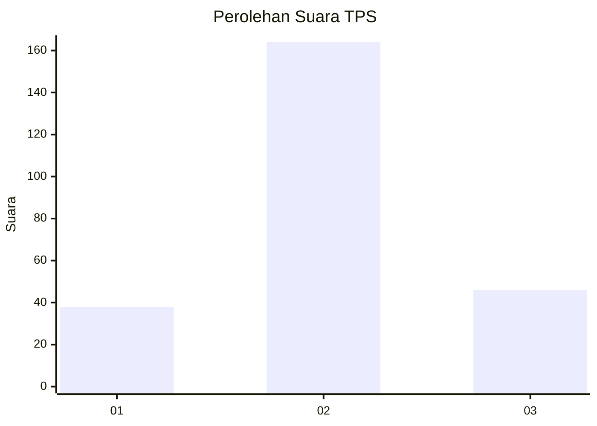
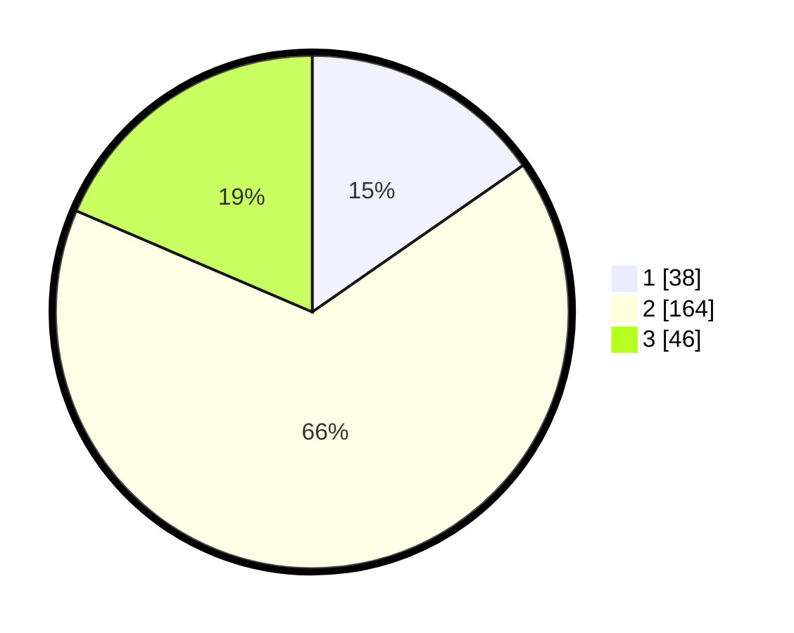

# Hasil

## Grafik

## Tabel

| No. | Nama Paslon    | Suara | Suara (raw) | Persentase |
|:--- |:-------------- | -----:| -----------:| ----------:|
| 1   | ANIES MUHAIMIN | 38    | [38][p-1]   | 15,32      |
| 2   | PRABOWO GIBRAN | 164   | [164][p-2]  | 66,13      |
| 3   | GANJAR MAHFUD  | 46    | [46][p-3]   | 18,55      |

[p-1]: https://github.com/gigit-pemilu/pemilu-2024-35-jawa-timur/blob/main/pilpres/hitung-suara/sub/35-jawa-timur/sub/10-banyuwangi/sub/09-genteng/sub/2004-setail/sub/015-tps/sub/paslon-1.txt
[p-2]: https://github.com/gigit-pemilu/pemilu-2024-35-jawa-timur/blob/main/pilpres/hitung-suara/sub/35-jawa-timur/sub/10-banyuwangi/sub/09-genteng/sub/2004-setail/sub/015-tps/sub/paslon-2.txt
[p-3]: https://github.com/gigit-pemilu/pemilu-2024-35-jawa-timur/blob/main/pilpres/hitung-suara/sub/35-jawa-timur/sub/10-banyuwangi/sub/09-genteng/sub/2004-setail/sub/015-tps/sub/paslon-3.txt

## Foto C Plano

https://sirekap-obj-formc.kpu.go.id/8e2e/pemilu/ppwp/35/10/09/20/04/3510092004015-20240222-163007--41d18b6a-8287-4b81-afc9-05cd8ec7dd5c.jpg

https://sirekap-obj-formc.kpu.go.id/8e2e/pemilu/ppwp/35/10/09/20/04/3510092004015-20240222-163111--27256730-bacf-4616-9957-07ccd437e837.jpg

https://sirekap-obj-formc.kpu.go.id/8e2e/pemilu/ppwp/35/10/09/20/04/3510092004015-20240222-163226--0c38188d-fa42-468f-bf0f-92235b69a611.jpg

## Metadata

| Key        | Value               |
| ---------- | ------------------- |
| Time Stamp | 2024-02-24 22:31:28 |

