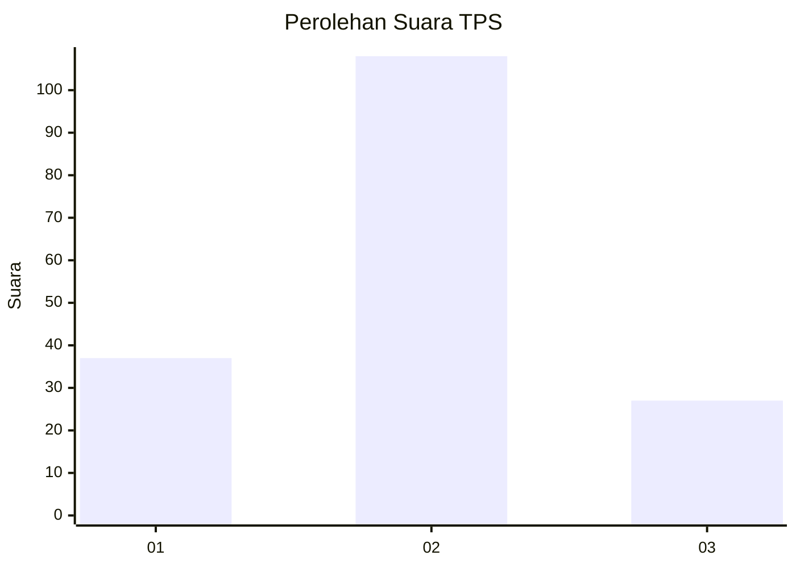
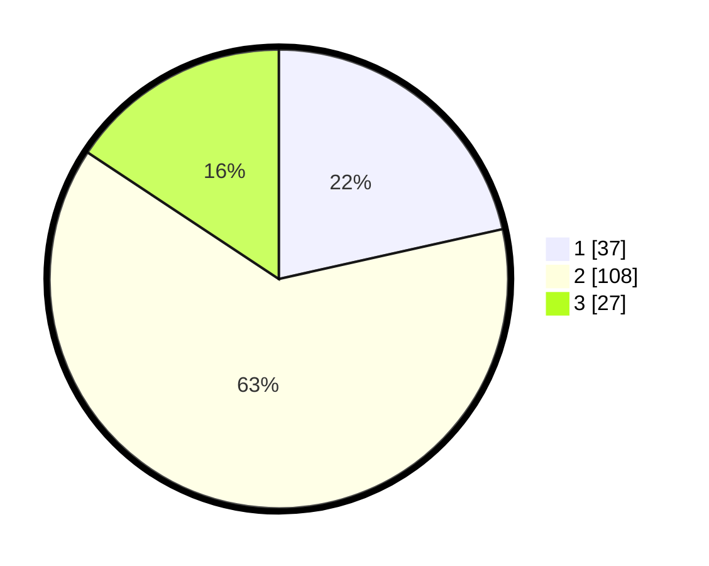

# Hasil

## Grafik

## Tabel

| No. | Nama Paslon    | Suara | Suara (raw) | Persentase |
|:--- |:-------------- | -----:| -----------:| ----------:|
| 1   | ANIES MUHAIMIN | 37    | [37][p-1]   | 21,51      |
| 2   | PRABOWO GIBRAN | 108   | [108][p-2]  | 62,79      |
| 3   | GANJAR MAHFUD  | 27    | [27][p-3]   | 15,70      |

[p-1]: https://github.com/gigit-pemilu/pemilu-2024/blob/main/pilpres/hitung-suara/sub/35-jawa-timur/sub/10-banyuwangi/sub/09-genteng/sub/2004-setail/sub/026-tps/sub/paslon-1.txt
[p-2]: https://github.com/gigit-pemilu/pemilu-2024/blob/main/pilpres/hitung-suara/sub/35-jawa-timur/sub/10-banyuwangi/sub/09-genteng/sub/2004-setail/sub/026-tps/sub/paslon-2.txt
[p-3]: https://github.com/gigit-pemilu/pemilu-2024/blob/main/pilpres/hitung-suara/sub/35-jawa-timur/sub/10-banyuwangi/sub/09-genteng/sub/2004-setail/sub/026-tps/sub/paslon-3.txt

## Foto C Plano

https://sirekap-obj-formc.kpu.go.id/c50b/pemilu/ppwp/35/10/09/20/04/3510092004026-20240214-221922--b3943228-2493-46c5-99ec-1aed3f75c4f8.jpg

https://sirekap-obj-formc.kpu.go.id/c50b/pemilu/ppwp/35/10/09/20/04/3510092004026-20240214-222118--52ca7989-43af-45eb-98c0-db10d6c6eb59.jpg

https://sirekap-obj-formc.kpu.go.id/c50b/pemilu/ppwp/35/10/09/20/04/3510092004026-20240214-222241--289f51f2-52dd-4290-a0a7-6b087aa222ef.jpg

## Metadata

| Key        | Value               |
| ---------- | ------------------- |
| Time Stamp | 2024-02-24 22:31:28 |

