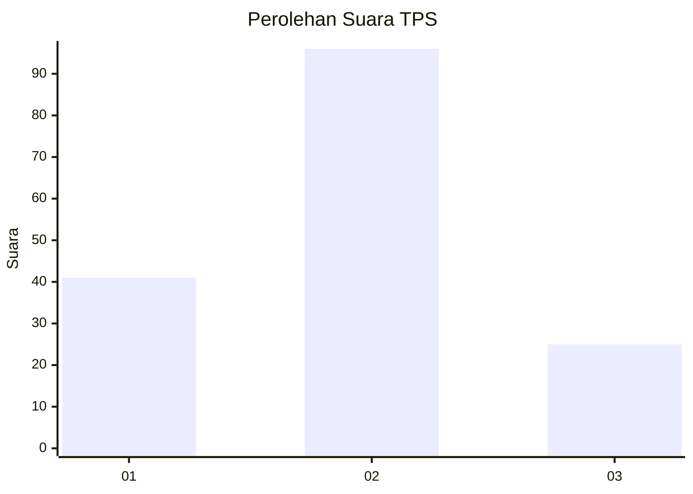
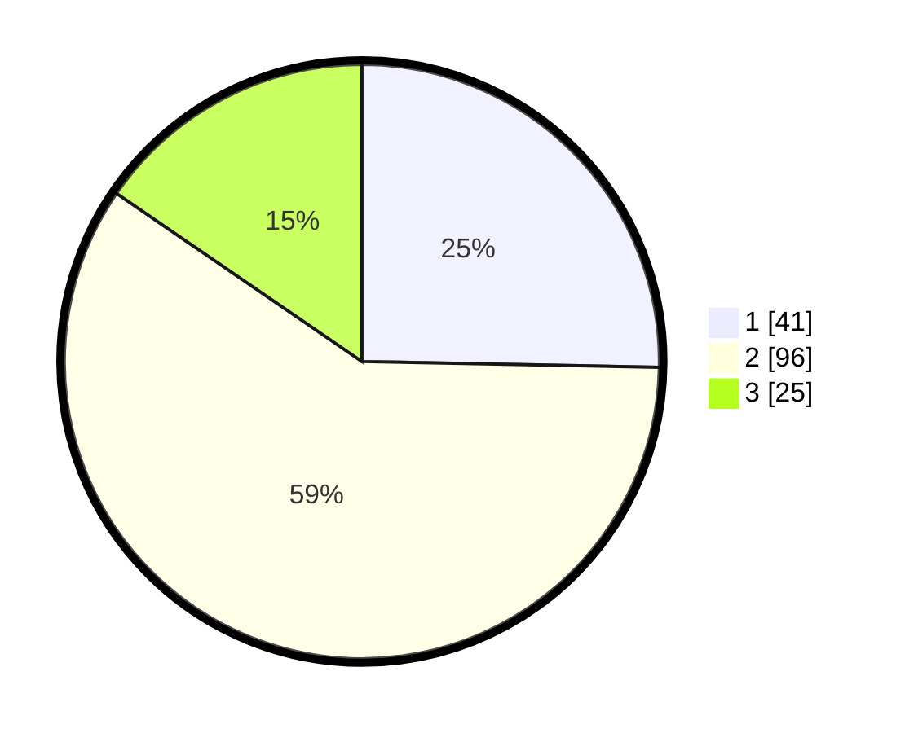

# Hasil

## Grafik

## Tabel

| No. | Nama Paslon    | Suara | Suara (raw) | Persentase |
|:--- |:-------------- | -----:| -----------:| ----------:|
| 1   | ANIES MUHAIMIN | 41    | [41][p-1]   | 25,31      |
| 2   | PRABOWO GIBRAN | 96    | [96][p-2]   | 59,26      |
| 3   | GANJAR MAHFUD  | 25    | [25][p-3]   | 15,43      |

[p-1]: https://github.com/gigit-pemilu/pemilu-2024-35-jawa-timur/blob/main/pilpres/hitung-suara/sub/35-jawa-timur/sub/10-banyuwangi/sub/09-genteng/sub/2004-setail/sub/038-tps/sub/paslon-1.txt
[p-2]: https://github.com/gigit-pemilu/pemilu-2024-35-jawa-timur/blob/main/pilpres/hitung-suara/sub/35-jawa-timur/sub/10-banyuwangi/sub/09-genteng/sub/2004-setail/sub/038-tps/sub/paslon-2.txt
[p-3]: https://github.com/gigit-pemilu/pemilu-2024-35-jawa-timur/blob/main/pilpres/hitung-suara/sub/35-jawa-timur/sub/10-banyuwangi/sub/09-genteng/sub/2004-setail/sub/038-tps/sub/paslon-3.txt

## Foto C Plano

https://sirekap-obj-formc.kpu.go.id/b492/pemilu/ppwp/35/10/09/20/04/3510092004038-20240220-121058--584df7ae-ab3a-450a-928e-0ca47adc8a52.jpg

https://sirekap-obj-formc.kpu.go.id/b492/pemilu/ppwp/35/10/09/20/04/3510092004038-20240220-121122--41b7e0d3-baf3-43d2-91a8-79116da74c20.jpg

https://sirekap-obj-formc.kpu.go.id/b492/pemilu/ppwp/35/10/09/20/04/3510092004038-20240220-121206--afd052eb-0ff2-4cb8-baca-56bc46b22452.jpg

## Metadata

| Key        | Value               |
| ---------- | ------------------- |
| Time Stamp | 2024-02-20 13:00:00 |

