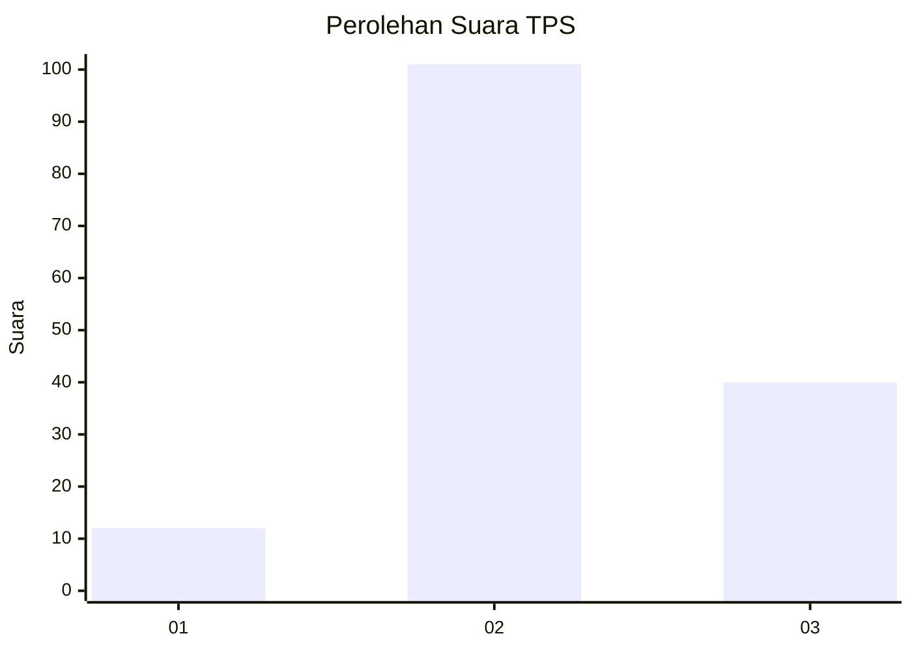
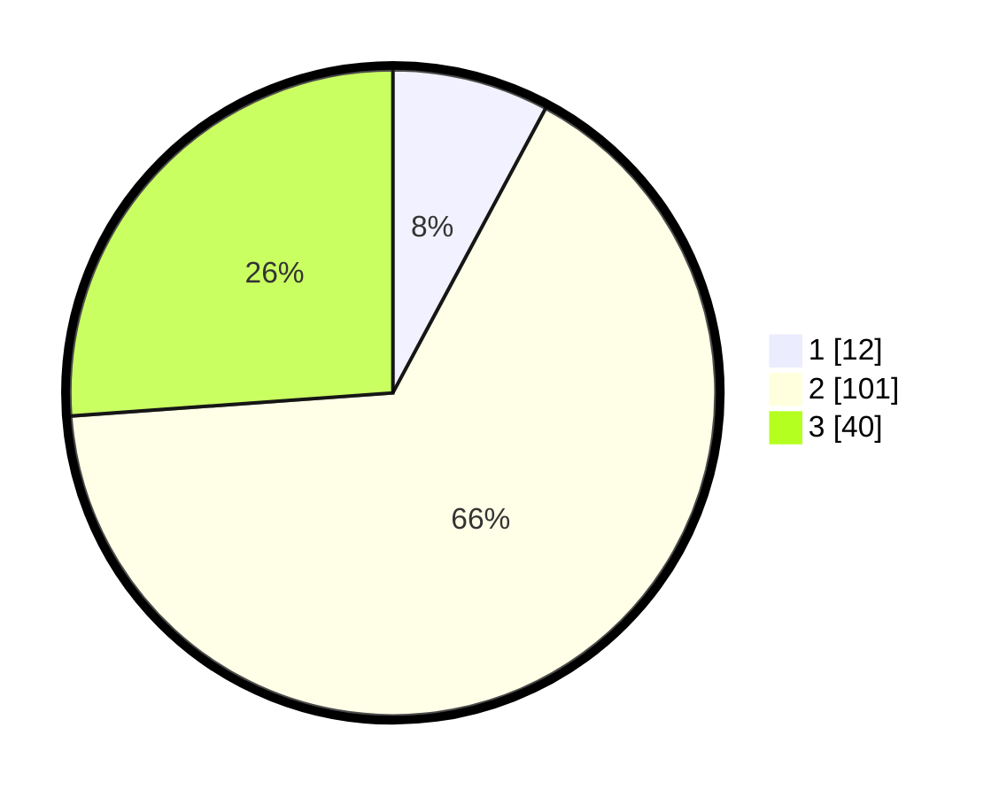

# Hasil

## Grafik

## Tabel

| No. | Nama Paslon    | Suara | Suara (raw) | Persentase |
|:--- |:-------------- | -----:| -----------:| ----------:|
| 1   | ANIES MUHAIMIN | 12    | [12][p-1]   | 7,84       |
| 2   | PRABOWO GIBRAN | 101   | [101][p-2]  | 66,01      |
| 3   | GANJAR MAHFUD  | 40    | [40][p-3]   | 26,14      |

[p-1]: https://github.com/gigit-pemilu/pemilu-2024-35-jawa-timur/blob/main/pilpres/hitung-suara/sub/35-jawa-timur/sub/10-banyuwangi/sub/09-genteng/sub/2004-setail/sub/049-tps/sub/paslon-1.txt
[p-2]: https://github.com/gigit-pemilu/pemilu-2024-35-jawa-timur/blob/main/pilpres/hitung-suara/sub/35-jawa-timur/sub/10-banyuwangi/sub/09-genteng/sub/2004-setail/sub/049-tps/sub/paslon-2.txt
[p-3]: https://github.com/gigit-pemilu/pemilu-2024-35-jawa-timur/blob/main/pilpres/hitung-suara/sub/35-jawa-timur/sub/10-banyuwangi/sub/09-genteng/sub/2004-setail/sub/049-tps/sub/paslon-3.txt

## Foto C Plano

https://sirekap-obj-formc.kpu.go.id/62f0/pemilu/ppwp/35/10/09/20/04/3510092004049-20240215-013809--a3d09f6f-a5b8-4434-a40e-76eee52214a9.jpg

https://sirekap-obj-formc.kpu.go.id/62f0/pemilu/ppwp/35/10/09/20/04/3510092004049-20240215-013905--f2cc1eae-81f3-4eea-a116-d544b0e80439.jpg

https://sirekap-obj-formc.kpu.go.id/62f0/pemilu/ppwp/35/10/09/20/04/3510092004049-20240215-014036--a5774f05-6e6a-485a-aa2d-63b24ef12ec3.jpg

## Metadata

| Key        | Value               |
| ---------- | ------------------- |
| Time Stamp | 2024-02-24 22:31:28 |

