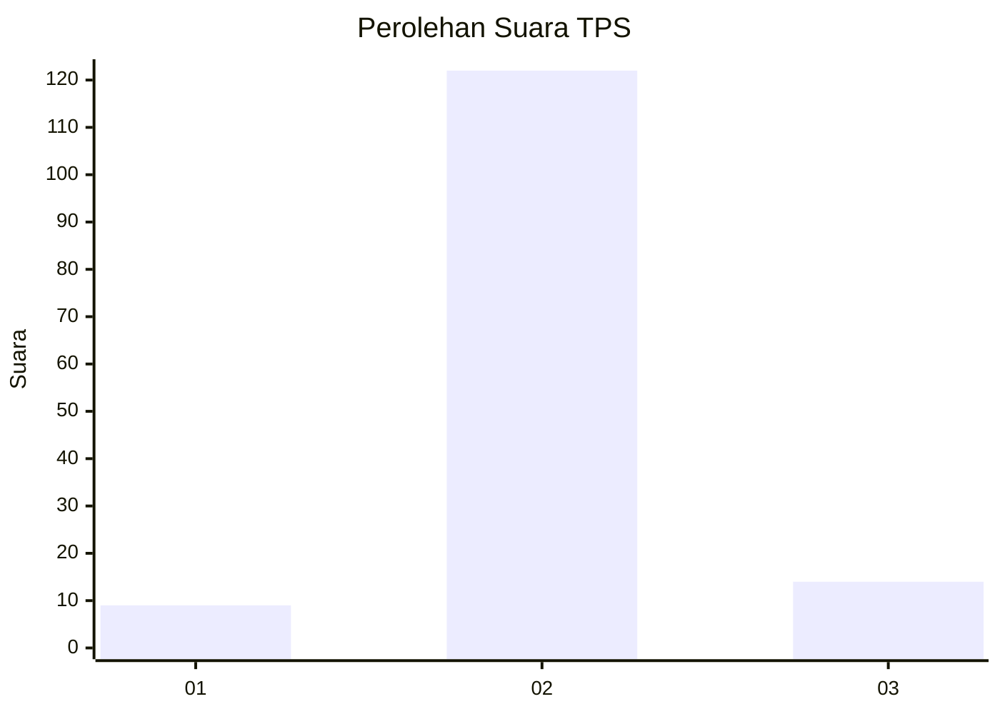
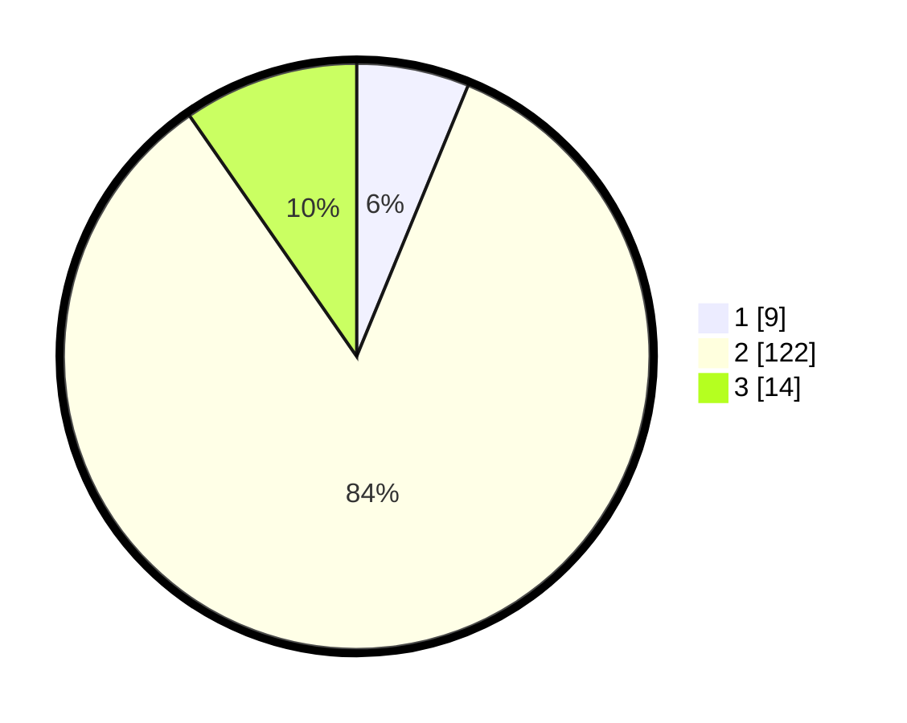

# Hasil

## Grafik

## Tabel

| No. | Nama Paslon    | Suara | Suara (raw) | Persentase |
|:--- |:-------------- | -----:| -----------:| ----------:|
| 1   | ANIES MUHAIMIN | 9     | [9][p-1]    | 6,21       |
| 2   | PRABOWO GIBRAN | 122   | [122][p-2]  | 84,14      |
| 3   | GANJAR MAHFUD  | 14    | [14][p-3]   | 9,66       |

[p-1]: https://github.com/gigit-pemilu/pemilu-2024-35-jawa-timur/blob/main/pilpres/hitung-suara/sub/35-jawa-timur/sub/10-banyuwangi/sub/09-genteng/sub/2005-kaligondo/sub/001-tps/sub/paslon-1.txt
[p-2]: https://github.com/gigit-pemilu/pemilu-2024-35-jawa-timur/blob/main/pilpres/hitung-suara/sub/35-jawa-timur/sub/10-banyuwangi/sub/09-genteng/sub/2005-kaligondo/sub/001-tps/sub/paslon-2.txt
[p-3]: https://github.com/gigit-pemilu/pemilu-2024-35-jawa-timur/blob/main/pilpres/hitung-suara/sub/35-jawa-timur/sub/10-banyuwangi/sub/09-genteng/sub/2005-kaligondo/sub/001-tps/sub/paslon-3.txt

## Foto C Plano

https://sirekap-obj-formc.kpu.go.id/424a/pemilu/ppwp/35/10/09/20/05/3510092005001-20240224-143340--8ef17567-cb74-4ab2-a2e6-3b81d5aef2ef.jpg

https://sirekap-obj-formc.kpu.go.id/424a/pemilu/ppwp/35/10/09/20/05/3510092005001-20240224-143508--170e2d58-40b0-451d-a66b-4db287792fba.jpg

https://sirekap-obj-formc.kpu.go.id/424a/pemilu/ppwp/35/10/09/20/05/3510092005001-20240224-143537--261865d0-04a8-454c-9c85-c5b003047d3e.jpg

## Metadata

| Key        | Value               |
| ---------- | ------------------- |
| Time Stamp | 2024-02-25 16:00:00 |

