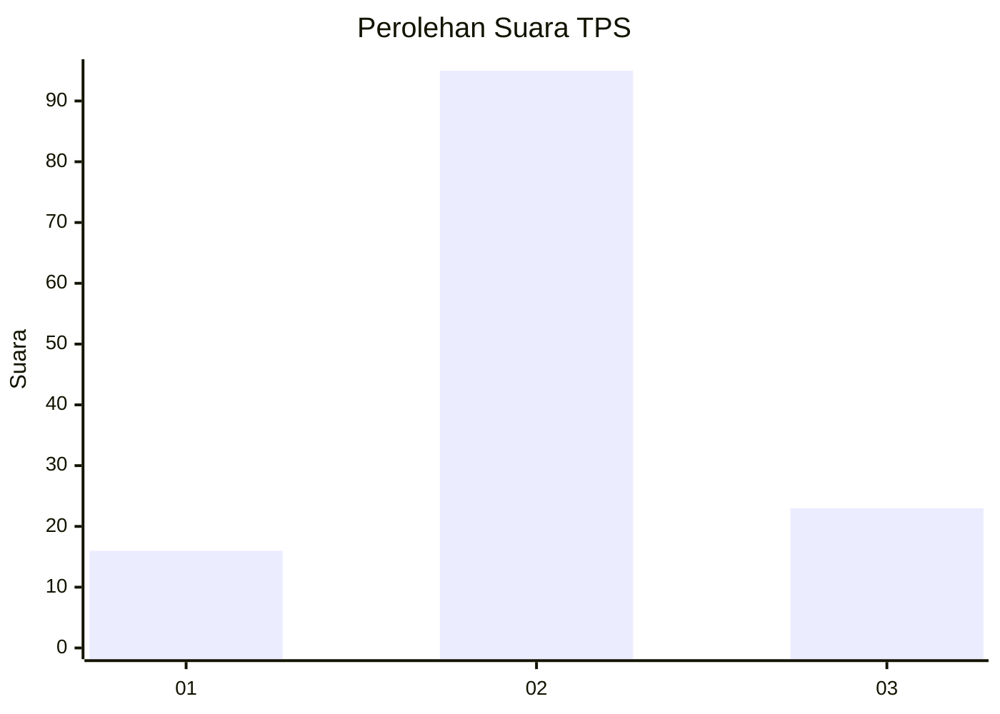
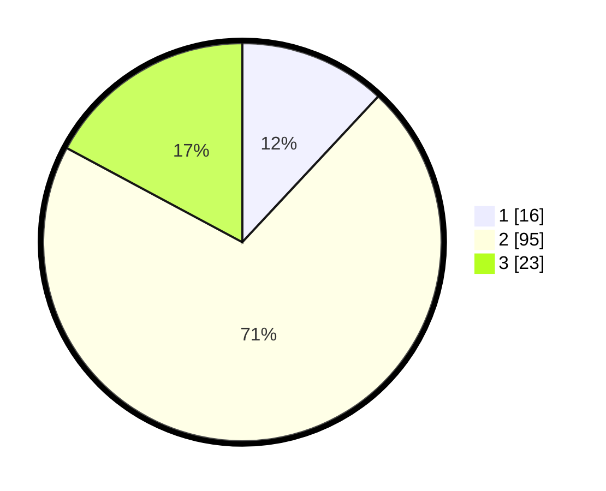

# Hasil

## Grafik

## Tabel

| No. | Nama Paslon    | Suara | Suara (raw) | Persentase |
|:--- |:-------------- | -----:| -----------:| ----------:|
| 1   | ANIES MUHAIMIN | 16    | [16][p-1]   | 11,94      |
| 2   | PRABOWO GIBRAN | 95    | [95][p-2]   | 70,90      |
| 3   | GANJAR MAHFUD  | 23    | [23][p-3]   | 17,16      |

[p-1]: https://github.com/gigit-pemilu/pemilu-2024/blob/main/pilpres/hitung-suara/sub/35-jawa-timur/sub/10-banyuwangi/sub/09-genteng/sub/2005-kaligondo/sub/002-tps/sub/paslon-1.txt
[p-2]: https://github.com/gigit-pemilu/pemilu-2024/blob/main/pilpres/hitung-suara/sub/35-jawa-timur/sub/10-banyuwangi/sub/09-genteng/sub/2005-kaligondo/sub/002-tps/sub/paslon-2.txt
[p-3]: https://github.com/gigit-pemilu/pemilu-2024/blob/main/pilpres/hitung-suara/sub/35-jawa-timur/sub/10-banyuwangi/sub/09-genteng/sub/2005-kaligondo/sub/002-tps/sub/paslon-3.txt

## Foto C Plano

https://sirekap-obj-formc.kpu.go.id/0bc7/pemilu/ppwp/35/10/09/20/05/3510092005002-20240219-211919--15a7dd01-153e-4279-84fd-f91ddfab820c.jpg

https://sirekap-obj-formc.kpu.go.id/0bc7/pemilu/ppwp/35/10/09/20/05/3510092005002-20240219-212017--93379c06-391a-4f3c-b51a-ba103eeda91a.jpg

https://sirekap-obj-formc.kpu.go.id/0bc7/pemilu/ppwp/35/10/09/20/05/3510092005002-20240219-212247--a431546f-439f-41fc-9be3-1d229644e710.jpg

## Metadata

| Key        | Value               |
| ---------- | ------------------- |
| Time Stamp | 2024-02-24 22:31:28 |

