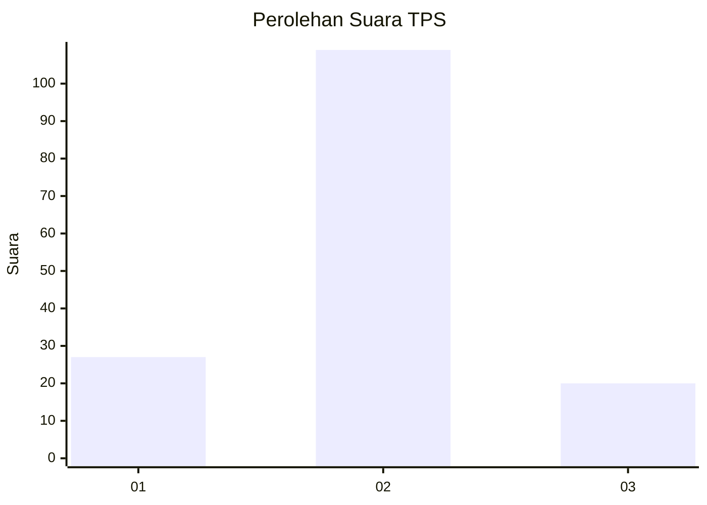
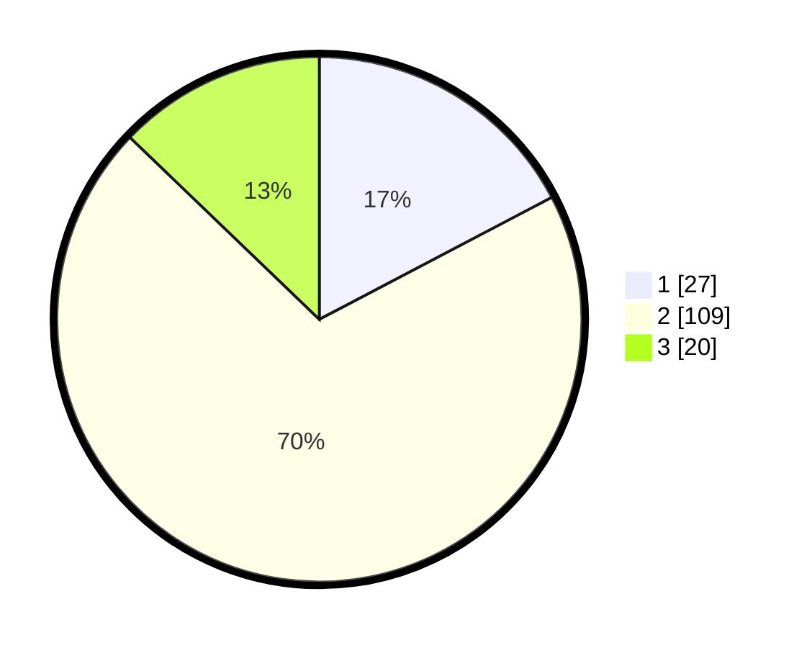

# Hasil

## Grafik

## Tabel

| No. | Nama Paslon    | Suara | Suara (raw) | Persentase |
|:--- |:-------------- | -----:| -----------:| ----------:|
| 1   | ANIES MUHAIMIN | 27    | [27][p-1]   | 17,31      |
| 2   | PRABOWO GIBRAN | 109   | [109][p-2]  | 69,87      |
| 3   | GANJAR MAHFUD  | 20    | [20][p-3]   | 12,82      |

[p-1]: https://github.com/gigit-pemilu/pemilu-2024/blob/main/pilpres/hitung-suara/sub/35-jawa-timur/sub/10-banyuwangi/sub/09-genteng/sub/2005-kaligondo/sub/007-tps/sub/paslon-1.txt
[p-2]: https://github.com/gigit-pemilu/pemilu-2024/blob/main/pilpres/hitung-suara/sub/35-jawa-timur/sub/10-banyuwangi/sub/09-genteng/sub/2005-kaligondo/sub/007-tps/sub/paslon-2.txt
[p-3]: https://github.com/gigit-pemilu/pemilu-2024/blob/main/pilpres/hitung-suara/sub/35-jawa-timur/sub/10-banyuwangi/sub/09-genteng/sub/2005-kaligondo/sub/007-tps/sub/paslon-3.txt

## Foto C Plano

https://sirekap-obj-formc.kpu.go.id/2e1a/pemilu/ppwp/35/10/09/20/05/3510092005007-20240215-025001--0aec6748-c77b-4e44-b6e7-1e4fdb85cc12.jpg

https://sirekap-obj-formc.kpu.go.id/2e1a/pemilu/ppwp/35/10/09/20/05/3510092005007-20240215-025255--76d5e15f-5bd7-457a-ad1f-d1c462ba72c2.jpg

https://sirekap-obj-formc.kpu.go.id/2e1a/pemilu/ppwp/35/10/09/20/05/3510092005007-20240215-025403--ff9d2e46-c348-434d-a2ff-91a0c537a2bc.jpg

## Metadata

| Key        | Value               |
| ---------- | ------------------- |
| Time Stamp | 2024-02-24 22:31:28 |

