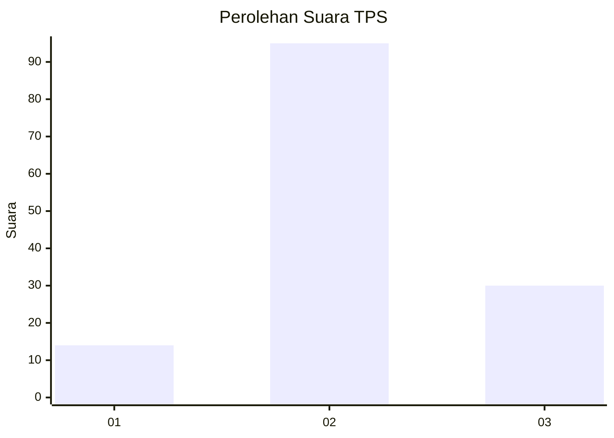
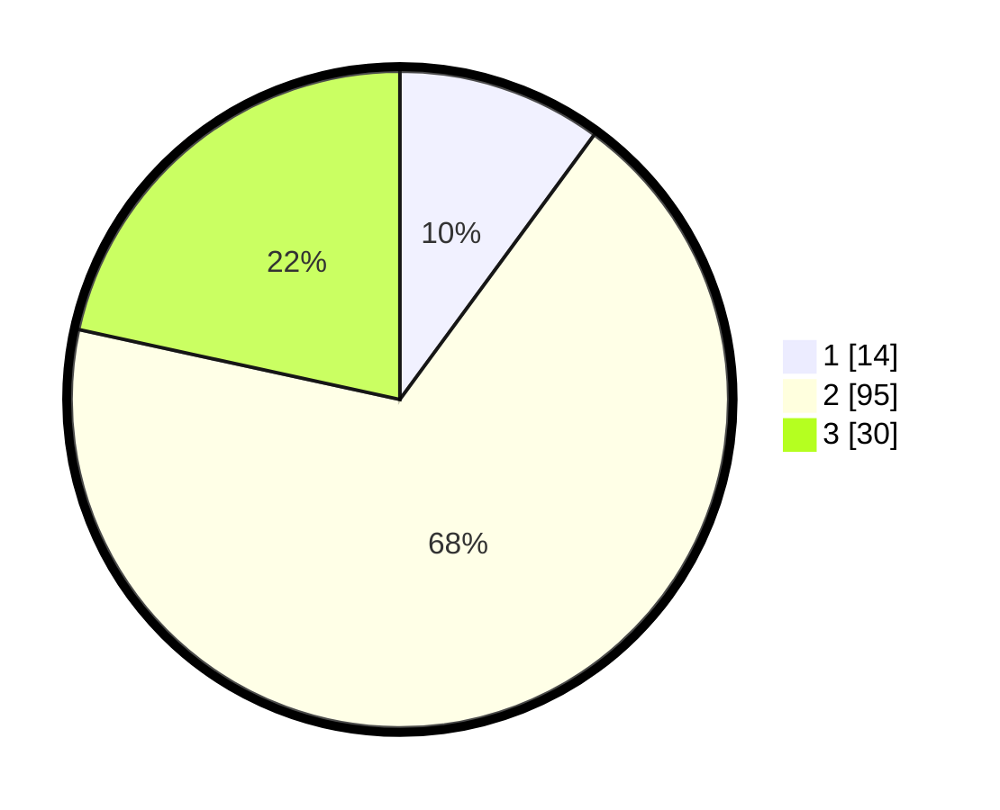

# Hasil

## Grafik

## Tabel

| No. | Nama Paslon    | Suara | Suara (raw) | Persentase |
|:--- |:-------------- | -----:| -----------:| ----------:|
| 1   | ANIES MUHAIMIN | 14    | [14][p-1]   | 10,07      |
| 2   | PRABOWO GIBRAN | 95    | [95][p-2]   | 68,35      |
| 3   | GANJAR MAHFUD  | 30    | [30][p-3]   | 21,58      |

[p-1]: https://github.com/gigit-pemilu/pemilu-2024/blob/main/pilpres/hitung-suara/sub/35-jawa-timur/sub/10-banyuwangi/sub/09-genteng/sub/2005-kaligondo/sub/008-tps/sub/paslon-1.txt
[p-2]: https://github.com/gigit-pemilu/pemilu-2024/blob/main/pilpres/hitung-suara/sub/35-jawa-timur/sub/10-banyuwangi/sub/09-genteng/sub/2005-kaligondo/sub/008-tps/sub/paslon-2.txt
[p-3]: https://github.com/gigit-pemilu/pemilu-2024/blob/main/pilpres/hitung-suara/sub/35-jawa-timur/sub/10-banyuwangi/sub/09-genteng/sub/2005-kaligondo/sub/008-tps/sub/paslon-3.txt

## Foto C Plano

https://sirekap-obj-formc.kpu.go.id/0283/pemilu/ppwp/35/10/09/20/05/3510092005008-20240215-031646--67dd6dbf-cdf3-46da-aab9-ab6d366b51d4.jpg

https://sirekap-obj-formc.kpu.go.id/0283/pemilu/ppwp/35/10/09/20/05/3510092005008-20240214-232441--bb50bd50-9c0b-436a-9792-8f2ca51052e9.jpg

https://sirekap-obj-formc.kpu.go.id/0283/pemilu/ppwp/35/10/09/20/05/3510092005008-20240214-232531--0e570c3e-e14b-40ec-8e33-347ab4669619.jpg

## Metadata

| Key        | Value               |
| ---------- | ------------------- |
| Time Stamp | 2024-02-24 22:31:28 |

