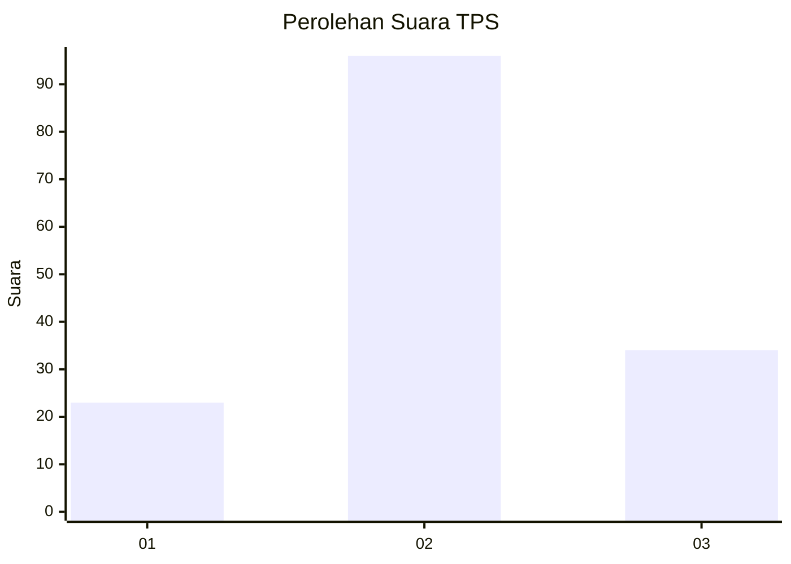
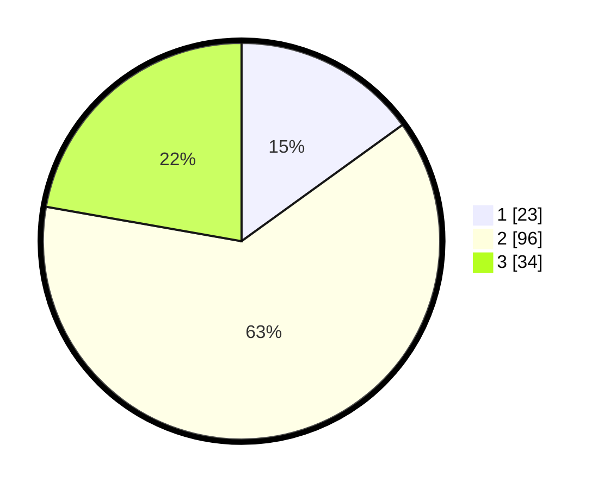

# Hasil

## Grafik

## Tabel

| No. | Nama Paslon    | Suara | Suara (raw) | Persentase |
|:--- |:-------------- | -----:| -----------:| ----------:|
| 1   | ANIES MUHAIMIN | 23    | [23][p-1]   | 15,03      |
| 2   | PRABOWO GIBRAN | 96    | [96][p-2]   | 62,75      |
| 3   | GANJAR MAHFUD  | 34    | [34][p-3]   | 22,22      |

[p-1]: https://github.com/gigit-pemilu/pemilu-2024-35-jawa-timur/blob/main/pilpres/hitung-suara/sub/35-jawa-timur/sub/10-banyuwangi/sub/09-genteng/sub/2005-kaligondo/sub/010-tps/sub/paslon-1.txt
[p-2]: https://github.com/gigit-pemilu/pemilu-2024-35-jawa-timur/blob/main/pilpres/hitung-suara/sub/35-jawa-timur/sub/10-banyuwangi/sub/09-genteng/sub/2005-kaligondo/sub/010-tps/sub/paslon-2.txt
[p-3]: https://github.com/gigit-pemilu/pemilu-2024-35-jawa-timur/blob/main/pilpres/hitung-suara/sub/35-jawa-timur/sub/10-banyuwangi/sub/09-genteng/sub/2005-kaligondo/sub/010-tps/sub/paslon-3.txt

## Foto C Plano

https://sirekap-obj-formc.kpu.go.id/44e2/pemilu/ppwp/35/10/09/20/05/3510092005010-20240219-211352--91750ed3-8893-4ce1-9458-2a3cbefc8405.jpg

https://sirekap-obj-formc.kpu.go.id/44e2/pemilu/ppwp/35/10/09/20/05/3510092005010-20240219-211447--754f5917-1cd1-41a4-9d95-98c05dd1932d.jpg

https://sirekap-obj-formc.kpu.go.id/44e2/pemilu/ppwp/35/10/09/20/05/3510092005010-20240219-211635--0e284920-11c8-4dc6-950f-810b87c94885.jpg

## Metadata

| Key        | Value               |
| ---------- | ------------------- |
| Time Stamp | 2024-02-24 22:31:28 |

