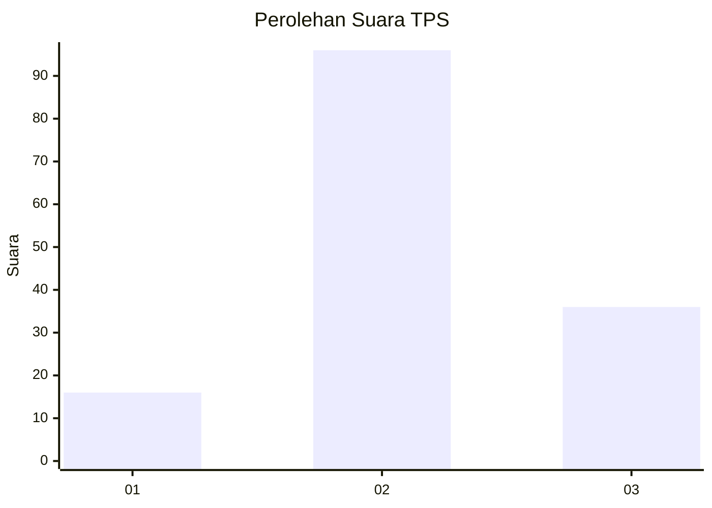
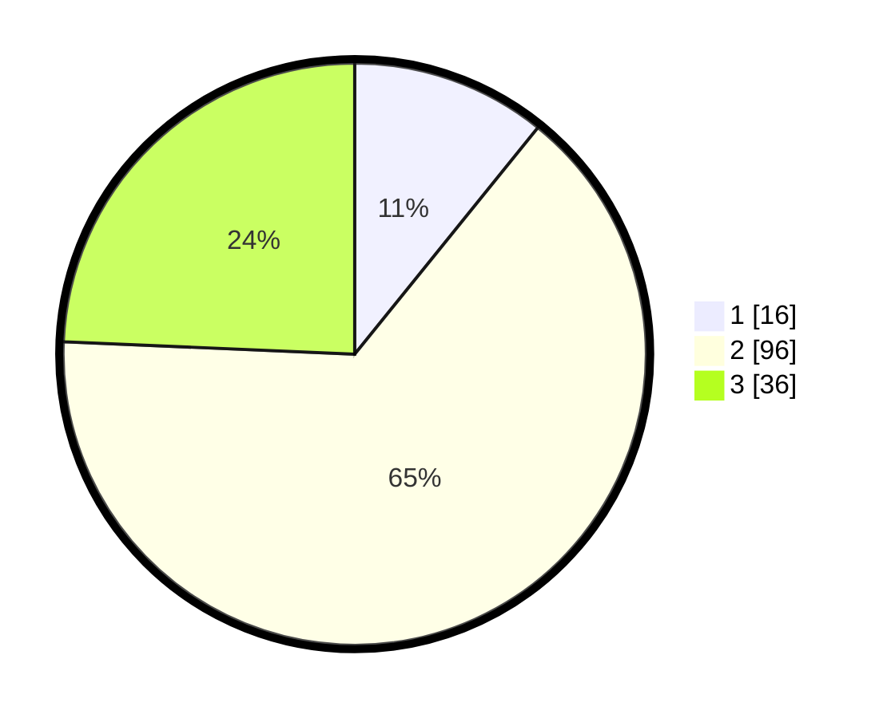

# Hasil

## Grafik

## Tabel

| No. | Nama Paslon    | Suara | Suara (raw) | Persentase |
|:--- |:-------------- | -----:| -----------:| ----------:|
| 1   | ANIES MUHAIMIN | 16    | [16][p-1]   | 10,81      |
| 2   | PRABOWO GIBRAN | 96    | [96][p-2]   | 64,86      |
| 3   | GANJAR MAHFUD  | 36    | [36][p-3]   | 24,32      |

[p-1]: https://github.com/gigit-pemilu/pemilu-2024/blob/main/pilpres/hitung-suara/sub/35-jawa-timur/sub/10-banyuwangi/sub/09-genteng/sub/2005-kaligondo/sub/017-tps/sub/paslon-1.txt
[p-2]: https://github.com/gigit-pemilu/pemilu-2024/blob/main/pilpres/hitung-suara/sub/35-jawa-timur/sub/10-banyuwangi/sub/09-genteng/sub/2005-kaligondo/sub/017-tps/sub/paslon-2.txt
[p-3]: https://github.com/gigit-pemilu/pemilu-2024/blob/main/pilpres/hitung-suara/sub/35-jawa-timur/sub/10-banyuwangi/sub/09-genteng/sub/2005-kaligondo/sub/017-tps/sub/paslon-3.txt

## Foto C Plano

https://sirekap-obj-formc.kpu.go.id/28a9/pemilu/ppwp/35/10/09/20/05/3510092005017-20240219-205759--989144ea-b2c1-4d29-abd9-1cc588c40358.jpg

https://sirekap-obj-formc.kpu.go.id/28a9/pemilu/ppwp/35/10/09/20/05/3510092005017-20240219-205937--56a63616-5298-42a4-a78d-30718ee9a86e.jpg

https://sirekap-obj-formc.kpu.go.id/28a9/pemilu/ppwp/35/10/09/20/05/3510092005017-20240219-210203--40386b13-0dfb-42db-b462-10bcc44a8e1d.jpg

## Metadata

| Key        | Value               |
| ---------- | ------------------- |
| Time Stamp | 2024-02-24 22:31:28 |

