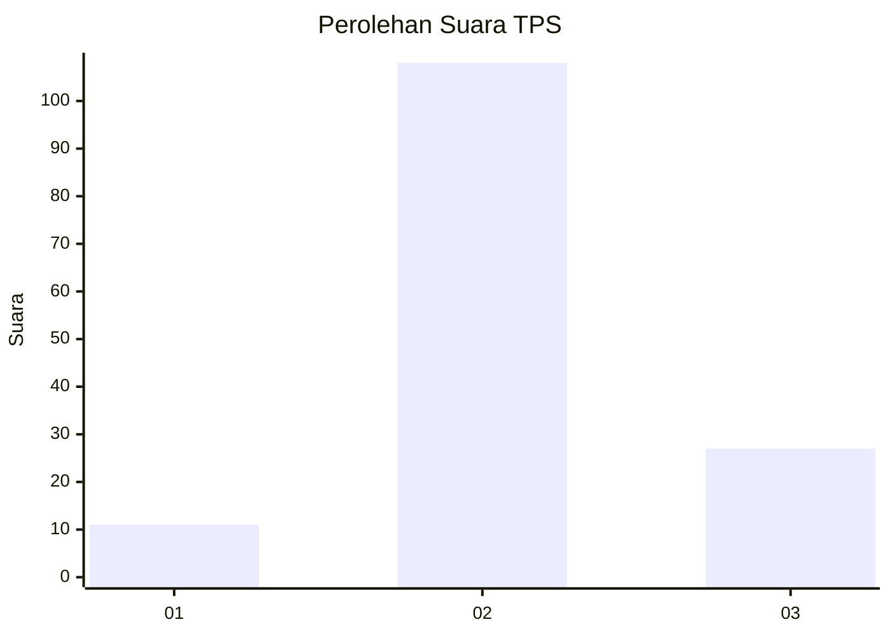
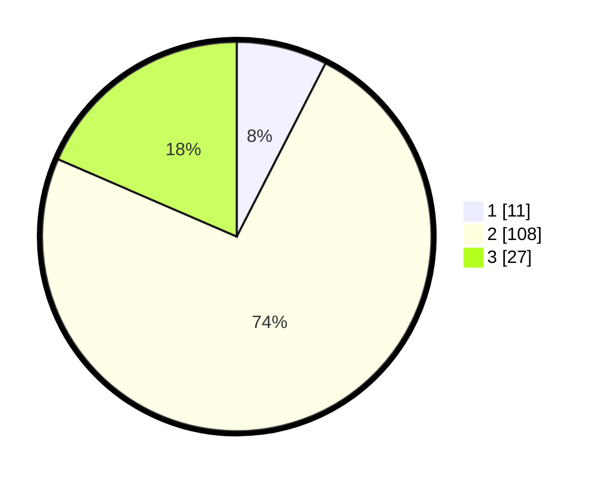

# Hasil

## Grafik

## Tabel

| No. | Nama Paslon    | Suara | Suara (raw) | Persentase |
|:--- |:-------------- | -----:| -----------:| ----------:|
| 1   | ANIES MUHAIMIN | 11    | [11][p-1]   | 7,53       |
| 2   | PRABOWO GIBRAN | 108   | [108][p-2]  | 73,97      |
| 3   | GANJAR MAHFUD  | 27    | [27][p-3]   | 18,49      |

[p-1]: https://github.com/gigit-pemilu/pemilu-2024/blob/main/pilpres/hitung-suara/sub/35-jawa-timur/sub/10-banyuwangi/sub/09-genteng/sub/2005-kaligondo/sub/020-tps/sub/paslon-1.txt
[p-2]: https://github.com/gigit-pemilu/pemilu-2024/blob/main/pilpres/hitung-suara/sub/35-jawa-timur/sub/10-banyuwangi/sub/09-genteng/sub/2005-kaligondo/sub/020-tps/sub/paslon-2.txt
[p-3]: https://github.com/gigit-pemilu/pemilu-2024/blob/main/pilpres/hitung-suara/sub/35-jawa-timur/sub/10-banyuwangi/sub/09-genteng/sub/2005-kaligondo/sub/020-tps/sub/paslon-3.txt

## Foto C Plano

https://sirekap-obj-formc.kpu.go.id/87ed/pemilu/ppwp/35/10/09/20/05/3510092005020-20240219-204140--bf3a3bd5-4c2d-4d21-ba6f-3382f15ff726.jpg

https://sirekap-obj-formc.kpu.go.id/87ed/pemilu/ppwp/35/10/09/20/05/3510092005020-20240219-204631--ca982b1d-1107-4568-862b-ed4fe7d4da4d.jpg

https://sirekap-obj-formc.kpu.go.id/87ed/pemilu/ppwp/35/10/09/20/05/3510092005020-20240219-204940--61cb2a02-ec41-4eaf-a61a-2098d66d3d81.jpg

## Metadata

| Key        | Value               |
| ---------- | ------------------- |
| Time Stamp | 2024-02-24 22:31:28 |

