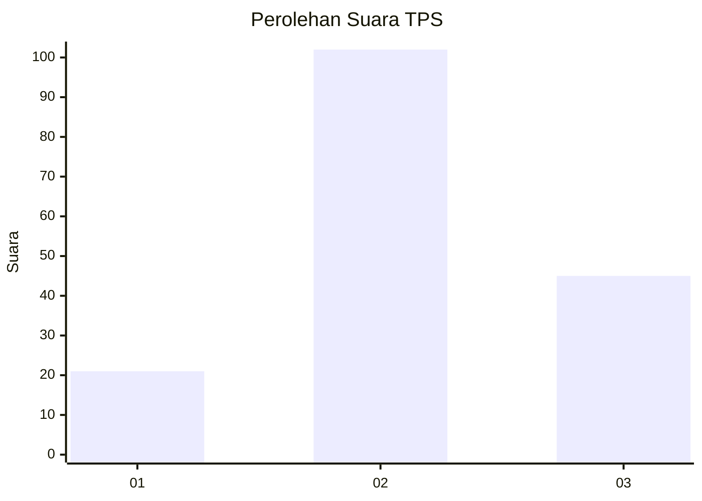
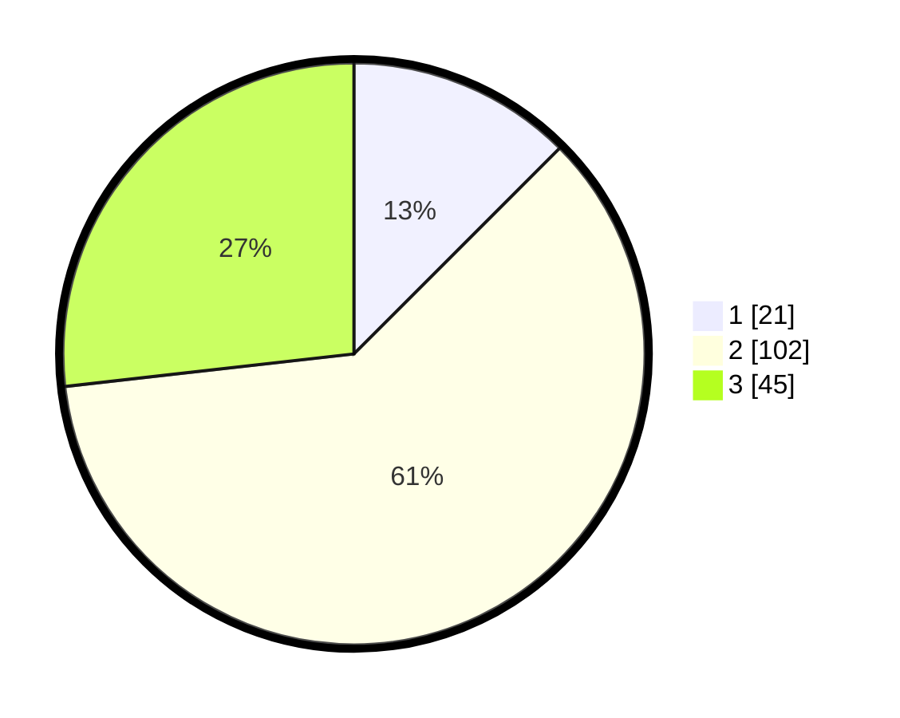

# Hasil

## Grafik

## Tabel

| No. | Nama Paslon    | Suara | Suara (raw) | Persentase |
|:--- |:-------------- | -----:| -----------:| ----------:|
| 1   | ANIES MUHAIMIN | 21    | [21][p-1]   | 12,50      |
| 2   | PRABOWO GIBRAN | 102   | [102][p-2]  | 60,71      |
| 3   | GANJAR MAHFUD  | 45    | [45][p-3]   | 26,79      |

[p-1]: https://github.com/gigit-pemilu/pemilu-2024-35-jawa-timur/blob/main/pilpres/hitung-suara/sub/35-jawa-timur/sub/10-banyuwangi/sub/09-genteng/sub/2005-kaligondo/sub/026-tps/sub/paslon-1.txt
[p-2]: https://github.com/gigit-pemilu/pemilu-2024-35-jawa-timur/blob/main/pilpres/hitung-suara/sub/35-jawa-timur/sub/10-banyuwangi/sub/09-genteng/sub/2005-kaligondo/sub/026-tps/sub/paslon-2.txt
[p-3]: https://github.com/gigit-pemilu/pemilu-2024-35-jawa-timur/blob/main/pilpres/hitung-suara/sub/35-jawa-timur/sub/10-banyuwangi/sub/09-genteng/sub/2005-kaligondo/sub/026-tps/sub/paslon-3.txt

## Foto C Plano

https://sirekap-obj-formc.kpu.go.id/794c/pemilu/ppwp/35/10/09/20/05/3510092005026-20240219-212452--b537baea-bf43-4ce9-9e76-eef661ce5d76.jpg

https://sirekap-obj-formc.kpu.go.id/794c/pemilu/ppwp/35/10/09/20/05/3510092005026-20240219-212558--598dbda5-c443-4719-8b0f-8806a48a2b8f.jpg

https://sirekap-obj-formc.kpu.go.id/794c/pemilu/ppwp/35/10/09/20/05/3510092005026-20240219-213054--9ceb3830-f024-4f3f-97bf-ffd0ce811615.jpg

## Metadata

| Key        | Value               |
| ---------- | ------------------- |
| Time Stamp | 2024-02-26 11:00:00 |

