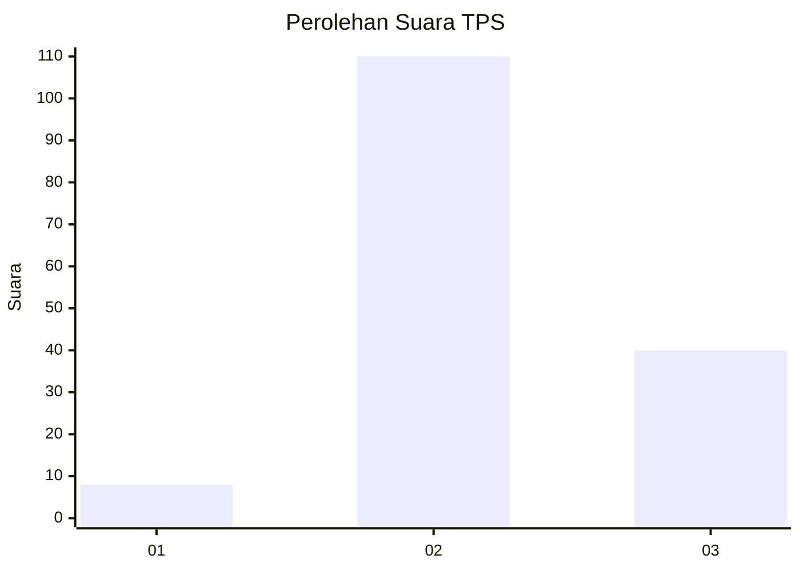
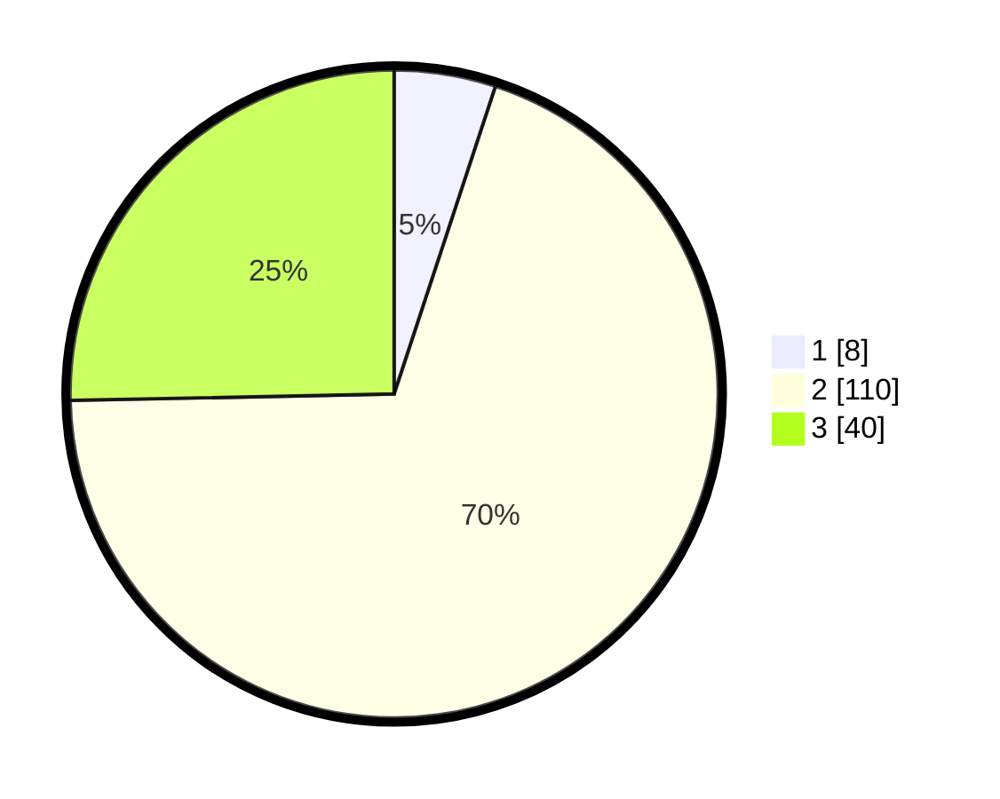

# Hasil

## Grafik

## Tabel

| No. | Nama Paslon    | Suara | Suara (raw) | Persentase |
|:--- |:-------------- | -----:| -----------:| ----------:|
| 1   | ANIES MUHAIMIN | 8     | [8][p-1]    | 5,06       |
| 2   | PRABOWO GIBRAN | 110   | [110][p-2]  | 69,62      |
| 3   | GANJAR MAHFUD  | 40    | [40][p-3]   | 25,32      |

[p-1]: https://github.com/gigit-pemilu/pemilu-2024-35-jawa-timur/blob/main/pilpres/hitung-suara/sub/35-jawa-timur/sub/10-banyuwangi/sub/09-genteng/sub/2005-kaligondo/sub/029-tps/sub/paslon-1.txt
[p-2]: https://github.com/gigit-pemilu/pemilu-2024-35-jawa-timur/blob/main/pilpres/hitung-suara/sub/35-jawa-timur/sub/10-banyuwangi/sub/09-genteng/sub/2005-kaligondo/sub/029-tps/sub/paslon-2.txt
[p-3]: https://github.com/gigit-pemilu/pemilu-2024-35-jawa-timur/blob/main/pilpres/hitung-suara/sub/35-jawa-timur/sub/10-banyuwangi/sub/09-genteng/sub/2005-kaligondo/sub/029-tps/sub/paslon-3.txt

## Foto C Plano

https://sirekap-obj-formc.kpu.go.id/db1c/pemilu/ppwp/35/10/09/20/05/3510092005029-20240219-210339--a517fcd7-9a1e-4e9c-88f9-03c4ecdb5850.jpg

https://sirekap-obj-formc.kpu.go.id/db1c/pemilu/ppwp/35/10/09/20/05/3510092005029-20240219-210452--0cb852b0-78d0-4586-b133-a5a9ff54eb55.jpg

https://sirekap-obj-formc.kpu.go.id/db1c/pemilu/ppwp/35/10/09/20/05/3510092005029-20240219-210659--15b53182-d805-47fe-a8be-12419315b532.jpg

## Metadata

| Key        | Value               |
| ---------- | ------------------- |
| Time Stamp | 2024-02-24 22:31:28 |

