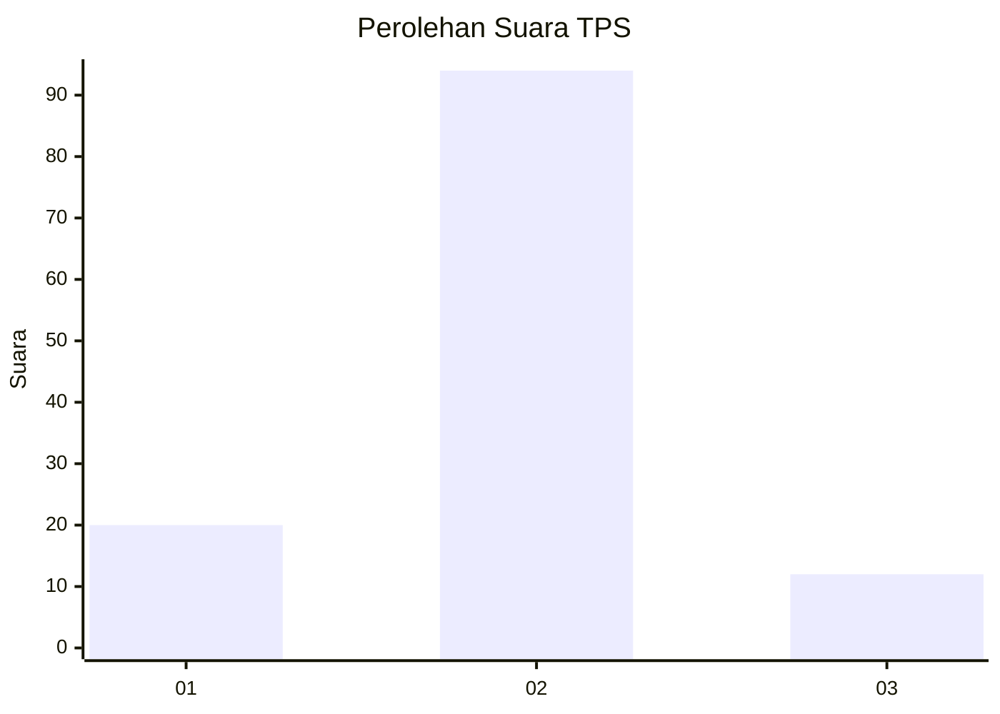
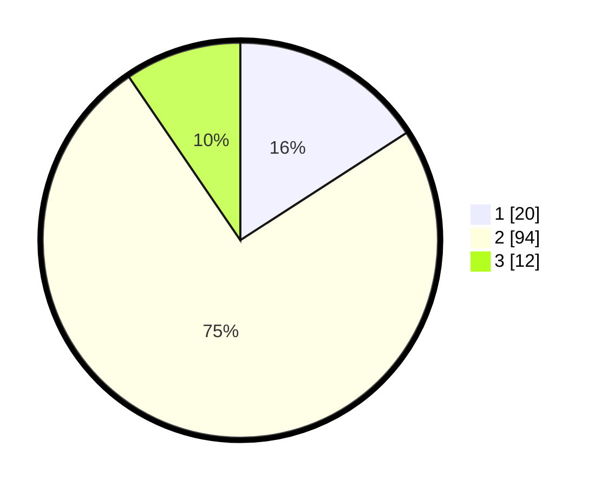

# Hasil

## Grafik

## Tabel

| No. | Nama Paslon    | Suara | Suara (raw) | Persentase |
|:--- |:-------------- | -----:| -----------:| ----------:|
| 1   | ANIES MUHAIMIN | 20    | [20][p-1]   | 15,87      |
| 2   | PRABOWO GIBRAN | 94    | [94][p-2]   | 74,60      |
| 3   | GANJAR MAHFUD  | 12    | [12][p-3]   | 9,52       |

[p-1]: https://github.com/gigit-pemilu/pemilu-2024-35-jawa-timur/blob/main/pilpres/hitung-suara/sub/35-jawa-timur/sub/10-banyuwangi/sub/10-glenmore/sub/2001-tegalharjo/sub/004-tps/sub/paslon-1.txt
[p-2]: https://github.com/gigit-pemilu/pemilu-2024-35-jawa-timur/blob/main/pilpres/hitung-suara/sub/35-jawa-timur/sub/10-banyuwangi/sub/10-glenmore/sub/2001-tegalharjo/sub/004-tps/sub/paslon-2.txt
[p-3]: https://github.com/gigit-pemilu/pemilu-2024-35-jawa-timur/blob/main/pilpres/hitung-suara/sub/35-jawa-timur/sub/10-banyuwangi/sub/10-glenmore/sub/2001-tegalharjo/sub/004-tps/sub/paslon-3.txt

## Foto C Plano

https://sirekap-obj-formc.kpu.go.id/e21b/pemilu/ppwp/35/10/10/20/01/3510102001004-20240215-174727--83b7793f-3ed1-4764-b35f-c39f03c0c7dc.jpg

https://sirekap-obj-formc.kpu.go.id/e21b/pemilu/ppwp/35/10/10/20/01/3510102001004-20240215-174829--f755b8f1-7318-42b7-bf46-10ebbd33c732.jpg

https://sirekap-obj-formc.kpu.go.id/e21b/pemilu/ppwp/35/10/10/20/01/3510102001004-20240215-174923--3e0b90fa-3c8a-44a6-9368-d974a2a71299.jpg

## Metadata

| Key        | Value               |
| ---------- | ------------------- |
| Time Stamp | 2024-02-17 07:30:03 |

## DATA PEMILIH TETAP

Jumlah pemilih dalam DPT: **182**.
 * L: **88**.
 * P: **94**.

## DATA PENGGUNA HAK PILIH

Jumlah pengguna hak pilih dalam DPT: **126**.
 * L: **53**.
 * P: **73**.

Jumlah pengguna hak pilih dalam DPTb: **0**.
 * L: **0**.
 * P: **0**.

Jumlah pengguna hak pilih dalam DPK: **2**.
 * L: **1**.
 * P: **1**.

Jumlah pengguna hak pilih: **128**.
 * L: **54**.
 * P: **74**.

## JUMLAH SUARA SAH DAN TIDAK SAH

JUMLAH SELURUH SUARA SAH: **126**.

JUMLAH SUARA TIDAK SAH: **2**.

JUMLAH SELURUH SUARA SAH DAN SUARA TIDAK SAH: **128**.

