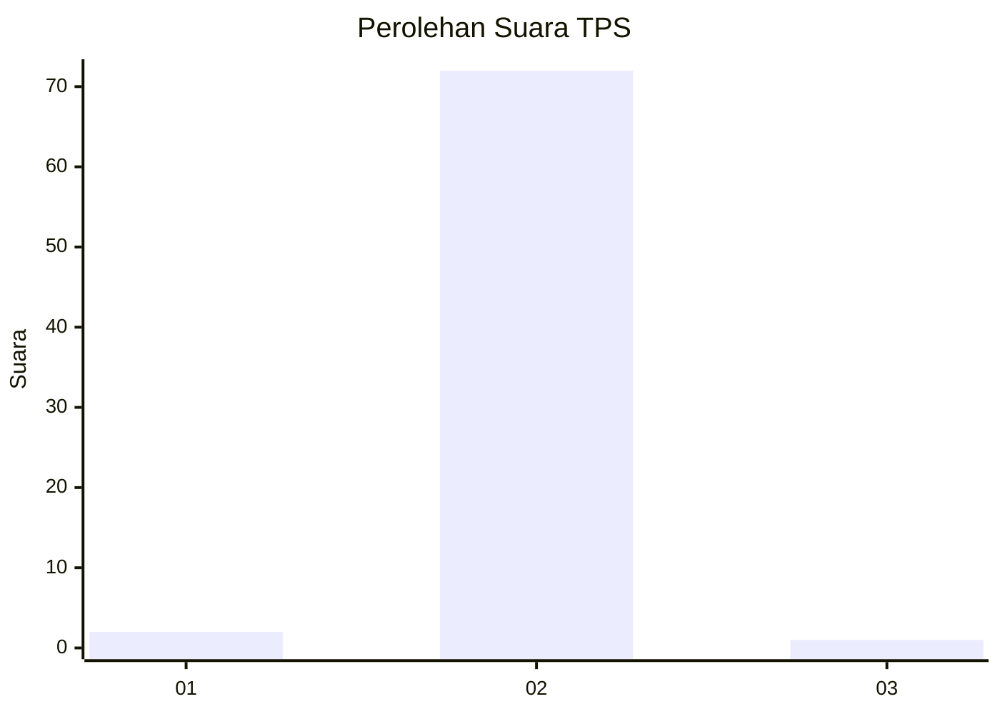
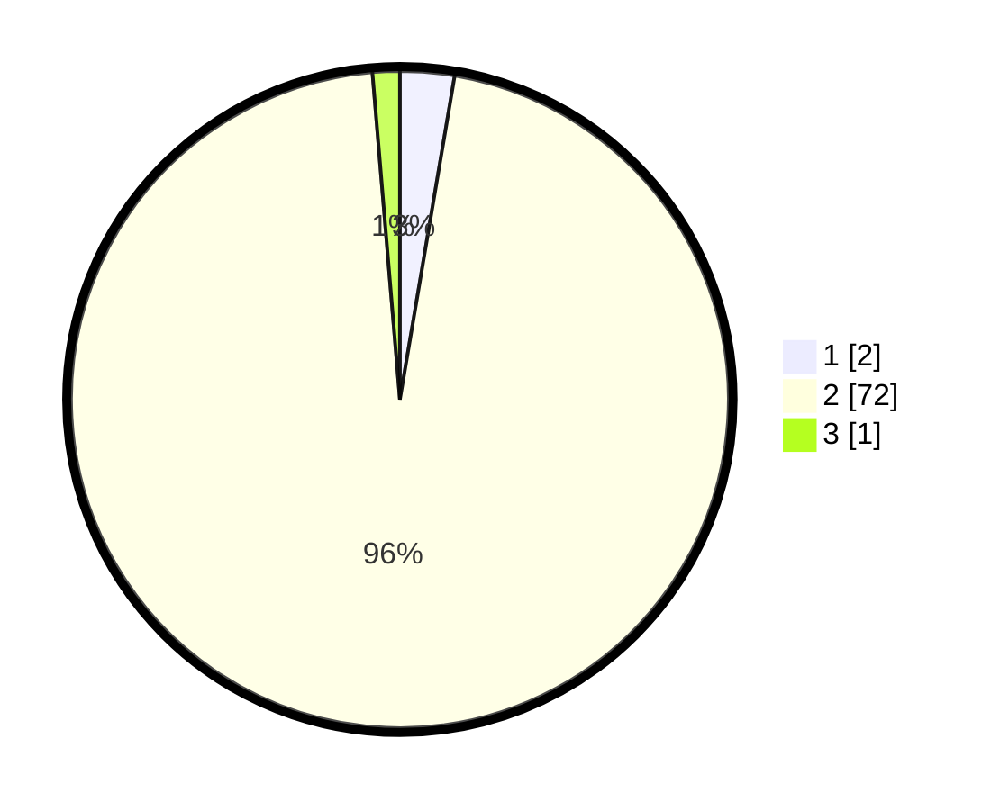

# Hasil

## Grafik

## Tabel

| No. | Nama Paslon    | Suara | Suara (raw) | Persentase |
|:--- |:-------------- | -----:| -----------:| ----------:|
| 1   | ANIES MUHAIMIN | 2     | [2][p-1]    | 2,67       |
| 2   | PRABOWO GIBRAN | 72    | [72][p-2]   | 96,00      |
| 3   | GANJAR MAHFUD  | 1     | [1][p-3]    | 1,33       |

[p-1]: https://github.com/gigit-pemilu/pemilu-2024/blob/main/pilpres/hitung-suara/sub/35-jawa-timur/sub/10-banyuwangi/sub/10-glenmore/sub/2003-karangharjo/sub/001-tps/sub/paslon-1.txt
[p-2]: https://github.com/gigit-pemilu/pemilu-2024/blob/main/pilpres/hitung-suara/sub/35-jawa-timur/sub/10-banyuwangi/sub/10-glenmore/sub/2003-karangharjo/sub/001-tps/sub/paslon-2.txt
[p-3]: https://github.com/gigit-pemilu/pemilu-2024/blob/main/pilpres/hitung-suara/sub/35-jawa-timur/sub/10-banyuwangi/sub/10-glenmore/sub/2003-karangharjo/sub/001-tps/sub/paslon-3.txt

## Foto C Plano

https://sirekap-obj-formc.kpu.go.id/b159/pemilu/ppwp/35/10/10/20/03/3510102003001-20240219-212804--ceb5902f-8d1d-4009-b1a1-4fedbffca8ab.jpg

https://sirekap-obj-formc.kpu.go.id/b159/pemilu/ppwp/35/10/10/20/03/3510102003001-20240219-212806--c2055dcd-5448-4306-89db-40d362f48d47.jpg

https://sirekap-obj-formc.kpu.go.id/b159/pemilu/ppwp/35/10/10/20/03/3510102003001-20240219-212805--000fe860-1881-48f9-950f-056212d9c3ec.jpg

## Metadata

| Key        | Value               |
| ---------- | ------------------- |
| Time Stamp | 2024-02-24 22:31:28 |

## DATA PEMILIH TETAP

Jumlah pemilih dalam DPT: **74**.
 * L: **39**.
 * P: **35**.

## DATA PENGGUNA HAK PILIH

Jumlah pengguna hak pilih dalam DPT: **74**.
 * L: **39**.
 * P: **35**.

Jumlah pengguna hak pilih dalam DPTb: **1**.
 * L: **1**.
 * P: **0**.

Jumlah pengguna hak pilih dalam DPK: **0**.
 * L: **0**.
 * P: **0**.

Jumlah pengguna hak pilih: **75**.
 * L: **40**.
 * P: **35**.

## JUMLAH SUARA SAH DAN TIDAK SAH

JUMLAH SELURUH SUARA SAH: **75**.

JUMLAH SUARA TIDAK SAH: **0**.

JUMLAH SELURUH SUARA SAH DAN SUARA TIDAK SAH: **75**.

