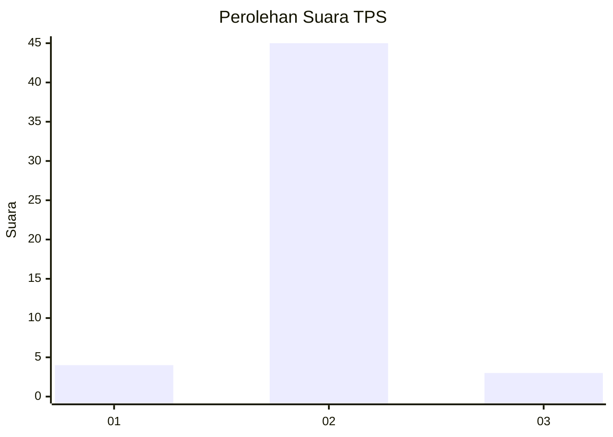
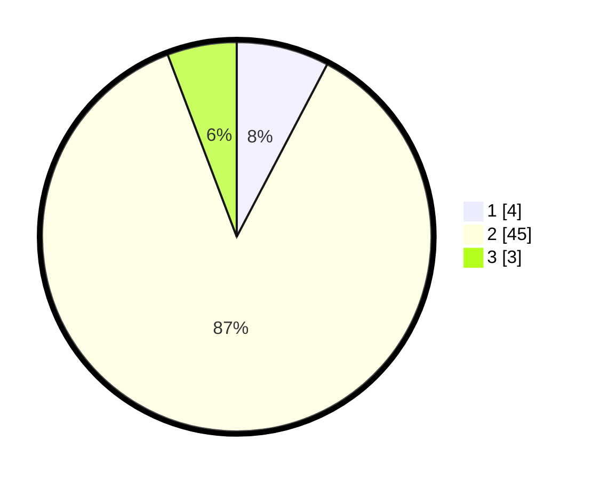

# Hasil

## Grafik

## Tabel

| No. | Nama Paslon    | Suara | Suara (raw) | Persentase |
|:--- |:-------------- | -----:| -----------:| ----------:|
| 1   | ANIES MUHAIMIN | 4     | [4][p-1]    | 7,69       |
| 2   | PRABOWO GIBRAN | 45    | [45][p-2]   | 86,54      |
| 3   | GANJAR MAHFUD  | 3     | [3][p-3]    | 5,77       |

[p-1]: https://github.com/gigit-pemilu/pemilu-2024/blob/main/pilpres/hitung-suara/sub/35-jawa-timur/sub/10-banyuwangi/sub/10-glenmore/sub/2003-karangharjo/sub/004-tps/sub/paslon-1.txt
[p-2]: https://github.com/gigit-pemilu/pemilu-2024/blob/main/pilpres/hitung-suara/sub/35-jawa-timur/sub/10-banyuwangi/sub/10-glenmore/sub/2003-karangharjo/sub/004-tps/sub/paslon-2.txt
[p-3]: https://github.com/gigit-pemilu/pemilu-2024/blob/main/pilpres/hitung-suara/sub/35-jawa-timur/sub/10-banyuwangi/sub/10-glenmore/sub/2003-karangharjo/sub/004-tps/sub/paslon-3.txt

## Foto C Plano

https://sirekap-obj-formc.kpu.go.id/4a5d/pemilu/ppwp/35/10/10/20/03/3510102003004-20240214-205032--51f515f1-90a5-49c5-ab2b-081bd5e88138.jpg

https://sirekap-obj-formc.kpu.go.id/4a5d/pemilu/ppwp/35/10/10/20/03/3510102003004-20240214-205244--69e6476b-cff3-4401-bd2c-1dc0035c578c.jpg

https://sirekap-obj-formc.kpu.go.id/4a5d/pemilu/ppwp/35/10/10/20/03/3510102003004-20240214-205447--d7b9adee-c033-40d7-9746-6109feaca837.jpg

## Metadata

| Key        | Value               |
| ---------- | ------------------- |
| Time Stamp | 2024-02-19 06:16:00 |

## DATA PEMILIH TETAP

Jumlah pemilih dalam DPT: **88**.
 * L: **49**.
 * P: **39**.

## DATA PENGGUNA HAK PILIH

Jumlah pengguna hak pilih dalam DPT: **51**.
 * L: **30**.
 * P: **21**.

Jumlah pengguna hak pilih dalam DPTb: **1**.
 * L: **1**.
 * P: **0**.

Jumlah pengguna hak pilih dalam DPK: **0**.
 * L: **0**.
 * P: **0**.

Jumlah pengguna hak pilih: **52**.
 * L: **31**.
 * P: **21**.

## JUMLAH SUARA SAH DAN TIDAK SAH

JUMLAH SELURUH SUARA SAH: **52**.

JUMLAH SUARA TIDAK SAH: **0**.

JUMLAH SELURUH SUARA SAH DAN SUARA TIDAK SAH: **52**.

