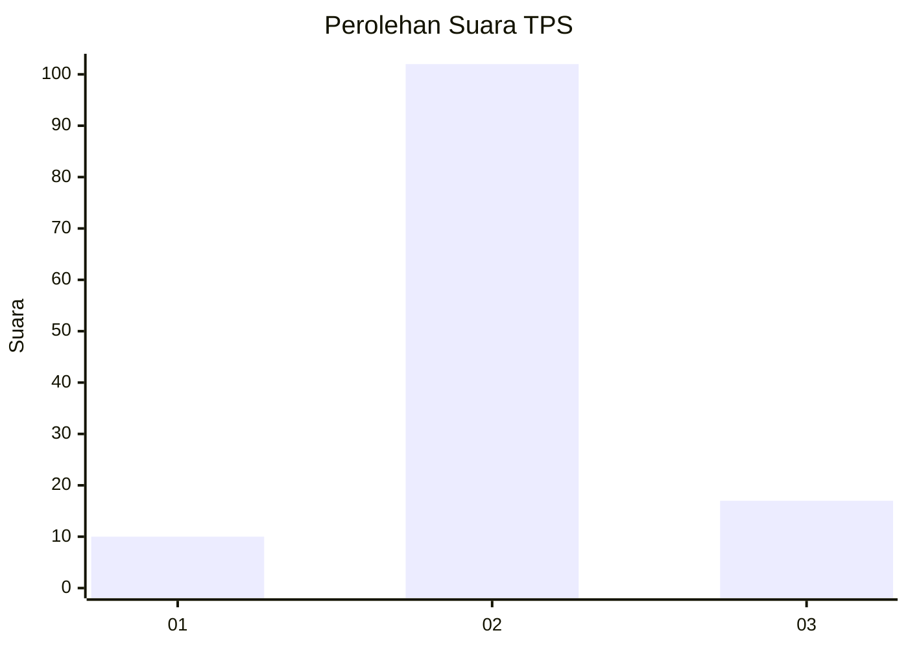
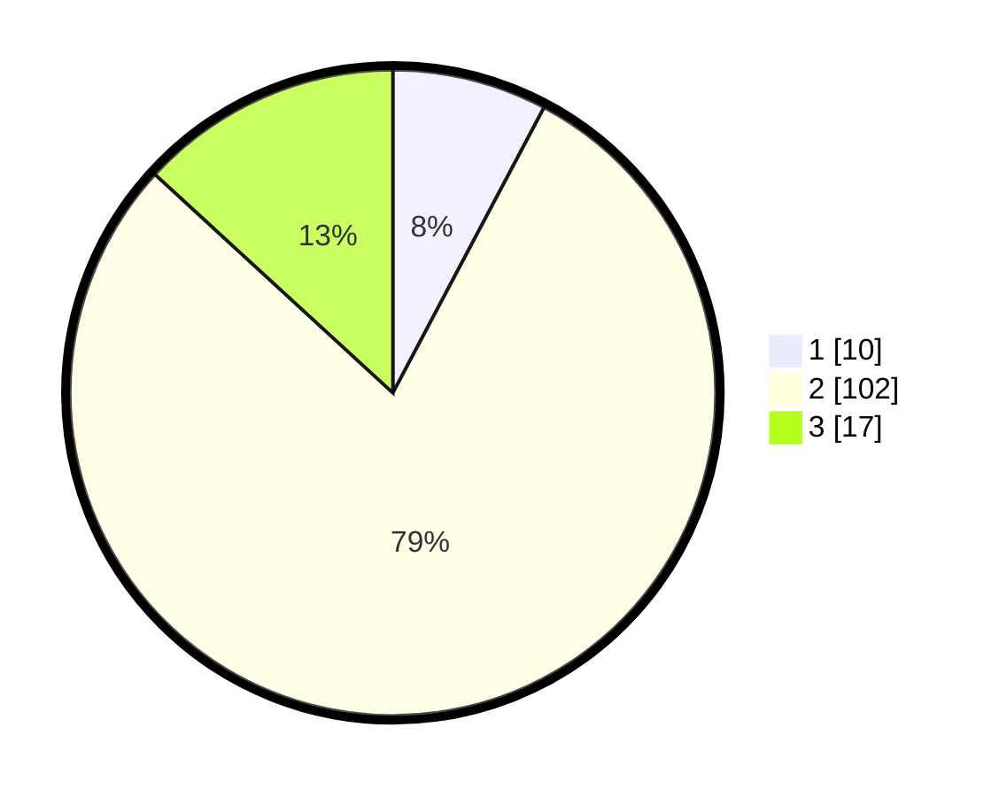

# Hasil

## Grafik

## Tabel

| No. | Nama Paslon    | Suara | Suara (raw) | Persentase |
|:--- |:-------------- | -----:| -----------:| ----------:|
| 1   | ANIES MUHAIMIN | 10    | [10][p-1]   | 7,75       |
| 2   | PRABOWO GIBRAN | 102   | [102][p-2]  | 79,07      |
| 3   | GANJAR MAHFUD  | 17    | [17][p-3]   | 13,18      |

[p-1]: https://github.com/gigit-pemilu/pemilu-2024/blob/main/pilpres/hitung-suara/sub/35-jawa-timur/sub/10-banyuwangi/sub/10-glenmore/sub/2004-tulungrejo/sub/044-tps/sub/paslon-1.txt
[p-2]: https://github.com/gigit-pemilu/pemilu-2024/blob/main/pilpres/hitung-suara/sub/35-jawa-timur/sub/10-banyuwangi/sub/10-glenmore/sub/2004-tulungrejo/sub/044-tps/sub/paslon-2.txt
[p-3]: https://github.com/gigit-pemilu/pemilu-2024/blob/main/pilpres/hitung-suara/sub/35-jawa-timur/sub/10-banyuwangi/sub/10-glenmore/sub/2004-tulungrejo/sub/044-tps/sub/paslon-3.txt

## Foto C Plano

https://sirekap-obj-formc.kpu.go.id/0051/pemilu/ppwp/35/10/10/20/04/3510102004044-20240214-141937--efd156ce-633b-4a90-8d34-345e8252f376.jpg

https://sirekap-obj-formc.kpu.go.id/0051/pemilu/ppwp/35/10/10/20/04/3510102004044-20240219-165549--98835bbe-b226-4f79-9d83-3ffe82a3c2c8.jpg

https://sirekap-obj-formc.kpu.go.id/0051/pemilu/ppwp/35/10/10/20/04/3510102004044-20240214-155443--7ff14625-154f-46ca-92d9-42de860b4807.jpg

## Metadata

| Key        | Value               |
| ---------- | ------------------- |
| Time Stamp | 2024-02-24 22:31:28 |

## DATA PEMILIH TETAP

Jumlah pemilih dalam DPT: **160**.
 * L: **30**.
 * P: **80**.

## DATA PENGGUNA HAK PILIH

Jumlah pengguna hak pilih dalam DPT: **126**.
 * L: **50**.
 * P: **66**.

Jumlah pengguna hak pilih dalam DPTb: **80**.
 * L: **0**.
 * P: **0**.

Jumlah pengguna hak pilih dalam DPK: **6**.
 * L: **85**.
 * P: **1**.

Jumlah pengguna hak pilih: **132**.
 * L: **65**.
 * P: **67**.

## JUMLAH SUARA SAH DAN TIDAK SAH

JUMLAH SELURUH SUARA SAH: **129**.

JUMLAH SUARA TIDAK SAH: **3**.

JUMLAH SELURUH SUARA SAH DAN SUARA TIDAK SAH: **132**.

