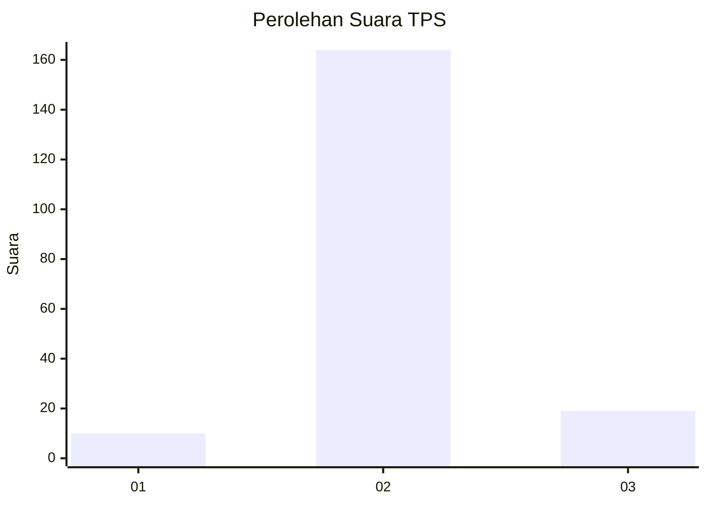
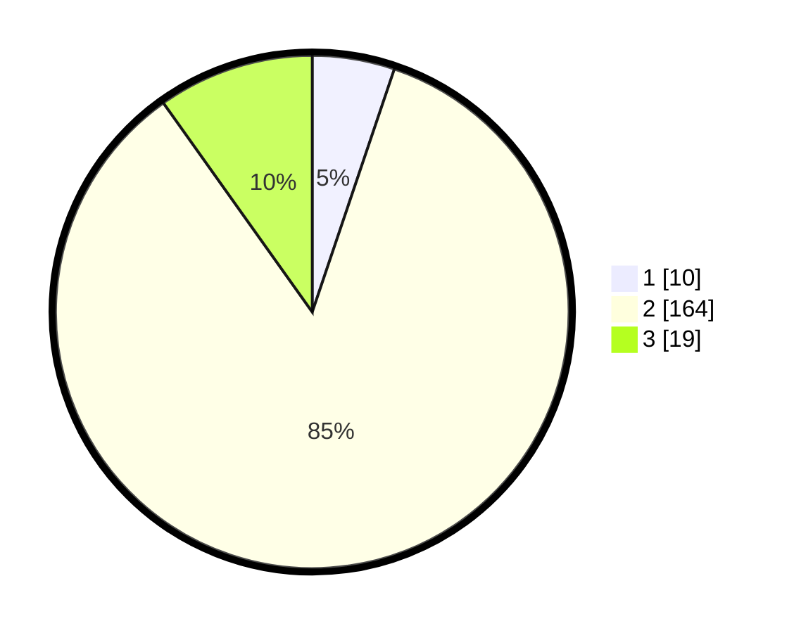

# Hasil

## Grafik

## Tabel

| No. | Nama Paslon    | Suara | Suara (raw) | Persentase |
|:--- |:-------------- | -----:| -----------:| ----------:|
| 1   | ANIES MUHAIMIN | 10    | [10][p-1]   | 5,18       |
| 2   | PRABOWO GIBRAN | 164   | [164][p-2]  | 84,97      |
| 3   | GANJAR MAHFUD  | 19    | [19][p-3]   | 9,84       |

[p-1]: https://github.com/gigit-pemilu/pemilu-2024/blob/main/pilpres/hitung-suara/sub/35-jawa-timur/sub/10-banyuwangi/sub/11-kalibaru/sub/2003-kalibaruwetan/sub/031-tps/sub/paslon-1.txt
[p-2]: https://github.com/gigit-pemilu/pemilu-2024/blob/main/pilpres/hitung-suara/sub/35-jawa-timur/sub/10-banyuwangi/sub/11-kalibaru/sub/2003-kalibaruwetan/sub/031-tps/sub/paslon-2.txt
[p-3]: https://github.com/gigit-pemilu/pemilu-2024/blob/main/pilpres/hitung-suara/sub/35-jawa-timur/sub/10-banyuwangi/sub/11-kalibaru/sub/2003-kalibaruwetan/sub/031-tps/sub/paslon-3.txt

## Foto C Plano

https://sirekap-obj-formc.kpu.go.id/bd67/pemilu/ppwp/35/10/11/20/03/3510112003031-20240217-145330--6c3d49c7-7834-4c82-a4d2-c45fa5a5ffaa.jpg

https://sirekap-obj-formc.kpu.go.id/bd67/pemilu/ppwp/35/10/11/20/03/3510112003031-20240217-144834--737616a1-c15e-47ba-aefc-dab29074371c.jpg

https://sirekap-obj-formc.kpu.go.id/bd67/pemilu/ppwp/35/10/11/20/03/3510112003031-20240217-144938--239f9312-6694-43d3-bc10-f16453cdf721.jpg

## Metadata

| Key        | Value               |
| ---------- | ------------------- |
| Time Stamp | 2024-02-24 22:31:28 |

