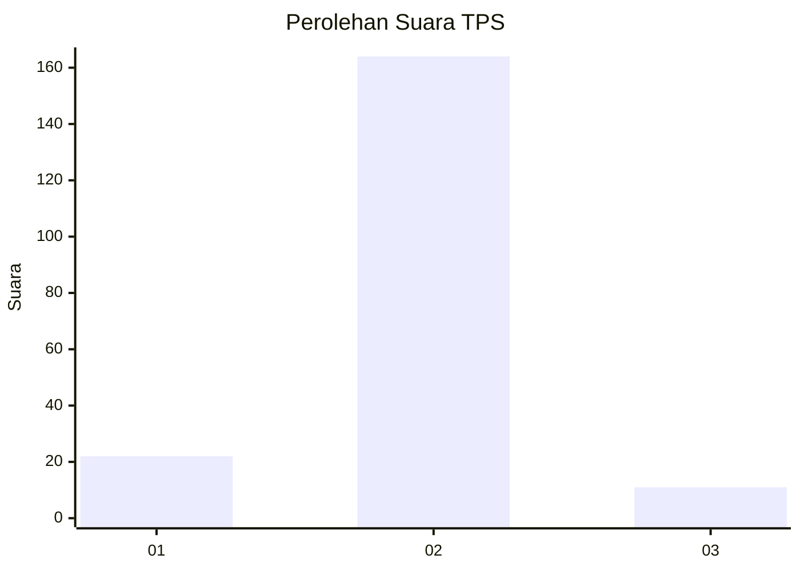
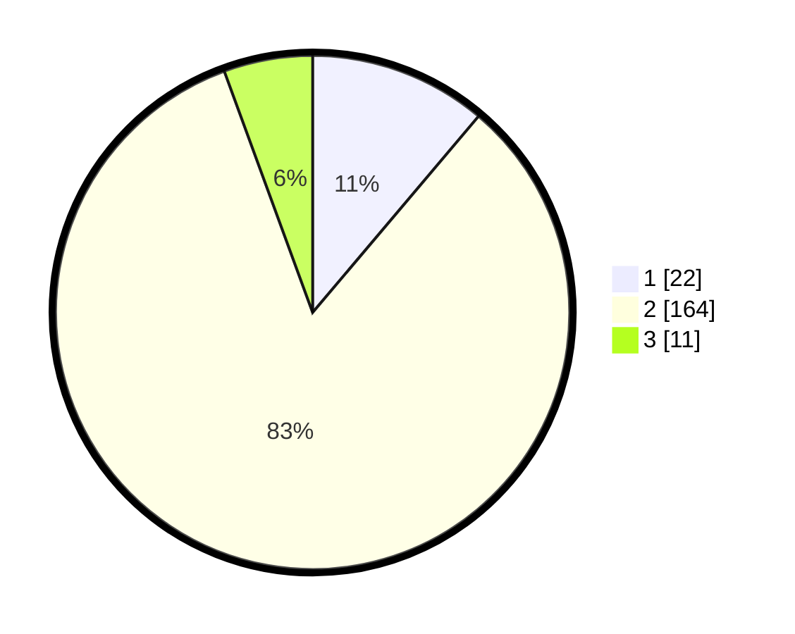

# Hasil

## Grafik

## Tabel

| No. | Nama Paslon    | Suara | Suara (raw) | Persentase |
|:--- |:-------------- | -----:| -----------:| ----------:|
| 1   | ANIES MUHAIMIN | 22    | [22][p-1]   | 11,17      |
| 2   | PRABOWO GIBRAN | 164   | [164][p-2]  | 83,25      |
| 3   | GANJAR MAHFUD  | 11    | [11][p-3]   | 5,58       |

[p-1]: https://github.com/gigit-pemilu/pemilu-2024-35-jawa-timur/blob/main/pilpres/hitung-suara/sub/35-jawa-timur/sub/10-banyuwangi/sub/11-kalibaru/sub/2003-kalibaruwetan/sub/039-tps/sub/paslon-1.txt
[p-2]: https://github.com/gigit-pemilu/pemilu-2024-35-jawa-timur/blob/main/pilpres/hitung-suara/sub/35-jawa-timur/sub/10-banyuwangi/sub/11-kalibaru/sub/2003-kalibaruwetan/sub/039-tps/sub/paslon-2.txt
[p-3]: https://github.com/gigit-pemilu/pemilu-2024-35-jawa-timur/blob/main/pilpres/hitung-suara/sub/35-jawa-timur/sub/10-banyuwangi/sub/11-kalibaru/sub/2003-kalibaruwetan/sub/039-tps/sub/paslon-3.txt

## Foto C Plano

https://sirekap-obj-formc.kpu.go.id/cd33/pemilu/ppwp/35/10/11/20/03/3510112003039-20240215-074641--2832737f-8441-4a63-8dbf-640f726084fe.jpg

https://sirekap-obj-formc.kpu.go.id/cd33/pemilu/ppwp/35/10/11/20/03/3510112003039-20240215-074938--fb395332-1ec6-458e-9eca-39d9e0033f88.jpg

https://sirekap-obj-formc.kpu.go.id/cd33/pemilu/ppwp/35/10/11/20/03/3510112003039-20240215-075209--11d34102-eb24-469a-9275-45aadf86ec48.jpg

## Metadata

| Key        | Value               |
| ---------- | ------------------- |
| Time Stamp | 2024-02-24 22:31:28 |

