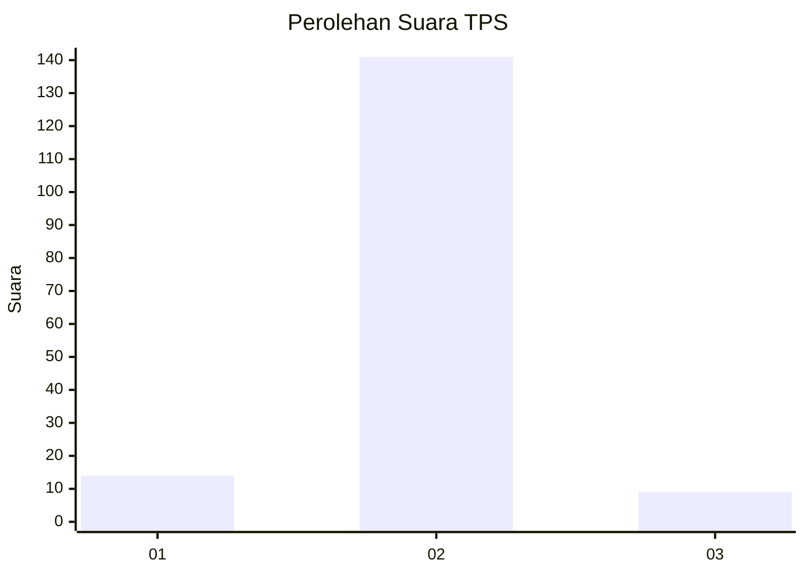
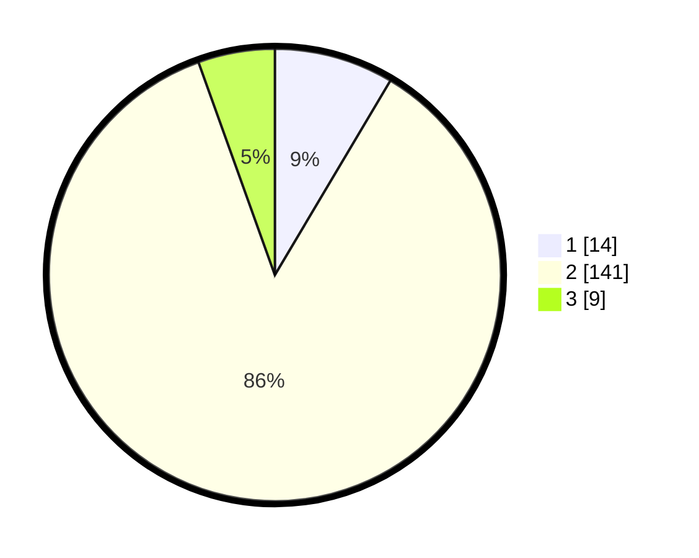

# Hasil

## Grafik

## Tabel

| No. | Nama Paslon    | Suara | Suara (raw) | Persentase |
|:--- |:-------------- | -----:| -----------:| ----------:|
| 1   | ANIES MUHAIMIN | 14    | [14][p-1]   | 8,54       |
| 2   | PRABOWO GIBRAN | 141   | [141][p-2]  | 85,98      |
| 3   | GANJAR MAHFUD  | 9     | [9][p-3]    | 5,49       |

[p-1]: https://github.com/gigit-pemilu/pemilu-2024-35-jawa-timur/blob/main/pilpres/hitung-suara/sub/35-jawa-timur/sub/10-banyuwangi/sub/11-kalibaru/sub/2004-kajarharjo/sub/028-tps/sub/paslon-1.txt
[p-2]: https://github.com/gigit-pemilu/pemilu-2024-35-jawa-timur/blob/main/pilpres/hitung-suara/sub/35-jawa-timur/sub/10-banyuwangi/sub/11-kalibaru/sub/2004-kajarharjo/sub/028-tps/sub/paslon-2.txt
[p-3]: https://github.com/gigit-pemilu/pemilu-2024-35-jawa-timur/blob/main/pilpres/hitung-suara/sub/35-jawa-timur/sub/10-banyuwangi/sub/11-kalibaru/sub/2004-kajarharjo/sub/028-tps/sub/paslon-3.txt

## Foto C Plano

https://sirekap-obj-formc.kpu.go.id/68e9/pemilu/ppwp/35/10/11/20/04/3510112004028-20240215-081724--f1dfd787-549f-433c-b549-83d3cd12c88e.jpg

https://sirekap-obj-formc.kpu.go.id/68e9/pemilu/ppwp/35/10/11/20/04/3510112004028-20240214-191609--781e574d-0277-4841-b838-79438e5936bf.jpg

https://sirekap-obj-formc.kpu.go.id/68e9/pemilu/ppwp/35/10/11/20/04/3510112004028-20240214-192643--2c23c617-533c-476c-92fe-3d9912414fb3.jpg

## Metadata

| Key        | Value               |
| ---------- | ------------------- |
| Time Stamp | 2024-02-17 13:37:34 |

