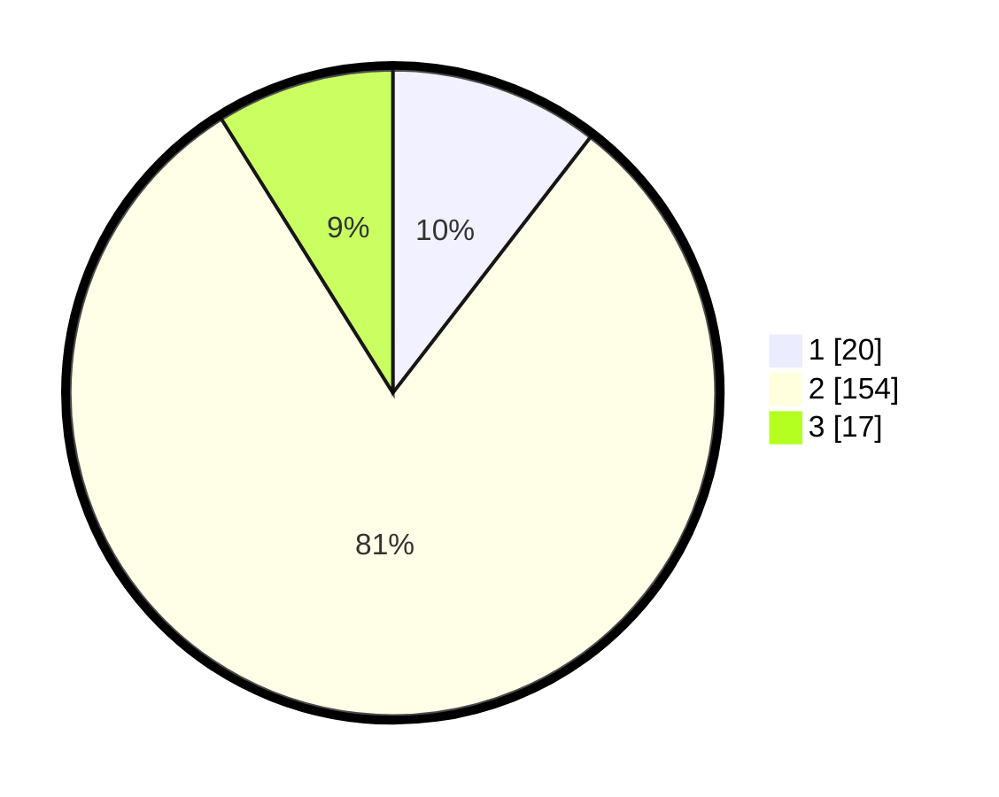

# Hasil

## Grafik

## Tabel

| No. | Nama Paslon    | Suara | Suara (raw) | Persentase |
|:--- |:-------------- | -----:| -----------:| ----------:|
| 1   | ANIES MUHAIMIN | 20    | [20][p-1]   | 10,47      |
| 2   | PRABOWO GIBRAN | 154   | [154][p-2]  | 80,63      |
| 3   | GANJAR MAHFUD  | 17    | [17][p-3]   | 8,90       |

[p-1]: https://github.com/gigit-pemilu/pemilu-2024-35-jawa-timur/blob/main/pilpres/hitung-suara/sub/35-jawa-timur/sub/10-banyuwangi/sub/11-kalibaru/sub/2004-kajarharjo/sub/044-tps/sub/paslon-1.txt
[p-2]: https://github.com/gigit-pemilu/pemilu-2024-35-jawa-timur/blob/main/pilpres/hitung-suara/sub/35-jawa-timur/sub/10-banyuwangi/sub/11-kalibaru/sub/2004-kajarharjo/sub/044-tps/sub/paslon-2.txt
[p-3]: https://github.com/gigit-pemilu/pemilu-2024-35-jawa-timur/blob/main/pilpres/hitung-suara/sub/35-jawa-timur/sub/10-banyuwangi/sub/11-kalibaru/sub/2004-kajarharjo/sub/044-tps/sub/paslon-3.txt

## Foto C Plano

https://sirekap-obj-formc.kpu.go.id/ba1f/pemilu/ppwp/35/10/11/20/04/3510112004044-20240217-171314--7b5a9bde-bc92-4b94-8067-9ee75c6698ce.jpg

https://sirekap-obj-formc.kpu.go.id/ba1f/pemilu/ppwp/35/10/11/20/04/3510112004044-20240217-160219--a04f79e1-918b-4ae7-a42d-eda7734447ae.jpg

https://sirekap-obj-formc.kpu.go.id/ba1f/pemilu/ppwp/35/10/11/20/04/3510112004044-20240217-160839--137e506f-7943-4e09-8cf5-80165da3ab0a.jpg

## Metadata

| Key        | Value               |
| ---------- | ------------------- |
| Time Stamp | 2024-02-21 16:00:00 |

