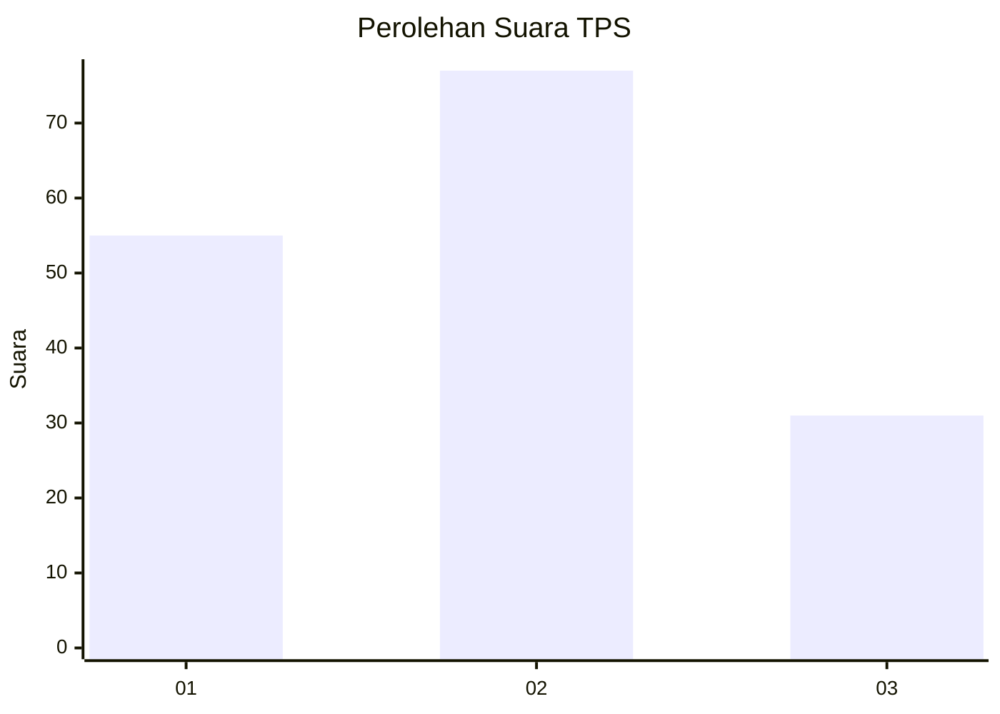
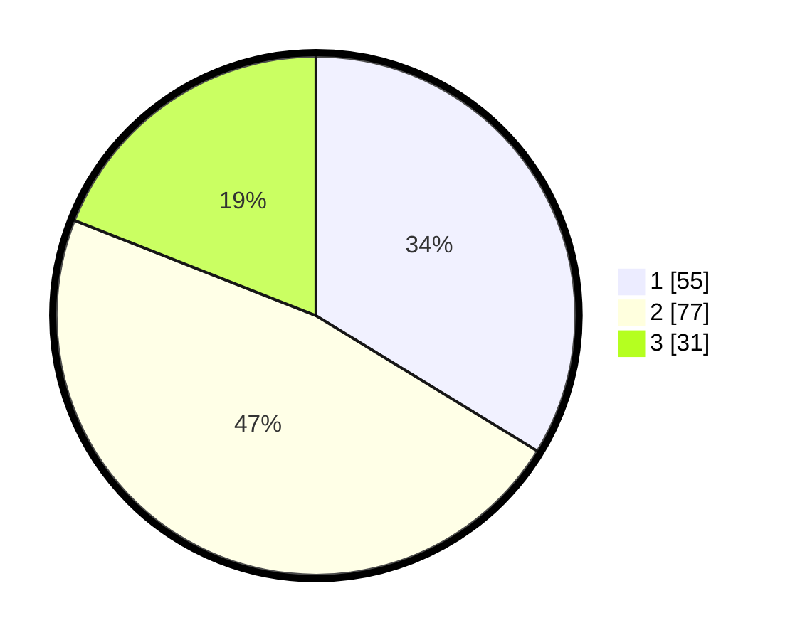

# Hasil

## Grafik

## Tabel

| No. | Nama Paslon    | Suara | Suara (raw) | Persentase |
|:--- |:-------------- | -----:| -----------:| ----------:|
| 1   | ANIES MUHAIMIN | 55    | [55][p-1]   | 33,74      |
| 2   | PRABOWO GIBRAN | 77    | [77][p-2]   | 47,24      |
| 3   | GANJAR MAHFUD  | 31    | [31][p-3]   | 19,02      |

[p-1]: https://github.com/gigit-pemilu/pemilu-2024/blob/main/pilpres/hitung-suara/sub/35-jawa-timur/sub/10-banyuwangi/sub/11-kalibaru/sub/2005-banyuanyar/sub/017-tps/sub/paslon-1.txt
[p-2]: https://github.com/gigit-pemilu/pemilu-2024/blob/main/pilpres/hitung-suara/sub/35-jawa-timur/sub/10-banyuwangi/sub/11-kalibaru/sub/2005-banyuanyar/sub/017-tps/sub/paslon-2.txt
[p-3]: https://github.com/gigit-pemilu/pemilu-2024/blob/main/pilpres/hitung-suara/sub/35-jawa-timur/sub/10-banyuwangi/sub/11-kalibaru/sub/2005-banyuanyar/sub/017-tps/sub/paslon-3.txt

## Foto C Plano

https://sirekap-obj-formc.kpu.go.id/3252/pemilu/ppwp/35/10/11/20/05/3510112005017-20240214-213847--622c562b-8e05-4bb7-8a3e-1686c4892063.jpg

https://sirekap-obj-formc.kpu.go.id/3252/pemilu/ppwp/35/10/11/20/05/3510112005017-20240214-213620--ab762f9b-7ba1-4b45-8913-88400e4d0c20.jpg

https://sirekap-obj-formc.kpu.go.id/3252/pemilu/ppwp/35/10/11/20/05/3510112005017-20240217-155306--5e8d08d0-a025-45c2-a74e-b3fa5dfb5b82.jpg

## Metadata

| Key        | Value               |
| ---------- | ------------------- |
| Time Stamp | 2024-02-24 22:31:28 |

