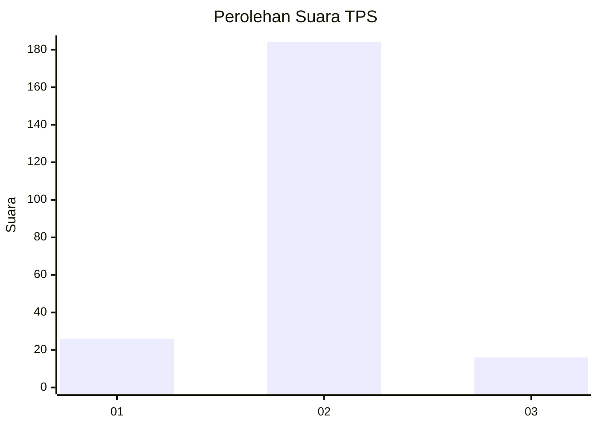
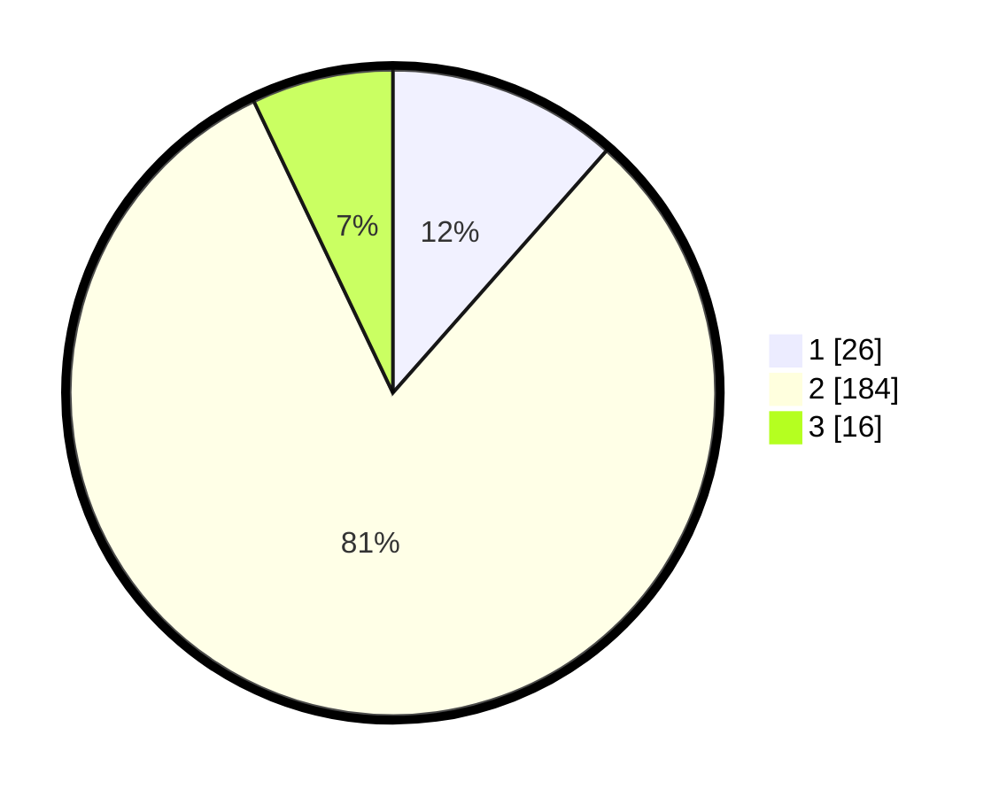

# Hasil

## Grafik

## Tabel

| No. | Nama Paslon    | Suara | Suara (raw) | Persentase |
|:--- |:-------------- | -----:| -----------:| ----------:|
| 1   | ANIES MUHAIMIN | 26    | [26][p-1]   | 11,50      |
| 2   | PRABOWO GIBRAN | 184   | [184][p-2]  | 81,42      |
| 3   | GANJAR MAHFUD  | 16    | [16][p-3]   | 7,08       |

[p-1]: https://github.com/gigit-pemilu/pemilu-2024/blob/main/pilpres/hitung-suara/sub/35-jawa-timur/sub/10-banyuwangi/sub/11-kalibaru/sub/2006-kebonrejo/sub/003-tps/sub/paslon-1.txt
[p-2]: https://github.com/gigit-pemilu/pemilu-2024/blob/main/pilpres/hitung-suara/sub/35-jawa-timur/sub/10-banyuwangi/sub/11-kalibaru/sub/2006-kebonrejo/sub/003-tps/sub/paslon-2.txt
[p-3]: https://github.com/gigit-pemilu/pemilu-2024/blob/main/pilpres/hitung-suara/sub/35-jawa-timur/sub/10-banyuwangi/sub/11-kalibaru/sub/2006-kebonrejo/sub/003-tps/sub/paslon-3.txt

## Foto C Plano

https://sirekap-obj-formc.kpu.go.id/1bb7/pemilu/ppwp/35/10/11/20/06/3510112006003-20240215-033959--2457026f-9db9-47e8-a445-790d3ed1862d.jpg

https://sirekap-obj-formc.kpu.go.id/1bb7/pemilu/ppwp/35/10/11/20/06/3510112006003-20240215-042047--3b8299ca-3c9f-47b4-b9a5-7f3f27d64ca0.jpg

https://sirekap-obj-formc.kpu.go.id/1bb7/pemilu/ppwp/35/10/11/20/06/3510112006003-20240215-034044--dc3e1b59-cfdc-4a42-b59b-2b2f40033e95.jpg

## Metadata

| Key        | Value               |
| ---------- | ------------------- |
| Time Stamp | 2024-02-24 22:31:28 |

