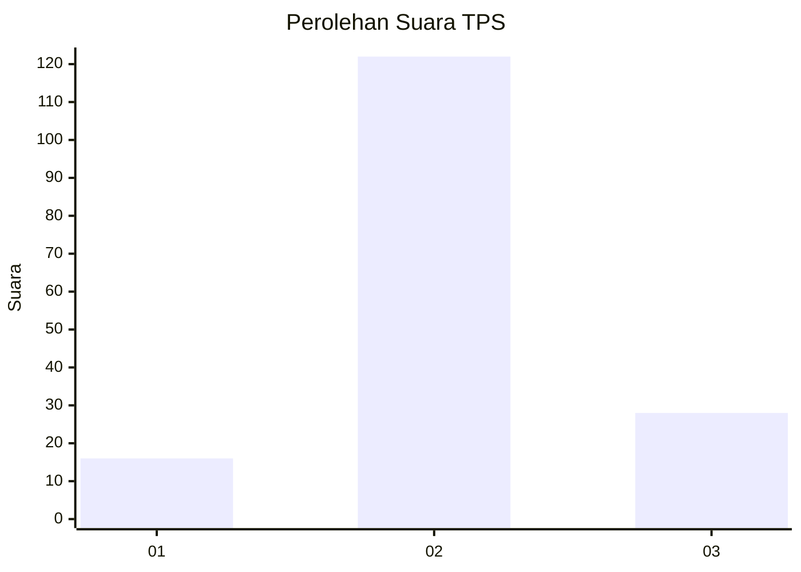
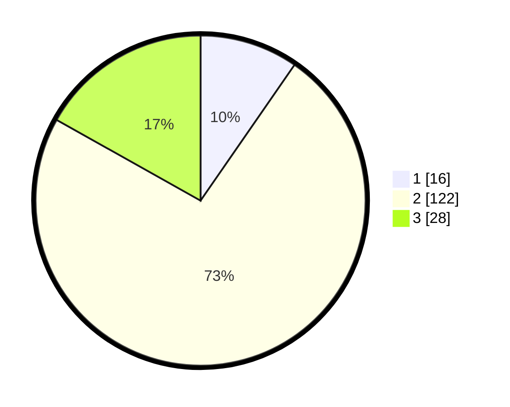

# Hasil

## Grafik

## Tabel

| No. | Nama Paslon    | Suara | Suara (raw) | Persentase |
|:--- |:-------------- | -----:| -----------:| ----------:|
| 1   | ANIES MUHAIMIN | 16    | [16][p-1]   | 9,64       |
| 2   | PRABOWO GIBRAN | 122   | [122][p-2]  | 73,49      |
| 3   | GANJAR MAHFUD  | 28    | [28][p-3]   | 16,87      |

[p-1]: https://github.com/gigit-pemilu/pemilu-2024-35-jawa-timur/blob/main/pilpres/hitung-suara/sub/35-jawa-timur/sub/10-banyuwangi/sub/11-kalibaru/sub/2006-kebonrejo/sub/005-tps/sub/paslon-1.txt
[p-2]: https://github.com/gigit-pemilu/pemilu-2024-35-jawa-timur/blob/main/pilpres/hitung-suara/sub/35-jawa-timur/sub/10-banyuwangi/sub/11-kalibaru/sub/2006-kebonrejo/sub/005-tps/sub/paslon-2.txt
[p-3]: https://github.com/gigit-pemilu/pemilu-2024-35-jawa-timur/blob/main/pilpres/hitung-suara/sub/35-jawa-timur/sub/10-banyuwangi/sub/11-kalibaru/sub/2006-kebonrejo/sub/005-tps/sub/paslon-3.txt

## Foto C Plano

https://sirekap-obj-formc.kpu.go.id/d18e/pemilu/ppwp/35/10/11/20/06/3510112006005-20240215-014457--161833ea-eb26-4a70-939b-12079bb37dd9.jpg

https://sirekap-obj-formc.kpu.go.id/d18e/pemilu/ppwp/35/10/11/20/06/3510112006005-20240215-014545--df0cc97f-fbba-4219-943c-264e3d2c789b.jpg

https://sirekap-obj-formc.kpu.go.id/d18e/pemilu/ppwp/35/10/11/20/06/3510112006005-20240214-210149--bac5585e-f0dd-4518-81e1-2a040a159e50.jpg

## Metadata

| Key        | Value               |
| ---------- | ------------------- |
| Time Stamp | 2024-02-24 22:31:28 |

