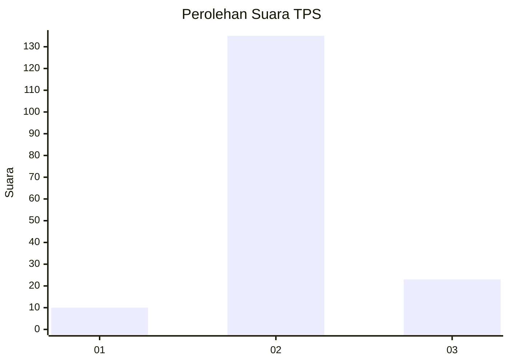
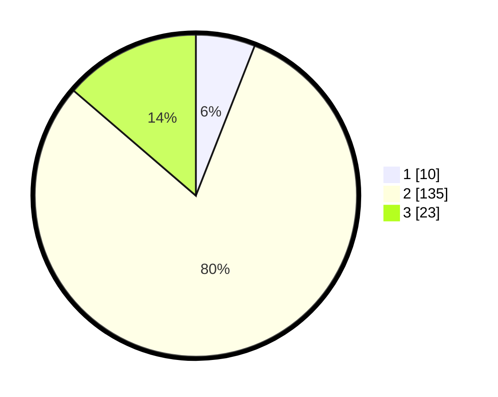

# Hasil

## Grafik

## Tabel

| No. | Nama Paslon    | Suara | Suara (raw) | Persentase |
|:--- |:-------------- | -----:| -----------:| ----------:|
| 1   | ANIES MUHAIMIN | 10    | [10][p-1]   | 5,95       |
| 2   | PRABOWO GIBRAN | 135   | [135][p-2]  | 80,36      |
| 3   | GANJAR MAHFUD  | 23    | [23][p-3]   | 13,69      |

[p-1]: https://github.com/gigit-pemilu/pemilu-2024/blob/main/pilpres/hitung-suara/sub/35-jawa-timur/sub/10-banyuwangi/sub/11-kalibaru/sub/2006-kebonrejo/sub/022-tps/sub/paslon-1.txt
[p-2]: https://github.com/gigit-pemilu/pemilu-2024/blob/main/pilpres/hitung-suara/sub/35-jawa-timur/sub/10-banyuwangi/sub/11-kalibaru/sub/2006-kebonrejo/sub/022-tps/sub/paslon-2.txt
[p-3]: https://github.com/gigit-pemilu/pemilu-2024/blob/main/pilpres/hitung-suara/sub/35-jawa-timur/sub/10-banyuwangi/sub/11-kalibaru/sub/2006-kebonrejo/sub/022-tps/sub/paslon-3.txt

## Foto C Plano

https://sirekap-obj-formc.kpu.go.id/59ae/pemilu/ppwp/35/10/11/20/06/3510112006022-20240214-155842--369e254e-32b4-45e1-a7e9-581474e63093.jpg

https://sirekap-obj-formc.kpu.go.id/59ae/pemilu/ppwp/35/10/11/20/06/3510112006022-20240216-085127--8be972b0-a5a2-4cb1-b313-5a0a959779ca.jpg

https://sirekap-obj-formc.kpu.go.id/59ae/pemilu/ppwp/35/10/11/20/06/3510112006022-20240214-205502--a8aea7f0-3351-419d-beef-19a0348dcc75.jpg

## Metadata

| Key        | Value               |
| ---------- | ------------------- |
| Time Stamp | 2024-02-24 22:31:28 |

