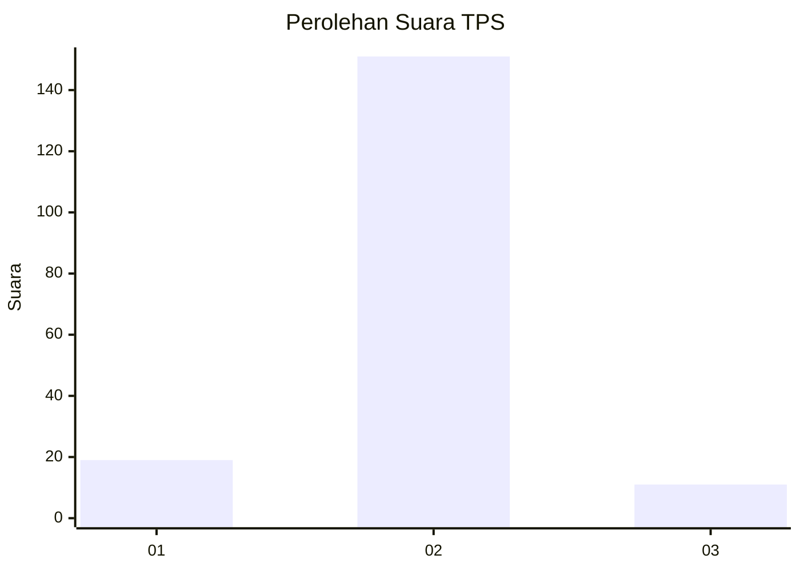
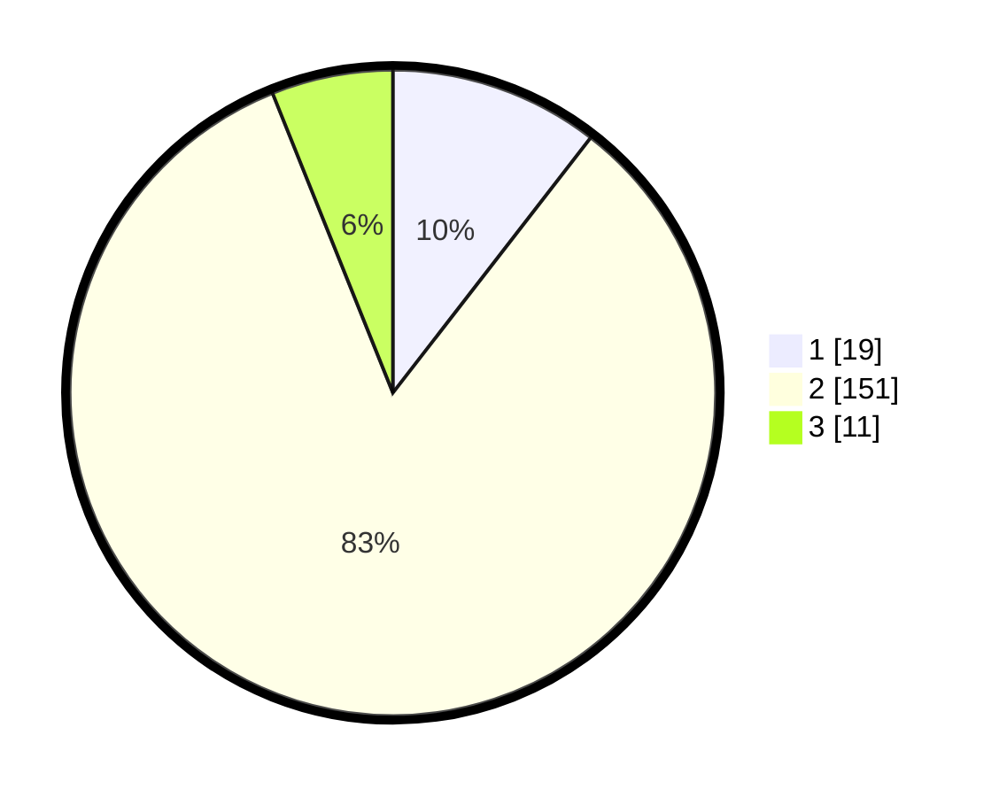

# Hasil

## Grafik

## Tabel

| No. | Nama Paslon    | Suara | Suara (raw) | Persentase |
|:--- |:-------------- | -----:| -----------:| ----------:|
| 1   | ANIES MUHAIMIN | 19    | [19][p-1]   | 10,50      |
| 2   | PRABOWO GIBRAN | 151   | [151][p-2]  | 83,43      |
| 3   | GANJAR MAHFUD  | 11    | [11][p-3]   | 6,08       |

[p-1]: https://github.com/gigit-pemilu/pemilu-2024-35-jawa-timur/blob/main/pilpres/hitung-suara/sub/35-jawa-timur/sub/10-banyuwangi/sub/12-singojuruh/sub/2001-gambor/sub/003-tps/sub/paslon-1.txt
[p-2]: https://github.com/gigit-pemilu/pemilu-2024-35-jawa-timur/blob/main/pilpres/hitung-suara/sub/35-jawa-timur/sub/10-banyuwangi/sub/12-singojuruh/sub/2001-gambor/sub/003-tps/sub/paslon-2.txt
[p-3]: https://github.com/gigit-pemilu/pemilu-2024-35-jawa-timur/blob/main/pilpres/hitung-suara/sub/35-jawa-timur/sub/10-banyuwangi/sub/12-singojuruh/sub/2001-gambor/sub/003-tps/sub/paslon-3.txt

## Foto C Plano

https://sirekap-obj-formc.kpu.go.id/1913/pemilu/ppwp/35/10/12/20/01/3510122001003-20240214-221415--7cd0cb5c-0c07-48f4-b1a3-209fb6c1db34.jpg

https://sirekap-obj-formc.kpu.go.id/1913/pemilu/ppwp/35/10/12/20/01/3510122001003-20240214-221328--17c9ee97-2e67-4c89-bb30-f2c968ca7f7e.jpg

https://sirekap-obj-formc.kpu.go.id/1913/pemilu/ppwp/35/10/12/20/01/3510122001003-20240214-221218--135514a8-f63b-48ee-a155-15c9aeb9d4d4.jpg

## Metadata

| Key        | Value               |
| ---------- | ------------------- |
| Time Stamp | 2024-02-21 22:00:00 |

