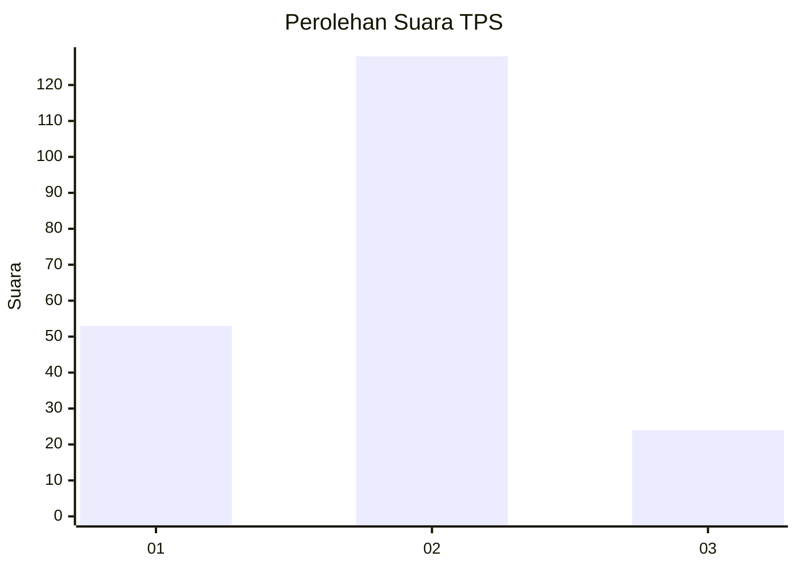
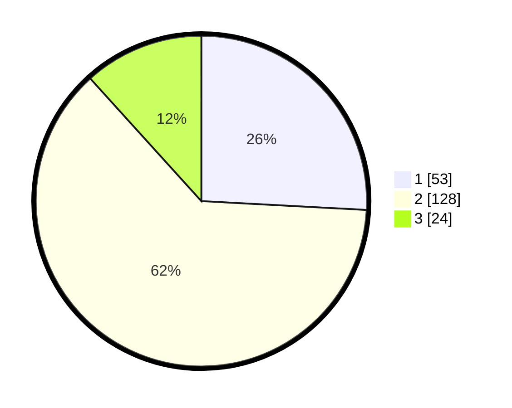

# Hasil

## Grafik

## Tabel

| No. | Nama Paslon    | Suara | Suara (raw) | Persentase |
|:--- |:-------------- | -----:| -----------:| ----------:|
| 1   | ANIES MUHAIMIN | 53    | [53][p-1]   | 25,85      |
| 2   | PRABOWO GIBRAN | 128   | [128][p-2]  | 62,44      |
| 3   | GANJAR MAHFUD  | 24    | [24][p-3]   | 11,71      |

[p-1]: https://github.com/gigit-pemilu/pemilu-2024/blob/main/pilpres/hitung-suara/sub/35-jawa-timur/sub/10-banyuwangi/sub/12-singojuruh/sub/2008-padang/sub/004-tps/sub/paslon-1.txt
[p-2]: https://github.com/gigit-pemilu/pemilu-2024/blob/main/pilpres/hitung-suara/sub/35-jawa-timur/sub/10-banyuwangi/sub/12-singojuruh/sub/2008-padang/sub/004-tps/sub/paslon-2.txt
[p-3]: https://github.com/gigit-pemilu/pemilu-2024/blob/main/pilpres/hitung-suara/sub/35-jawa-timur/sub/10-banyuwangi/sub/12-singojuruh/sub/2008-padang/sub/004-tps/sub/paslon-3.txt

## Foto C Plano

https://sirekap-obj-formc.kpu.go.id/d82a/pemilu/ppwp/35/10/12/20/08/3510122008004-20240217-175109--88bc124b-57be-4538-807a-54c4fb98b69c.jpg

https://sirekap-obj-formc.kpu.go.id/d82a/pemilu/ppwp/35/10/12/20/08/3510122008004-20240217-211420--592ef175-84aa-43b7-aa6f-01d717e792c9.jpg

https://sirekap-obj-formc.kpu.go.id/d82a/pemilu/ppwp/35/10/12/20/08/3510122008004-20240217-175754--9a2163f7-5851-4384-b4e4-751f6454d686.jpg

## Metadata

| Key        | Value               |
| ---------- | ------------------- |
| Time Stamp | 2024-02-21 16:00:00 |

