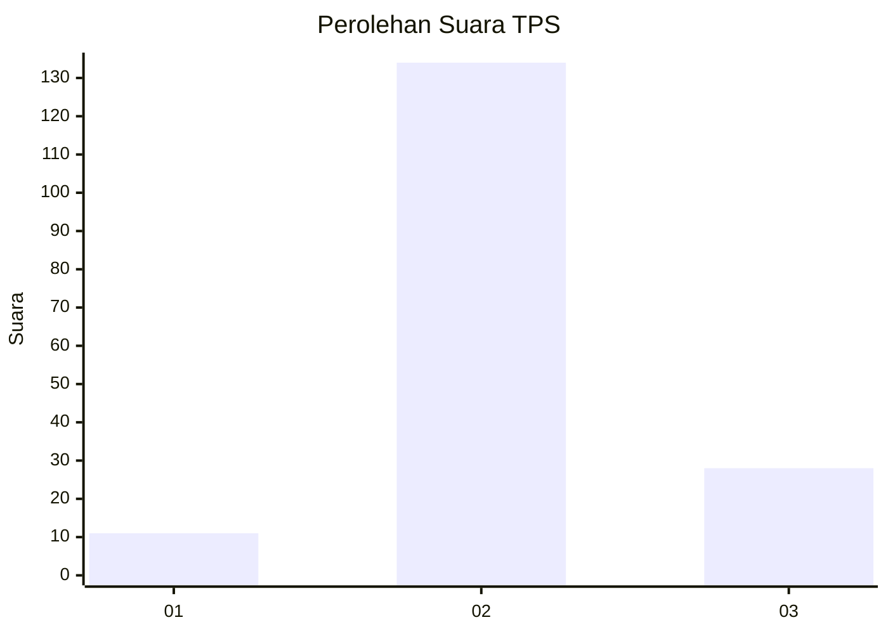
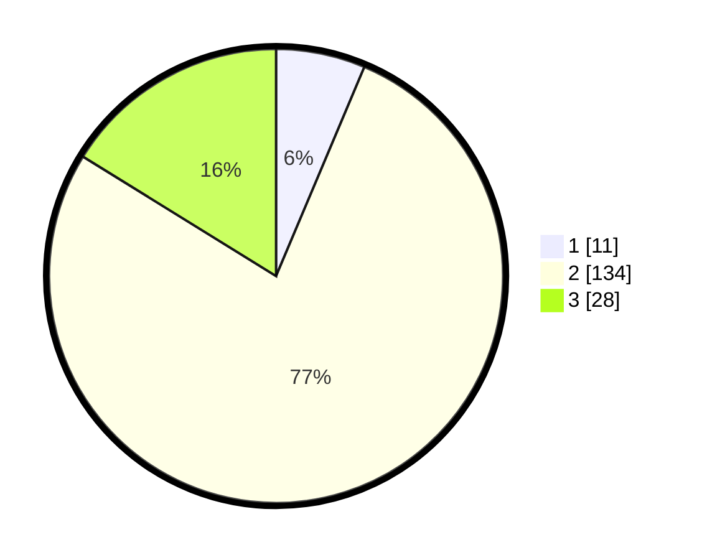

# Hasil

## Grafik

## Tabel

| No. | Nama Paslon    | Suara | Suara (raw) | Persentase |
|:--- |:-------------- | -----:| -----------:| ----------:|
| 1   | ANIES MUHAIMIN | 11    | [11][p-1]   | 6,36       |
| 2   | PRABOWO GIBRAN | 134   | [134][p-2]  | 77,46      |
| 3   | GANJAR MAHFUD  | 28    | [28][p-3]   | 16,18      |

[p-1]: https://github.com/gigit-pemilu/pemilu-2024-35-jawa-timur/blob/main/pilpres/hitung-suara/sub/35-jawa-timur/sub/10-banyuwangi/sub/13-rogojampi/sub/2001-aliyan/sub/002-tps/sub/paslon-1.txt
[p-2]: https://github.com/gigit-pemilu/pemilu-2024-35-jawa-timur/blob/main/pilpres/hitung-suara/sub/35-jawa-timur/sub/10-banyuwangi/sub/13-rogojampi/sub/2001-aliyan/sub/002-tps/sub/paslon-2.txt
[p-3]: https://github.com/gigit-pemilu/pemilu-2024-35-jawa-timur/blob/main/pilpres/hitung-suara/sub/35-jawa-timur/sub/10-banyuwangi/sub/13-rogojampi/sub/2001-aliyan/sub/002-tps/sub/paslon-3.txt

## Foto C Plano

https://sirekap-obj-formc.kpu.go.id/42a9/pemilu/ppwp/35/10/13/20/01/3510132001002-20240216-192639--fee61053-7409-4752-8730-45bc63f9e40e.jpg

https://sirekap-obj-formc.kpu.go.id/42a9/pemilu/ppwp/35/10/13/20/01/3510132001002-20240216-193113--d9e8c712-ab2a-4688-8ef0-9cbb1ac5e67c.jpg

https://sirekap-obj-formc.kpu.go.id/42a9/pemilu/ppwp/35/10/13/20/01/3510132001002-20240216-192430--26d1024f-322a-4fa6-8414-a44d73ff2955.jpg

## Metadata

| Key        | Value               |
| ---------- | ------------------- |
| Time Stamp | 2024-02-22 14:00:00 |

