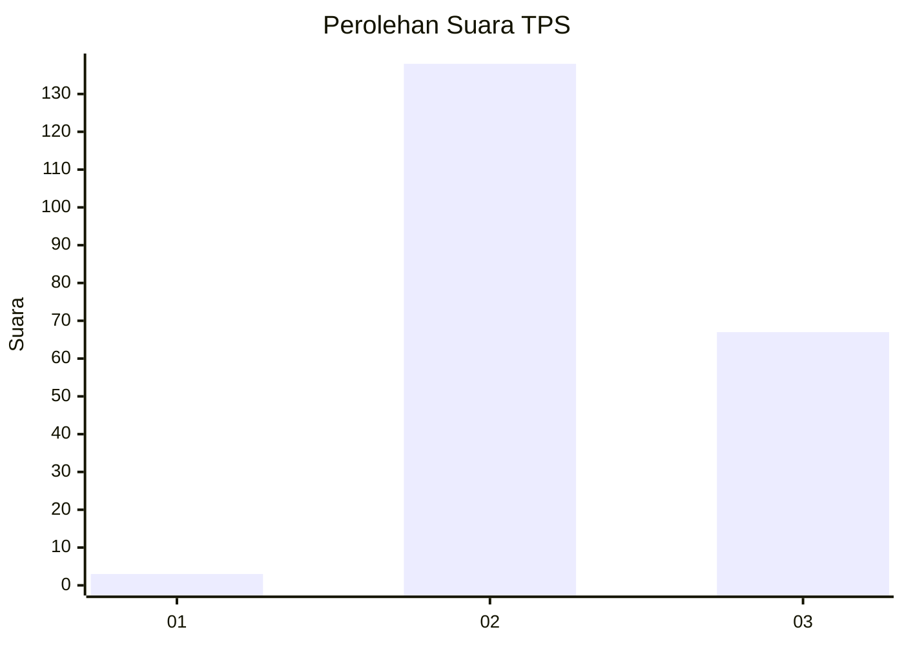
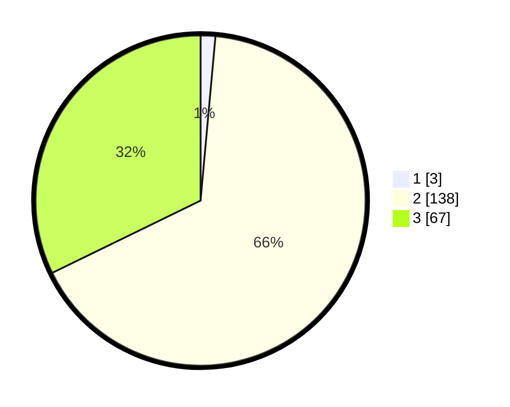

# Hasil

## Grafik

## Tabel

| No. | Nama Paslon    | Suara | Suara (raw) | Persentase |
|:--- |:-------------- | -----:| -----------:| ----------:|
| 1   | ANIES MUHAIMIN | 3     | [3][p-1]    | 1,44       |
| 2   | PRABOWO GIBRAN | 138   | [138][p-2]  | 66,35      |
| 3   | GANJAR MAHFUD  | 67    | [67][p-3]   | 32,21      |

[p-1]: https://github.com/gigit-pemilu/pemilu-2024/blob/main/pilpres/hitung-suara/sub/35-jawa-timur/sub/10-banyuwangi/sub/13-rogojampi/sub/2001-aliyan/sub/005-tps/sub/paslon-1.txt
[p-2]: https://github.com/gigit-pemilu/pemilu-2024/blob/main/pilpres/hitung-suara/sub/35-jawa-timur/sub/10-banyuwangi/sub/13-rogojampi/sub/2001-aliyan/sub/005-tps/sub/paslon-2.txt
[p-3]: https://github.com/gigit-pemilu/pemilu-2024/blob/main/pilpres/hitung-suara/sub/35-jawa-timur/sub/10-banyuwangi/sub/13-rogojampi/sub/2001-aliyan/sub/005-tps/sub/paslon-3.txt

## Foto C Plano

https://sirekap-obj-formc.kpu.go.id/5db5/pemilu/ppwp/35/10/13/20/01/3510132001005-20240216-163247--afe9e2c9-d8e9-4dd0-b950-57e09fccefe1.jpg

https://sirekap-obj-formc.kpu.go.id/5db5/pemilu/ppwp/35/10/13/20/01/3510132001005-20240216-161819--9d42e378-120d-4af4-87d9-79c88c0d1b4a.jpg

https://sirekap-obj-formc.kpu.go.id/5db5/pemilu/ppwp/35/10/13/20/01/3510132001005-20240216-162230--a5ac1942-c6b4-4681-8bec-9b2e70f5a249.jpg

## Metadata

| Key        | Value               |
| ---------- | ------------------- |
| Time Stamp | 2024-02-22 14:00:00 |

