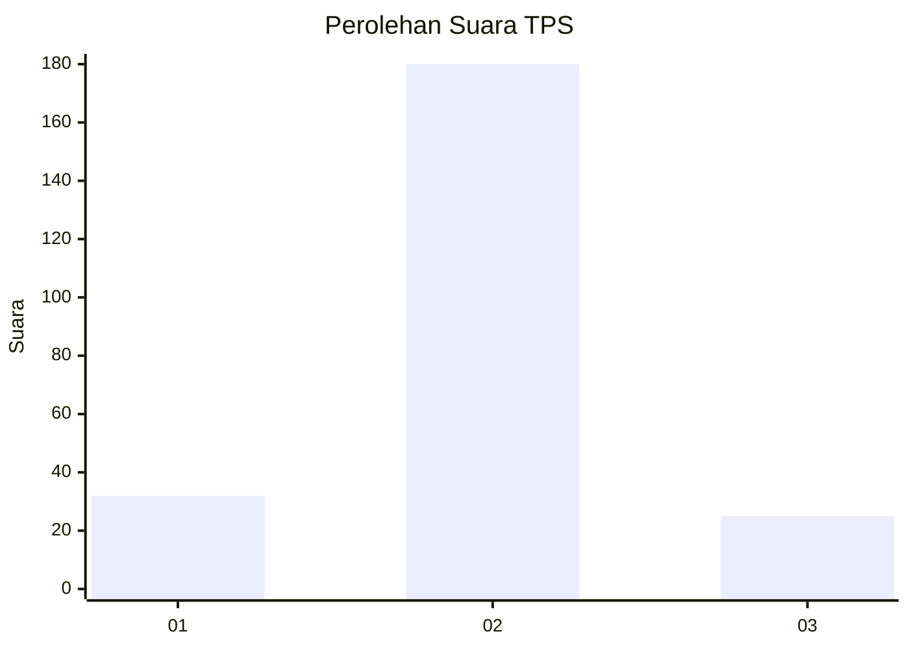
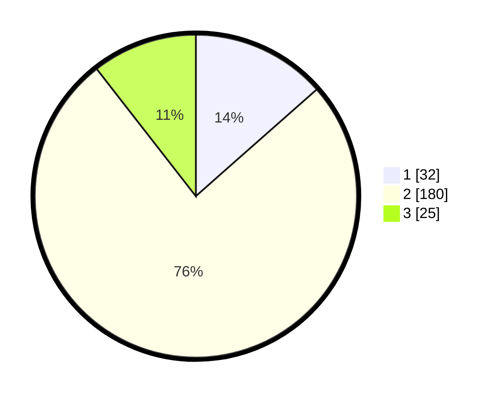

# Hasil

## Grafik

## Tabel

| No. | Nama Paslon    | Suara | Suara (raw) | Persentase |
|:--- |:-------------- | -----:| -----------:| ----------:|
| 1   | ANIES MUHAIMIN | 32    | [32][p-1]   | 13,50      |
| 2   | PRABOWO GIBRAN | 180   | [180][p-2]  | 75,95      |
| 3   | GANJAR MAHFUD  | 25    | [25][p-3]   | 10,55      |

[p-1]: https://github.com/gigit-pemilu/pemilu-2024-35-jawa-timur/blob/main/pilpres/hitung-suara/sub/35-jawa-timur/sub/10-banyuwangi/sub/13-rogojampi/sub/2002-mangir/sub/012-tps/sub/paslon-1.txt
[p-2]: https://github.com/gigit-pemilu/pemilu-2024-35-jawa-timur/blob/main/pilpres/hitung-suara/sub/35-jawa-timur/sub/10-banyuwangi/sub/13-rogojampi/sub/2002-mangir/sub/012-tps/sub/paslon-2.txt
[p-3]: https://github.com/gigit-pemilu/pemilu-2024-35-jawa-timur/blob/main/pilpres/hitung-suara/sub/35-jawa-timur/sub/10-banyuwangi/sub/13-rogojampi/sub/2002-mangir/sub/012-tps/sub/paslon-3.txt

## Foto C Plano

https://sirekap-obj-formc.kpu.go.id/2d9b/pemilu/ppwp/35/10/13/20/02/3510132002012-20240215-021648--37a8c92a-fccb-4429-8ff7-98a59e1d32fd.jpg

https://sirekap-obj-formc.kpu.go.id/2d9b/pemilu/ppwp/35/10/13/20/02/3510132002012-20240216-213200--9fb8032a-ce01-4ba3-b583-97e305434b52.jpg

https://sirekap-obj-formc.kpu.go.id/2d9b/pemilu/ppwp/35/10/13/20/02/3510132002012-20240216-213630--5fe68d21-b21f-41b9-aec5-9bafa2b07eb7.jpg

## Metadata

| Key        | Value               |
| ---------- | ------------------- |
| Time Stamp | 2024-02-21 22:00:00 |

