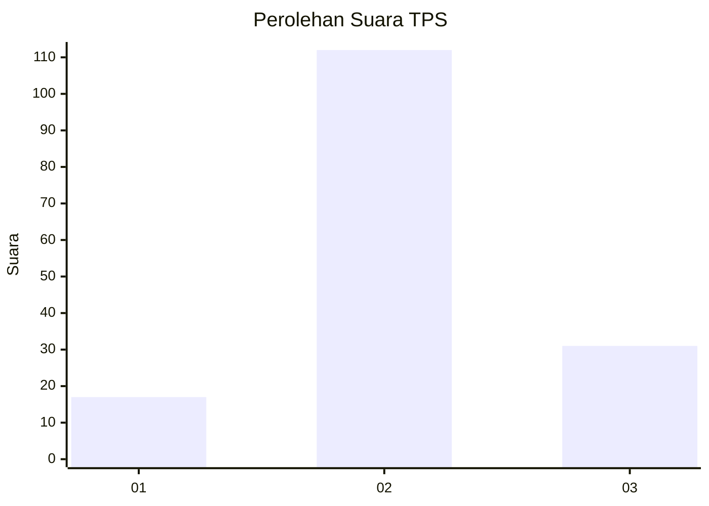
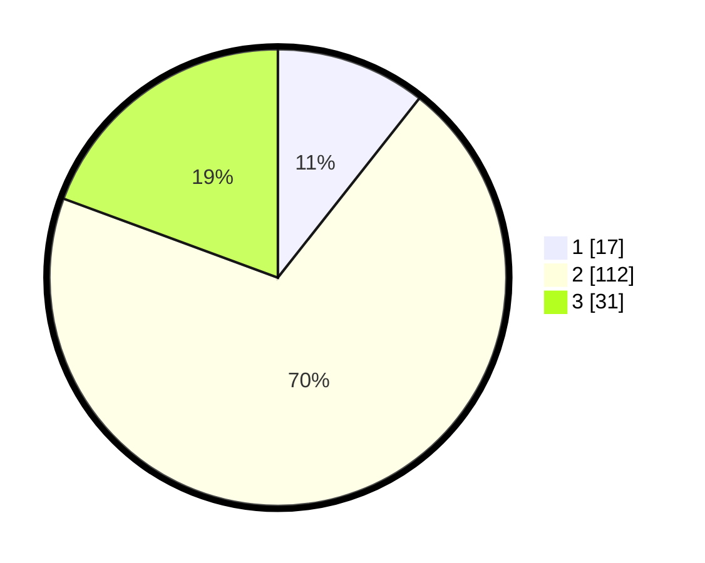

# Hasil

## Grafik

## Tabel

| No. | Nama Paslon    | Suara | Suara (raw) | Persentase |
|:--- |:-------------- | -----:| -----------:| ----------:|
| 1   | ANIES MUHAIMIN | 17    | [17][p-1]   | 10,63      |
| 2   | PRABOWO GIBRAN | 112   | [112][p-2]  | 70,00      |
| 3   | GANJAR MAHFUD  | 31    | [31][p-3]   | 19,38      |

[p-1]: https://github.com/gigit-pemilu/pemilu-2024-35-jawa-timur/blob/main/pilpres/hitung-suara/sub/35-jawa-timur/sub/10-banyuwangi/sub/13-rogojampi/sub/2008-lemahbangdewo/sub/005-tps/sub/paslon-1.txt
[p-2]: https://github.com/gigit-pemilu/pemilu-2024-35-jawa-timur/blob/main/pilpres/hitung-suara/sub/35-jawa-timur/sub/10-banyuwangi/sub/13-rogojampi/sub/2008-lemahbangdewo/sub/005-tps/sub/paslon-2.txt
[p-3]: https://github.com/gigit-pemilu/pemilu-2024-35-jawa-timur/blob/main/pilpres/hitung-suara/sub/35-jawa-timur/sub/10-banyuwangi/sub/13-rogojampi/sub/2008-lemahbangdewo/sub/005-tps/sub/paslon-3.txt

## Foto C Plano

https://sirekap-obj-formc.kpu.go.id/673c/pemilu/ppwp/35/10/13/20/08/3510132008005-20240217-125409--0c27e4bd-2a37-479b-b7a5-baf9d5521519.jpg

https://sirekap-obj-formc.kpu.go.id/673c/pemilu/ppwp/35/10/13/20/08/3510132008005-20240217-130826--990ce82b-c56a-4de8-9831-a2c45d00fa4c.jpg

https://sirekap-obj-formc.kpu.go.id/673c/pemilu/ppwp/35/10/13/20/08/3510132008005-20240217-130706--57b7d303-4be0-425a-8995-fa53f119f922.jpg

## Metadata

| Key        | Value               |
| ---------- | ------------------- |
| Time Stamp | 2024-02-19 06:16:00 |

