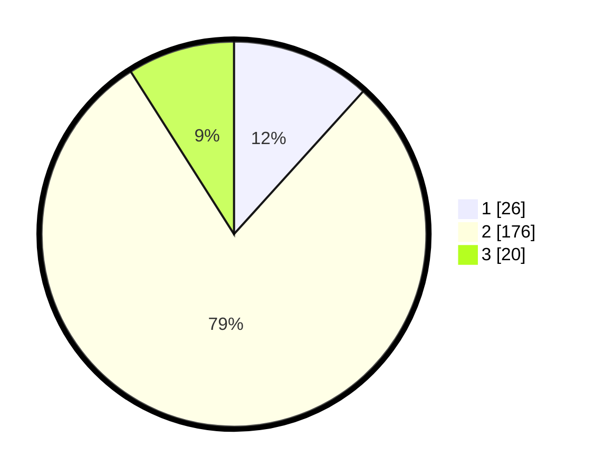

# Hasil

## Grafik

## Tabel

| No. | Nama Paslon    | Suara | Suara (raw) | Persentase |
|:--- |:-------------- | -----:| -----------:| ----------:|
| 1   | ANIES MUHAIMIN | 26    | [26][p-1]   | 11,71      |
| 2   | PRABOWO GIBRAN | 176   | [176][p-2]  | 79,28      |
| 3   | GANJAR MAHFUD  | 20    | [20][p-3]   | 9,01       |

[p-1]: https://github.com/gigit-pemilu/pemilu-2024-35-jawa-timur/blob/main/pilpres/hitung-suara/sub/35-jawa-timur/sub/10-banyuwangi/sub/13-rogojampi/sub/2012-karangbendo/sub/003-tps/sub/paslon-1.txt
[p-2]: https://github.com/gigit-pemilu/pemilu-2024-35-jawa-timur/blob/main/pilpres/hitung-suara/sub/35-jawa-timur/sub/10-banyuwangi/sub/13-rogojampi/sub/2012-karangbendo/sub/003-tps/sub/paslon-2.txt
[p-3]: https://github.com/gigit-pemilu/pemilu-2024-35-jawa-timur/blob/main/pilpres/hitung-suara/sub/35-jawa-timur/sub/10-banyuwangi/sub/13-rogojampi/sub/2012-karangbendo/sub/003-tps/sub/paslon-3.txt

## Foto C Plano

https://sirekap-obj-formc.kpu.go.id/b6b2/pemilu/ppwp/35/10/13/20/12/3510132012003-20240216-194554--4dd33850-5750-49c6-98d1-193e9fe199d5.jpg

https://sirekap-obj-formc.kpu.go.id/b6b2/pemilu/ppwp/35/10/13/20/12/3510132012003-20240216-194803--7c1f85a8-a8b4-4c6e-9bfe-41e54fdb49e0.jpg

https://sirekap-obj-formc.kpu.go.id/b6b2/pemilu/ppwp/35/10/13/20/12/3510132012003-20240216-194937--1be55094-0e93-451b-8d3d-6084beccfdfd.jpg

## Metadata

| Key        | Value               |
| ---------- | ------------------- |
| Time Stamp | 2024-02-22 14:00:00 |

