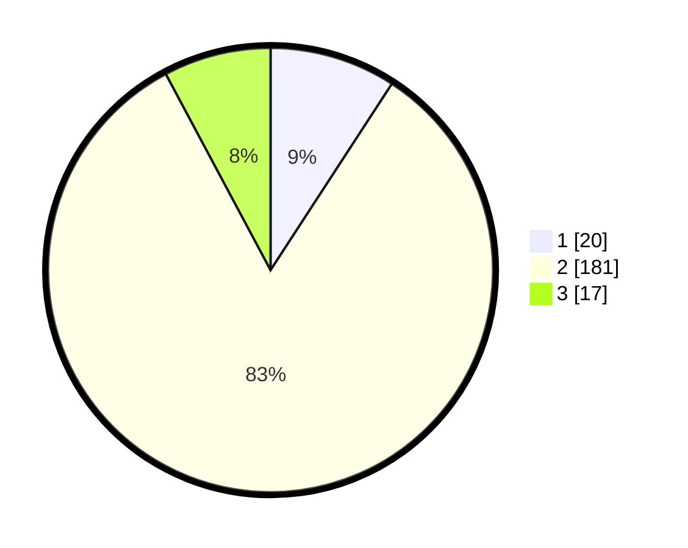

# Hasil

## Grafik

## Tabel

| No. | Nama Paslon    | Suara | Suara (raw) | Persentase |
|:--- |:-------------- | -----:| -----------:| ----------:|
| 1   | ANIES MUHAIMIN | 20    | [20][p-1]   | 9,17       |
| 2   | PRABOWO GIBRAN | 181   | [181][p-2]  | 83,03      |
| 3   | GANJAR MAHFUD  | 17    | [17][p-3]   | 7,80       |

[p-1]: https://github.com/gigit-pemilu/pemilu-2024/blob/main/pilpres/hitung-suara/sub/35-jawa-timur/sub/10-banyuwangi/sub/13-rogojampi/sub/2012-karangbendo/sub/014-tps/sub/paslon-1.txt
[p-2]: https://github.com/gigit-pemilu/pemilu-2024/blob/main/pilpres/hitung-suara/sub/35-jawa-timur/sub/10-banyuwangi/sub/13-rogojampi/sub/2012-karangbendo/sub/014-tps/sub/paslon-2.txt
[p-3]: https://github.com/gigit-pemilu/pemilu-2024/blob/main/pilpres/hitung-suara/sub/35-jawa-timur/sub/10-banyuwangi/sub/13-rogojampi/sub/2012-karangbendo/sub/014-tps/sub/paslon-3.txt

## Foto C Plano

https://sirekap-obj-formc.kpu.go.id/148f/pemilu/ppwp/35/10/13/20/12/3510132012014-20240214-193950--ac490607-e844-4c52-99b1-452c16f038f7.jpg

https://sirekap-obj-formc.kpu.go.id/148f/pemilu/ppwp/35/10/13/20/12/3510132012014-20240214-194454--c622ee2c-ecd9-4628-a526-6a45950b6976.jpg

https://sirekap-obj-formc.kpu.go.id/148f/pemilu/ppwp/35/10/13/20/12/3510132012014-20240214-194755--2eff2c64-5cdb-4c0c-993d-f7944448b850.jpg

## Metadata

| Key        | Value               |
| ---------- | ------------------- |
| Time Stamp | 2024-02-24 22:31:28 |

